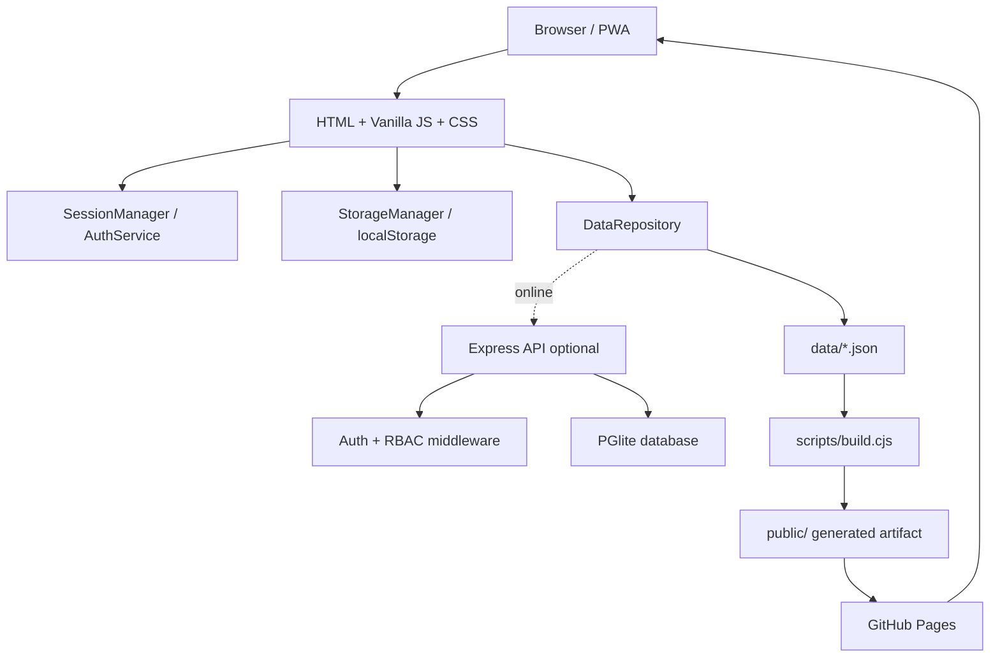

# Cloud Academy A3 — Auditoria Final

**Data:** 2026-08-16  
**Tipo:** auditoria técnica, arquitetural e de produto, sem refatoração.

## Executive Summary

A Cloud Academy A3 é uma plataforma educacional multi-page em Vanilla JavaScript, HTML/CSS, JSON versionado e backend Express opcional com PGlite. O desenho é local-first: o navegador consegue consumir os bancos estáticos, manter sessão e progresso localmente e usar a API quando configurada. O GitHub Pages publica o artefato `public/` gerado por `scripts/build.cjs`.

O estado funcional atual é consistente para o escopo conhecido: 2.498 Questions, 170 Flashcards, 25 Cases bilíngues, 56 dias estruturais de Sprint, 18 Labs e 238 serviços reconhecidos. A validação desta auditoria passou com 0 errors, 4 warnings conhecidos, 0 content gaps e 4 legacy. Lint e build passaram. A suíte completa terminou com 44 suítes e 340 testes em 206,724 s.

O principal limite não é funcionalidade ausente, mas a distância entre uma aplicação local-first/internal beta e uma plataforma pública multiusuário. PGlite é adequado para desenvolvimento, testes e instalação pequena controlada; não deve ser assumido como autoridade de produção para múltiplas instâncias, backup gerenciado e failover. GitHub Pages é adequado ao frontend estático, mas não oferece backend, segredos, banco ou autorização privada.

### Principais conclusões

- **React não é necessário agora.** Há ganhos potenciais em componentes e estado, mas os problemas prioritários são contratos duplicados, globals, CSS sobreposto e falta de E2E; React não corrige esses problemas automaticamente.
- **GitHub Pages continua recomendado agora** para o frontend local-first. Para usuários externos autenticados, a opção equilibrada é CDN/frontend estático + API Node + PostgreSQL gerenciado.
- **Google Login é viável**, mas exige verificação server-side de ID token/OIDC, mapeamento para o usuário local e preservação de `STUDENT`, `VALIDATOR` e `ADMIN` como roles da aplicação.
- **Prontidão:** Internal Beta / Production Candidate; não Production Ready para usuários externos sem banco gerenciado, auth operacional, backup, observabilidade e E2E de browser/deploy.

Os riscos prioritários são: operação multiusuário com PGlite, dependência de backend fora do Pages para autenticação, `app.js` com aproximadamente 3.993 LOC e muitos globals, cerca de 208 referências a `localStorage`/`innerHTML`, e 168 ocorrências de `!important`.

## 1. Scope

Inspecionados `src/frontend`, `backend`, `data`, `scripts`, `__tests__`, `.github/workflows`, `public`, `package.json`, manifest, service worker, schema, seeders, validation, auth, storage, API, CSS e i18n. Também foram buscados hardcodes, paths, listeners, globals, `innerHTML`, estilos inline, Tailwind e arquivos grandes.

Não foram feitas alterações de aplicação, banco, deploy, autenticação, hospedagem, React ou TypeScript. Não houve browser E2E, teste de carga, pentest, revisão de provedor ou cotação comercial; esses pontos são `NOT VERIFIED`.

## 2. Current Architecture



Fluxo real: dados editoriais entram no build; `public/` é publicado; páginas multi-page compartilham shell/managers; `DataRepository` tenta API quando configurada e usa JSON/local fallback; o backend Express usa token HMAC, RBAC e PGlite. GitHub Pages não executa o backend.

## 3. Functional Inventory

| Módulo | Status | Fonte | Persistência | Risco |
|---|---|---|---|---|
| Home | Funcional | `pages/index.html`, `js/app.js` | storage/API | app shell e charts |
| Simulados | Funcional | `simulados.html`, `quizEngine.js` | history/answers | async state alto |
| Jornada | Funcional | `jornada.html` + managers | module state | globals legados |
| Raio-X | Funcional local-first | `diagnostico.html`, `quizEngine.js` | resultado/contexto | paths e seleção |
| Flashcards | Funcional | `flashcards.html`, `flashcards.js` | deck user+cert | state sensível |
| Cases | Funcional bilíngue | `architecture_cases.json`, `caseManager.js` | case progress | 4 service warnings |
| Labs | Funcional | `labs.json`, `laboratorios.js` | completion | Pages base path |
| Sprint | Funcional | `sprintData.js` | module state | dataset estático |
| Resources | Funcional | `resources.html` | navegação | links externos |
| Profile/Settings | Funcional | páginas + `/api/me` | perfil/theme/goals | escopos de storage |
| Validation/Admin | Funcional com API | `src/frontend/validation`, `/api/access` | requests/audits | RBAC obrigatório |
| i18n | Funcional | `languageManager.js`, `translations.js` | locale | strings legadas |
| Gamification | Funcional | `gamificacao/*` | badges/streaks | estado derivado |
| PWA | Parcialmente funcional | `public/sw.js`, manifest | cache | stale assets |
| Recommendation | Funcional | `recommendations/*` | estado derivado | IDs/contexto |
| Auth/RBAC | Funcional com API | `auth.js`, `requireRole.js` | DB + sessão | não é Pages-only |

## 4. Data Architecture

| Dataset | Quantidade | Fonte |
|---|---:|---|
| Questions | 2.498, 1.249/idioma | `data/questions/*.json` |
| Flashcards | 170 | dados/runtime de Flashcards |
| Cases | 25 | `data/cases/architecture_cases.json` |
| Sprint | 56 dias | `src/frontend/js/sprintData.js` |
| Labs | 18 | `data/labs/labs.json` |
| Domínios | 17 canônicos | `canonical_taxonomy.json` |
| Services | 238 reconhecidos | `aws_services_catalog.json`/validator |

JSON estático continua apropriado para o volume atual. Em 5 mil Questions ainda é aceitável com partição e lazy load; em 10 mil deve haver carregamento sob demanda/índices; em 50 mil a plataforma deve usar API paginada ou índices no cliente, não baixar todo o banco.

`backend/database/schema.sql` possui usuários, estados por módulo, requests de validator, roles/auditoria, domains, questions, quiz history, answers, gamification, focus sessions, services, cases e progresso com FKs, índices e constraints. É uma base razoável para PostgreSQL.

PGlite é adequado para local/teste e pequena instalação controlada. PostgreSQL gerenciado torna-se necessário quando houver concorrência, mais de uma instância, backups operacionais, restore, disponibilidade ou usuários externos persistentes.

## 5. Frontend Architecture

O frontend tem módulos ES, partials HTML, CSS próprio, Tailwind e globals para compatibilidade com handlers inline. A estrutura de diretórios é boa, mas o legado ainda concentra responsabilidades.

| Arquivo | LOC aprox. | Avaliação |
|---|---:|---|
| `src/frontend/js/app.js` | 3.993 | shell, eventos, simulados, dashboard e globals |
| `backend/database/db.js` | 2.851 | conexão, schema e queries |
| `src/frontend/js/storageManager.js` | 1.363 | muitas famílias de estado |
| `src/frontend/js/i18n/translations.js` | 1.148 | catálogo grande, mas coeso |
| `src/frontend/js/quizEngine.js` | 927 | fluxo/seleção/diagnóstico |
| `src/frontend/js/shell.js` | 917 | navegação, tema e menu |
| `src/frontend/js/data.js` | 895 | dados e transformações |
| `src/frontend/js/flashcards.js` | 703 | runtime completo |
| `src/frontend/js/services/api.js` | 638 | HTTP/config/fallback |

O código pode ser simplificado sem trocar framework: separar carregamento, domínio e renderização; reduzir `window`; usar registry de config/rotas/storage; manter regras puras importáveis.

## 6. Backend Architecture

`backend/api/server.js` configura Express, Helmet, CORS, JSON/urlencoded de 10 MB, rate limit global de 300/15 min, logging, `/api/health`, rotas de auth/profile/access/users/questions/quiz/cases/services/leaderboard e shutdown gracioso.

Pontos positivos: RBAC no backend, token assinado, constraints SQL, índices, API opcional. Riscos: CORS e ports configurados em código; logging sem correlação; PGlite single-writer; ausência demonstrada de métricas, backup/restore e rate limit específico por operação sensível.

## 7. Authentication and Authorization

`backend/api/routes/auth.js` restringe login a `a3data.com.br`/`a3data.com`, faz upsert e devolve token. `backend/api/services/sessionToken.js` cria payload HMAC SHA-256 com TTL de 8 horas. `backend/api/middleware/requireRole.js` valida `Authorization: Bearer`, consulta o usuário e aplica roles. `STUDENT`, `VALIDATOR` e `ADMIN` são propriedades do banco; o frontend não deve concedê-las.

O bypass `X-Test-Role` é limitado ao ambiente de teste. O Pages estático não pode validar esta sessão nem proteger dados privados; seu modo local é útil para demo/offline, não para autorização externa.

## 8. Persistence

`StorageManager` usa prefixo e escopo `user:<id>` para grande parte dos dados. Foram encontradas aproximadamente 208 referências a `localStorage`, incluindo chaves diretas de tema/sidebar/idioma e chaves legacy de certificação. Tema e sidebar podem ser device-scoped; histórico, decks e completion precisam permanecer user/cert-scoped.

localStorage pode continuar para preferências e offline pequeno. Não deve ser a autoridade de conta em produção, e token em localStorage precisa de threat model de XSS. IndexedDB é opção futura para cache grande; Postgres é a autoridade online.

## 9. Data Governance

O validator é uma parte madura e foi executado com 0 erros. `data/taxonomy/canonical_taxonomy.json` é a fonte de domínios/certificações; `aws_services_catalog.json` e a camada de services alimentam governança.

### Warnings

Os quatro warnings são Cases com `aws-dms`, `aws-certificate-manager` e `amazon-auto-scaling` (duas ocorrências) não reconhecidos pelo catálogo. Impacto atual: qualidade de referência, não quebra comprovada de runtime. Classificação: P2 de governança, normalizar após decisão de identidade.

### Legacy

Os quatro itens são `data/nivelamento/diagnostic-{clf,saa,dva,aif}-c02.json`. O validator informa que ficam por compatibilidade e Diagnóstico V2 usa o banco principal. Classificação: KEEP temporário / DEPRECATE documentado.

## 10. Bugs and Risks

| ID | Severidade | Classificação | Evidência | Impacto | Recomendação | Esforço |
|---|---|---|---|---|---|---|
| F-001 | P1 | RISCO | `backend/database/db.js:140-289` | PGlite não prova escala/DR multiusuário | PostgreSQL gerenciado antes de público externo | L |
| F-002 | P1 | CONFIRMADO como limitação | `deploy-pages.yml`, `auth.js` | Pages não fornece backend/segredo/auth | Separar frontend e API | M |
| F-003 | P1 | RISCO | `public/` versionado + `build.cjs` | divergência source/artifact | política de artifact e diff de CI | M |
| F-004 | P1 | CODE SMELL | `app.js:1-3993`, globals `3478+` | regressões e migração difíceis | extração incremental | L |
| F-005 | P1 | GAP | workflow sem browser E2E | deploy verde pode esconder UI quebrada | Playwright pós-deploy | M |
| F-006 | P2 | RISCO | ~208 `innerHTML`, `case-view.html`, `app.js` | XSS se sink receber dado não confiável | classificar/escapar/sanitizar | M/L |
| F-007 | P2 | CODE SMELL | ~208 localStorage refs | colisão, logout ou escopo incorreto | registry versionado | M |
| F-008 | P2 | CODE SMELL | 168 `!important` CSS | cascade/dark-mode regressions | tokens/classes e menor especificidade | M |
| F-009 | P2 | RISCO | `server.js`, `logger.js` console | diagnóstico tardio | logs estruturados/Sentry/metrics | M |
| F-010 | P2 | RISCO | IDs/routes/ports repetidos | mudança incompleta | config central pequena | M |
| F-011 | P2 | RISCO | taxonomy + DB services + aliases | filtros/warnings divergentes | identity canônica | M |
| F-012 | P2 | RISCO | `public/sw.js` cache v8 | JS/CSS stale | testar lifecycle/rollback | S/M |
| F-013 | P2 | RISCO | header `X-User-Id` permitido | integração antiga pode confundir identidade | auditar rotas e remover fora de teste | M |
| F-014 | P3 | CODE SMELL | `build_labs.cjs` | escrita de source fora do build oficial | marcar legacy/documentar | S |
| F-015 | P3 | DÍVIDA | 4 warnings + 4 legacy | governança pendente | owner e prazo | S |

Não foram confirmados nesta auditoria: race de sessão produtiva, import quebrado, perda de progress, mistura de usuários, falha atual de Pages ou corrupção de encoding. Esses pontos devem permanecer em E2E.

## 11. Security Review

Helmet, CORS allowlist, rate limit, token HMAC, timing-safe comparison e RBAC server-side são pontos positivos. O principal risco é que `innerHTML` aparece em muitos sinks; templates com JSON confiável diferem de texto de API/usuário, então a busca não prova XSS nem sua ausência. Não houve pentest/DAST.

O modo de teste aceita `X-Test-Role` por desenho e deve permanecer isolado. O `.env` local não está listado pelo Git (`git ls-files .env` não retornou caminho); valores não foram exibidos. Não foi executado `npm audit` nesta auditoria, embora exista no CI.

Se a arquitetura migrar para cookie, CSRF será obrigatório; com Bearer, a proteção de token/XSS é central. Rate limiting por IP/usuário e proteção de brute force no login devem ser definidos antes de público.

## 12. Hardcoded Values Audit

| Categoria | Ocorrências aprox. | Evidência | Risco | Ação |
|---|---:|---|---|---|
| `clf-c02` | 2.121 incl. dados/testes | frontend/data/scripts | fallback e casing | registry canônico |
| `saa-c03` | 1.456 | idem | idem | idem |
| `dva-c02` | 1.346 | idem | idem | idem |
| `aif-c01` | 1.338 | idem | idem | idem |
| nome do repo | 22 | workflows/paths/docs | Pages portability | base derivado |
| `localhost` | 18 | API/config/testes | ambientes | env config |
| localStorage | 208 | frontend | storage | key registry |
| `fetch(` | 38 | managers/API | fallback inconsistente | HTTP policy |
| `window.location` | 57 | páginas/JS | subpath Pages | `resolveAppUrl` |
| `addEventListener` | 125 | frontend | lifecycle | delegation |
| `innerHTML` | 208 | renderers | XSS/encoding | sinks explícitos |
| `!important` | 168 | CSS | especificidade | tokens/classes |

Também há ports 3001/8080, paths `data/...`, routes HTML, URLs de CDN/Skill Builder, roles e thresholds espalhados. Recomenda-se futura estrutura pequena `src/frontend/js/config/{certifications,routes,storageKeys,features,environment}.js`, sem generic repository excessivo.

## 13. Technical Debt

| ID | Dívida | Impacto | Esforço | Prioridade |
|---|---|---|---|---|
| TD-01 | `app.js` concentra UI/estado/negócio | alto | L | Must Fix gradual |
| TD-02 | PGlite como autoridade operacional | alto em escala | L/XL | Must Fix antes de externo |
| TD-03 | storage keys sem registry único | médio/alto | M | Should Fix |
| TD-04 | Tailwind + CSS/tokens sobrepostos | médio | M/L | Should Fix |
| TD-05 | globals/handlers inline | médio | M | Should Fix pré-React |
| TD-06 | 4 service warnings | médio | S | Should Fix |
| TD-07 | 4 datasets diagnostic legacy | médio | S | Deprecate |
| TD-08 | ausência de browser E2E | alto operacional | M | Must Fix |
| TD-09 | logs não estruturados | médio | M | Should Fix |
| TD-10 | `build_labs.cjs` fora do fluxo | baixo/médio | S | Clean-up |

## 14. Performance

Tamanhos medidos: `public/js/app.js` ~142 KB, `public/css/style.css` ~271 KB, `public/sw.js` ~5,9 KB e `public/data/labs/labs.json` ~17 KB. O tamanho é aceitável para MVP, mas `app.js` é carregado amplamente e Questions são grandes para crescimento. O teste completo levou 206,7 s; `datasetSeeds.test.js` levou aproximadamente 136 s.

Gargalos prováveis: parse/memória de JSON, DOM de relatórios, localStorage monolítico, charts globais e cache. Futuramente usar partição por cert/idioma, lazy load, code splitting, IndexedDB para cache maior e API paginada.

## 15. Scalability

| Cenário | Frontend | Backend/DB | Operação |
|---|---|---|---|
| interno pequeno | Pages + JSON/local-first | Express + PGlite controlado | logs básicos |
| centenas | CDN + JSON particionado | Node stateless + Postgres | OIDC, logs estruturados |
| milhares | CDN/lazy load/API | várias instâncias + Postgres/cache medido | rate limit, Sentry, métricas |
| dezenas de milhares | CDN global + API paginada | Postgres escalável/réplicas | tracing, SLO, DR |

O primeiro limite provável é auth/sessão + PGlite/operação, depois JSON monolítico, localStorage e app shell. React não resolve esses limites.

## 16. Testing

| Tipo | Estado |
|---|---|
| Unit/integration/backend/data governance | presente em 44 suítes |
| Auth/session/RBAC | presente |
| Build/deploy asset | presente no CI/Pages |
| Browser E2E | NOT VERIFIED / não é gate equivalente ao usuário |
| Load/performance | ausente |
| Security/DAST | ausente |

Playwright é recomendado para login/local mode, troca de certificação, diagnóstico PT/EN, Flashcards, Cases, Labs, Settings dark mode, completion/reload e assets Pages.

## 17. CI/CD

`ci.yml` roda Node 22, `npm audit --omit=dev`, lint, seed, coverage, testes, build e artifact. `deploy-pages.yml` valida `public/`, inclui Labs, faz upload de `./public` e smoke HTTP do site publicado, inclusive parse de `labs.json`. É uma base boa.

Gaps: ausência de browser E2E, security policy completa, visual/contract checks por página e distinção rigorosa entre alterações de source e artifact. Pipeline futuro: lint → unit → integration → validator → build → asset contract → security → preview E2E → deploy → browser smoke → monitoramento/rollback.

## 18. PWA / Service Worker

`public/sw.js` usa `aws-sim-cache-v8`, cache de assets e estratégia específica para alguns JSONs. O catálogo Labs não deve entrar na lista de JSONs cacheados. O risco geral é servir JS/CSS antigo até activation/cleanup. Testar instalação, atualização, `activate`, subpath Pages e fallback; não alterar o SW preventivamente.

## 19. Observability

Há console logs e `/api/health`, mas não logs estruturados, request IDs, métricas ou tracing configurados. Recomenda-se Sentry (frontend/backend), logs JSON com usuário pseudonimizado, métricas de latência/erro/rate limit, readiness de API/DB e OpenTelemetry apenas quando houver mais serviços. CloudWatch é coerente em AWS; Sentry reduz esforço inicial.

## 20. Google Login Feasibility

**SIM, viável com backend/provedor; NÃO no GitHub Pages sozinho.** Fluxo seguro:

```text
Google/OIDC -> ID token ou authorization code -> backend/provedor
-> valida issuer/audience/assinatura/expiração/nonce
-> mapeia subject para usuário local -> role da aplicação -> sessão
```

Google identifica a pessoa; a aplicação mantém `STUDENT`, `VALIDATOR`, `ADMIN`. Nunca inferir ADMIN pelo e-mail. `hd`/domínio recebido do browser não é autorização suficiente; o backend deve validar identidade e política de tenant/domínio.

| Opção | Adequação | Trade-off |
|---|---|---|
| GIS + backend Express | alta | menor migração, maior responsabilidade própria |
| Firebase Auth | média | SDK pronto, novo ecossistema |
| Supabase Auth | alta se migrar DB | Auth + Postgres, lock-in moderado |
| Auth0 | alta enterprise | custo/lock-in |
| Cognito + Google federation | alta AWS-native | curva e operação maiores |

Referências oficiais consultadas: [Google backend auth](https://developers.google.com/identity/sign-in/web/backend-auth), [Firebase Google sign-in](https://firebase.google.com/docs/auth/web/google-signin), [Supabase Google login](https://supabase.com/docs/guides/auth/social-login/auth-google). A decisão deve incluir redirect URIs, consent screen, nonce, domínio, logout, refresh e mapping de usuários.

## 21. Hosting Options

| Opção | Frontend | Backend | DB | Google Auth | Complexidade | Melhor fit |
|---|---|---|---|---|---|---|
| GitHub Pages | excelente estático | não | não | externo | baixa | estado atual |
| Vercel | CDN | Functions/Node | externo | boa | baixa/média | frontend + API leve |
| Netlify | CDN | Functions | externo | boa | baixa/média | static + functions |
| Cloudflare Pages | CDN | Pages Functions/Workers | D1/externo | boa | média | edge/static |
| Amplify | forte | serviços AWS | AWS/externo | Cognito | média | time AWS |
| S3 + CloudFront | excelente estático | não | não | externo | média | frontend AWS |
| Render/Railway | static/API | Node | Postgres | boa | baixa/média | Express/MVP |
| App Runner | separado | container | RDS | Cognito/Google | média/alta | backend AWS |
| ECS Fargate | separado | containers | RDS/Aurora | Cognito | alta | escala/controle |
| Lambda + API Gateway | separado | serverless | RDS/Dynamo | Cognito | alta | workloads event-driven |

**Agora:** manter GitHub Pages. **Futuro equilibrado:** CDN + Node stateless + PostgreSQL gerenciado + OIDC. **Futuro AWS-native:** CloudFront/Amplify + App Runner/ECS/Lambda + RDS/Aurora + Cognito, somente com requisito operacional AWS. Fontes atuais: [Vercel Functions](https://vercel.com/docs/functions), [Cloudflare Pages Functions](https://developers.cloudflare.com/pages/functions/), [Cloudflare limits](https://developers.cloudflare.com/pages/platform/limits/), [AWS S3/CloudFront](https://docs.aws.amazon.com/pdfs/hands-on/latest/host-static-website/host-static-website.pdf). Custos: indicativos, requerem cotação.

## 22. React Migration Assessment

**Recomendação: não migrar agora.** React ajudaria reuso de cards, shell, filtros e estados, mas não resolve hardcodes, storage, auth, CSS ou contratos. O custo é alto por multi-page, globals, PWA, i18n, quiz e progress.

| Módulo | Complexidade | Motivo |
|---|---|---|
| Shell | High | partials, globals, tema, paths |
| Home | High | charts/analytics |
| Labs | Medium | filtros/completion |
| Cases | Medium/High | locale/diagram/progress |
| Flashcards | High | state/deck/language |
| Sprint | Medium | dataset/progress |
| Quiz/Diagnóstico | Very High | timers, async, resultado |
| Settings/Profile | Medium | forms/session |
| Validation | High | RBAC/API/tabelas |
| PWA | High | lifecycle/cache |

Scores: Need now **4/10**; complexity **9/10**; risk **8/10**; maintainability gain após preparação **7/10**; portabilidade atual **6/10**. Big Bang é contraindicado; usar Strangler incremental. Reaproveitar normalizers, taxonomy, recommendation, validators e repositories; reescrever DOM/handlers/shell por fases. Manter lógica pura sem React.

## 23. Recommended Future Architecture

```text
UI -> application services -> domain utilities -> repositories -> API/static storage
                                                \-> auth/session -> managed PostgreSQL
```

Arquitetura A/MVP: frontend estático + API Express hospedada + managed auth + Postgres.  
Arquitetura B/equilibrada: CDN + Node stateless + Postgres + Google/OIDC + observabilidade.  
Arquitetura C/AWS-native: CloudFront/Amplify + App Runner/ECS/Lambda + RDS/Aurora + Cognito/Google federation.

## 24. Roadmap

### Fase 1 — Stabilization

Playwright crítico; registry de config/storage/routes; revisão de sinks HTML; warnings Services; documentação de SW/release.

### Fase 2 — Production Architecture

Escolher hosting de API/Postgres; backup/restore; migrations; health/readiness; logs/metrics.

### Fase 3 — Auth

Escolher GIS/backend, Supabase, Auth0 ou Cognito; validar tokens; mapping por subject; política corporativa.

### Fase 4 — Frontend evolution

Extrair domínio/repositories; reduzir globals; decidir Vanilla modular versus strangler React; consolidar CSS.

### Fase 5 — Scale

Lazy load/partição de Questions; paginação; cache medido; teste de carga; SLO/DR.

## 25. Priority × Effort Matrix

| | Baixo esforço | Alto esforço |
|---|---|---|
| Alto impacto | E2E smoke, config registry, SW docs, warnings | Postgres, OIDC, app.js, observability |
| Baixo impacto | limpar tool legacy, documentação | remover Tailwind, React Big Bang, microservices |

## 26. Maturity Score

| Área | Nota | Razão |
|---|---:|---|
| Architecture | 7 | módulos reais, contratos implícitos |
| Frontend | 6 | rico, porém monolítico/global |
| Backend | 6 | Express/RBAC/schema bons, PGlite local |
| Data Governance | 8 | validator/editorial fortes |
| Security | 5 | base boa, hardening externo ausente |
| Authentication | 5 | sessão própria, sem OIDC |
| Testing | 7 | 340 testes, falta browser/load |
| CI/CD | 7 | build/validator/Pages smoke |
| Performance | 6 | aceitável, crescerá com JSON/app.js |
| Scalability | 4 | PGlite/localStorage limitam |
| Maintainability | 5 | concentradores/hardcodes |
| Observability | 4 | console/health básicos |
| Documentation | 7 | documentação existente + este relatório |
| Production Readiness | 5 | Internal Beta / Candidate |
| Clean Code | 5 | coesão desigual |
| Modularity | 6 | diretórios bons, arquivos grandes |
| Coupling | 4 | shell/globals/state |
| Cohesion | 5 | desigual |
| Configuration Management | 4 | valores espalhados |
| CSS Architecture | 5 | tokens e sobreposição |
| Design System | 6 | tokens/temas/componentes |
| Framework Dependency | 7 | runtime relativamente leve |
| Code Reuse | 6 | helpers existem, uso desigual |
| Developer Experience | 6 | scripts bons, suíte lenta |

## 27. Production Readiness

**Internal Beta / Production Candidate.** Adequada para uso interno, demonstração e estudo local-first. Não pronta para usuários externos com dados persistentes sem managed DB, auth operacional, backups, observability, E2E e política de privacidade/segurança.

## 28. Final Recommendations

1. Adicionar Playwright nos fluxos críticos.
2. Centralizar certificações, rotas, storage keys, environment e service identity.
3. Manter GitHub Pages enquanto o produto for estático/local-first.
4. Definir Postgres/OIDC antes de público externo.
5. Manter Tailwind, mas reduzir utilities arbitrárias e conflitos de tokens.
6. Reduzir globals e `app.js` por fatias, sem big bang.

## 29. CSS Inline Audit

A busca cobriu `style=`, `.style.`, `setAttribute('style')`, `style.setProperty` e `cssText` em pages, partials, JS e validation. A classificação deve distinguir:

| Ocorrência | Classificação | Recomendação |
|---|---|---|
| largura de progress/chart calculada | LEGITIMATE / DYNAMIC STYLE | CSS custom property |
| coordenada de tooltip/chart | LEGITIMATE / DYNAMIC STYLE | manter quando calculada |
| cor/background fixos no JS | CODE SMELL | classe de estado/token |
| `style="..."` declarativo em HTML | NEEDS MIGRATION | classe semântica |
| style em validation/print | REVIEW | migrar com teste visual |

Não é correto declarar que todo estilo inline é defeito. O alvo é JavaScript mudar estado/classes; CSS decidir aparência. A contagem exata por AST é `NOT VERIFIED` nesta execução e deve ser feita antes de uma limpeza em massa.

## 30. Tailwind Dependency Assessment

Tailwind é usado por `@tailwindcss/cli` e `tailwind.source.css`, com `@source` para pages, partials e JS. Há uso substancial em Home, Jornada, Simulados, Diagnóstico, partials e templates. O output `public/css/style.css` tem ~271 KB. Há sobreposição com `tokens.css`, `themes.css`, `base.css`, `components.css`, `style.css` e CSS de páginas.

**É possível remover?** Sim, tecnicamente; esforço **Very High**, muitas páginas afetadas, risco responsivo/dark mode e ganho funcional baixo. **Decisão: KEEP/REDUCE**, não REMOVE: proibir crescimento de arbitrary values, migrar shell/componentes gradualmente para tokens e só remover após testes visuais.

## 31. Clean Code & Maintainability Review

Os dez maiores smells são: `app.js` concentrado; `db.js` concentrado; globals `window`; DOM+negócio misturados; muitas chaves localStorage; IDs/routes repetidos; `innerHTML` padrão; Tailwind/CSS sobrepostos; fallbacks que podem virar empty state; ferramenta auxiliar que escreve source. Há under-abstraction em config/identity/storage e risco de over-abstraction em wrappers que só repassam chamadas.

Funções puras de taxonomy, recommendation, normalizers e validators são reaproveitáveis em qualquer framework. Storage/API/i18n precisam de pequeno refactor; shell, inline handlers e renderers DOM precisam de rewrite em eventual React.

**TypeScript independente:** necessidade 7/10, complexidade 6/10, redução de bugs 7/10; começar por contratos/repos de dados, não por migração integral.

## 32. Lightweight Architecture Assessment

Manter uma aplicação, um API service, um repositório de dados, um banco gerenciado quando necessário e observability proporcional. Não há evidência para microservices, Kubernetes, GraphQL ou state manager global agora. A arquitetura simples que cresce é UI → application services → domain utilities → repositories, sem DDD completo.

## 33. Senior Engineering Review

**Não mexeria:** conteúdo aprovado, validator, i18n de Cases/Labs, RBAC, deploy Pages e helpers de normalização já funcionais.  
**Corrigiria:** browser E2E, storage/config, sinks HTML, CORS/test boundary e observability.  
**Simplificaria:** globals, routes duplicadas e `app.js`.  
**Manteria em Vanilla:** domain utilities, recommendation, validators e repositories.  
**Migraria para React somente depois:** shell e módulos selecionados, começando por Labs/Cases.  
**Backend:** manter Express monolítico modular; migrar DB/hosting antes de microservices.  
**Próxima decisão:** quando a API/auth/DB devem virar autoridade para usuários externos.

## Appendix A — Hardcoded Inventory

| Item | Fonte atual | Futuro |
|---|---|---|
| Certifications | taxonomy + strings | `certifications.js` |
| Domains | taxonomy + aliases | `domainTaxonomy` |
| Services | taxonomy + DB + aliases | identity única |
| Routes | HTML/shell/app | registry + `resolveAppUrl` |
| Storage | manager + páginas | registry versionado |
| Ports/API | api/server/tests | environment config |
| Roles | DB/middleware/frontend | backend authoritative |
| Thresholds | quiz/gamification | policies nomeadas |
| Languages | languageManager + legacy | locale contract |

## Appendix B — Storage Keys

| Família | Owner | Escopo | Estado |
|---|---|---|---|
| `cloudacademy_session` | Session/Auth | user | principal |
| `cloudacademy_user` | Auth legacy | user | revisar |
| `aws_sim_*` | StorageManager | user/guest | principal local |
| `activeCertification`, `aws_sim_cert` | legado/migração | variável | consolidar |
| `aws_sim_theme` | shell/settings | device | legítima |
| `language`, `aws_sim_lang` | i18n | device/user | consolidar |
| `sidebar_closed`, `pomodoro_duration`, `daily_goal` | settings/shell | device/user | documentar |
| history/decks/completion | StorageManager | user+cert | preservar isolation |

## Appendix C — Routes

Páginas: `index.html`, `simulados.html`, `diagnostico.html`, `flashcards.html`, `jornada.html`, `cases.html`, `case-view.html`, `laboratorios.html`, `study-sprint.html`, `resources.html`, `profile.html`, `settings.html`, `simulator-hub.html`, `simulator-room.html`, `study-now.html` e validation. `src/frontend/js/core/navigation.js` já possui `getAppBasePath`/`resolveAppUrl`; todos os consumidores deveriam adotá-los.

## Appendix D — Data Sources

| Fonte | Consumidor | Estado |
|---|---|---|
| `data/questions/*.json` | quiz/diagnostic/build | 2.498 |
| `data/labs/labs.json` | Labs/Pages | 18 |
| `data/cases/architecture_cases.json` | Cases/API/seed | 25 |
| `data/taxonomy/canonical_taxonomy.json` | filters/validator | 17 domínios |
| `data/taxonomy/aws_services_catalog.json` | governance/DB | 238 |
| `sprintData.js` | Sprint | 56 dias |
| `public/` | browser/Pages | gerado; divergência possível |

## Appendix E — Findings

Não foram confirmados nesta auditoria: race produtiva de sessão, import quebrado, perda de progresso, mistura entre usuários após logout, falha atual de Pages ou XSS reproduzível. A saída PowerShell exibiu mojibake em comentários/textos, mas isso não prova corrupção UTF-8 do arquivo; build/validator/testes passaram.

### Must Fix

E2E crítico; decisão DB/auth; config/storage registry; revisão de HTML sinks; observability básica.

### Should Fix

Reduzir globals/app.js; service warnings; logs estruturados; SW release/rollback.

### Could Improve

Tailwind duplicado; TypeScript gradual; lazy load de Questions/charts.

### Future

React incremental; CDN/API global; teste de carga/SLO.

## Appendix F — Validation Results

| Comando | Resultado |
|---|---|
| `npm run lint` | PASS |
| `node scripts/validation/validate_data_consistency.mjs` | PASS — 0 errors, 4 warnings, 0 content gaps, 4 legacy |
| `npm test -- --runInBand` | PASS — 44 suites, 340 tests, 206,724 s |
| `npm run build` | PASS |
| `git diff --check` | PASS |

O teste completo exibiu warnings esperados de fallback da API em ambiente de teste (`fetch is not defined`), sem falhas de suíte. `datasetSeeds.test.js` levou aproximadamente 136 s e terminou com sucesso.

### Estado Git

Branch `main`, working tree limpo e alinhado com `origin/main` antes da criação deste relatório. Commit observado: `890c52d aumennto de labs`. O único arquivo criado nesta auditoria é este Markdown.

### Fontes externas consultadas

- [Google backend authentication](https://developers.google.com/identity/sign-in/web/backend-auth)
- [Firebase Google sign-in](https://firebase.google.com/docs/auth/web/google-signin)
- [Supabase Google login](https://supabase.com/docs/guides/auth/social-login/auth-google)
- [Vercel Functions](https://vercel.com/docs/functions)
- [Cloudflare Pages Functions](https://developers.cloudflare.com/pages/functions/)
- [AWS S3/CloudFront static hosting](https://docs.aws.amazon.com/pdfs/hands-on/latest/host-static-website/host-static-website.pdf)

Preços, quotas contratuais, postura do provedor e validação de deploy real devem ser atualizados no momento da decisão.
