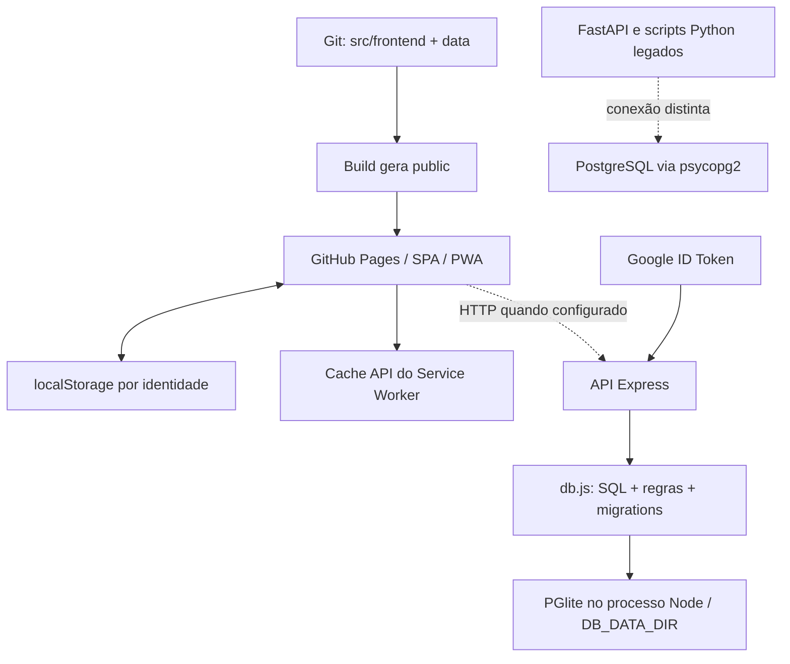
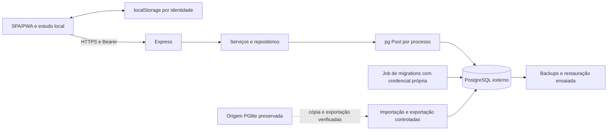

# D4.4 — Auditoria arquitetural PGlite → PostgreSQL

Data: **25/09/2026**. Escopo: auditoria do checkout, sem implementação da migração.

## 1. Resumo executivo

**A migração é viável com reaproveitamento amplo do Express, SQL, autenticação, RBAC e frontend local-first. Não requer reconstrução da plataforma nem adoção de ORM.** A recomendação é substituir o ciclo de vida PGlite por um adaptador `pg` com pool, preservar inicialmente a fachada de funções de `db.js`, separar migrations do startup e corrigir os pontos de concorrência e serialização antes de publicar.

O banco embarcado não aparece no navegador: a persistência pessoal local usa `localStorage`, com chaves por identidade; o frontend fala HTTP com a API. Assim, trocar o motor remoto não exige trocar namespaces, limpar caches de progresso ou recriar identidades. Evidências: `src/frontend/js/storageManager.js:47-83`, `src/frontend/js/core/sessionManager.js:11-79`, `src/frontend/js/services/api.js:109-177`.

| Constatação principal | Estado e consequência | Evidência |
| --- | --- | --- |
| SQL já é majoritariamente PostgreSQL | UUID, JSONB, arrays, enums, views, triggers, UPSERT e parâmetros posicionais são reaproveitáveis; execução no PostgreSQL externo ainda não comprovada | `backend/database/schema.sql:7-32,217-294,490-545`; `backend/database/db.js:276-283,1726-1791` |
| Node ativo só abre PGlite | Não basta configurar `DATABASE_URL`; é preciso substituir conexão, `.exec()`, `.transaction()`, `.closed` e `.close()` | `backend/database/db.js:286-525`; `package.json:54-69` |
| PostgreSQL já existe como infraestrutura/código legado | Compose PostgreSQL 16 e Python/psycopg2 existem, mas não atendem o contrato do Express/D4.3 | `docker-compose.yml:1-19`; `backend/api/database.py:5-21`; `src/python/scripts/migrate_to_postgres.py:39-45,181-197` |
| `schema.sql` não representa sozinho o schema efetivo | Falta `local_identity_links`; lista de módulos é ampliada por migration JavaScript | `backend/database/localLinks.js:8-25`; `backend/database/db.js:378-385` |
| Trocar para pool altera pressupostos de concorrência | Seeds usam BEGIN/COMMIT em chamadas globais; quizzes leem estado sem bloquear a tentativa; RBAC faz múltiplas escritas sem atomicidade | `scripts/seed/seed-pglite.mjs:226-240`; `backend/database/db.js:2985-3137,2067-2247` |
| Contrato `version` pode quebrar com `pg` | Coluna BIGINT e frontend exige número inteiro seguro; adaptar serialização na API | `schema.sql:78-85`; `src/frontend/js/dataRepository.js:48-66`; [parser oficial pg-types](https://github.com/brianc/node-pg-types#use) |
| Há lacunas preexistentes na sincronização | Vínculo v1 cobre cinco módulos; gamificação global encontra rejeição na API; merges de labs/eventos XP perdem itens remotos | `src/frontend/js/core/contracts/localLinkMigration.js:1-10`; `backend/api/routes/me.js:159-179`; `src/frontend/js/progressSync.js:170-190,237-240` |
| Há risco de autorização editorial | CRUD aceita estado/logs de validação sem checagem por certificação equivalente à rota `/validate` | `backend/api/routes/questions.js:178-200,314-384`; `backend/database/db.js:882-898,920-954` |
| Recuperação da origem permanece pendente | Os ~32 MB e a falha próxima de 1 GB no Railway são informações fornecidas, não evidência de vazio ou corrupção | Contexto D4.4; utilitário em `scripts/diagnostics/pglite-recovery.mjs:5-35` |

### 1.1 Método, estado Git e limites da evidência

- Branch observada: `login-integracao`; HEAD `270e1ac774325f7ecd235dcdfbbccad29abc59cc` (`feat: implement hybrid mode support with Google login configuration and update translations`). `git status --short --branch`, `git diff --stat` e `git diff --cached --stat` não mostraram alterações iniciais. A referência local de tracking aparecia sem ahead/behind; não houve fetch, portanto isso não prova estado atual do remoto nem publicação.
- O contexto informa D4.3 local e alteração pendente em `__tests__/publicRuntimeConfig.test.js`; **neste checkout ambos já estavam sem diff**. O arquivo foi somente lido; hash Git inicial `efdd9eea5127ce30d6c3fa473984b0fae7a297d9`. Não se tentou recriar, descartar, stagear ou modificar trabalho anterior.
- Inventário por `git ls-files`: **684 arquivos versionados**. Leitura direta dos caminhos críticos, busca transversal de persistência/identidade/consumidores, enumeração de SQL/rotas e análise dos datasets JSON. Arquivos visuais e artefatos foram inventariados por função; não se afirma revisão linha a linha de todo CSS, imagem ou conteúdo textual de cada questão.
- Não foram executados startup, seeds, migrations, build, Jest, Playwright, Docker ou utilitário de recuperação. Esses comandos podem criar/alterar arquivos e bancos. Não houve consulta à conta Railway, ao volume, ao Google Console ou a bancos. Nenhuma credencial de `.env` foi lida ou incluída.
- Foram executadas apenas duas sondas de funções puras de reconciliação, em memória, e contagens/leitura de JSON/lockfile. Seus resultados são descritos na seção 9. Não substituem testes integrados.
- A enumeração genérica encontrou seis diretórios temporários `scratch/python-data-test-*` com acesso negado; o inventário versionado foi obtido pelo Git. Conteúdo privado/ignorado desses temporários não foi auditado. Dependências instaladas e estado persistente local não foram tratados como fonte de dados produtivos.
- Documentação pública de preços/driver foi consultada em 25/09/2026, via Firecrawl e busca web, somente leitura. Preços não são orçamento contratado. Não se enviou conteúdo do repositório aos provedores consultados.
- **Implementado** significa caminho concreto encontrado. **Funcional verificado nesta auditoria** aplica-se somente às sondas explicitamente executadas. Testes existentes constituem cobertura encontrada, não PASS atual. **Parcial**, **legado**, **somente testes**, **planejado** e **não verificável** são usados separadamente abaixo.

## 2. Estado atual da arquitetura



O diagrama representa dependências do código, não confirmação de serviços online. O workflow Pages define `PUBLIC_BUILD_TARGET: local-first`; o artefato local `public/js/runtimeConfig.js:1` tem `localFirst: true` e URL de API vazia. O suporte `hybrid` existe em `scripts/public-runtime-config.cjs:14-57` e em `e2e/local-first.spec.js:6-35`, mas publicação híbrida não foi verificada. O comando `npm run dev` inicia Express e build/servidor estático, não FastAPI (`package.json:20-30`).

| Ambiente | Implementação atual | Limite relevante |
| --- | --- | --- |
| Desenvolvimento Node | PGlite persistente, exige `DB_DATA_DIR`; `.env.example` sugere `.pglite-data` | API e seed não devem abrir simultaneamente o mesmo diretório; `db:dev` não provisiona PostgreSQL (`db.js:286-321`; `backend/server.js:28-44`) |
| Testes unitários/integração | PGlite `memory://` em testes integrados; mocks em outros; temporários persistentes em produção/seed | Não demonstra comportamento de pool/conexões concorrentes PostgreSQL (`__tests__/api.integration.test.js:61-62`; `apiProduction.test.js:10-17`; `api.validation.test.js:66-109`) |
| CI | `NODE_ENV=test`, `DB_DATA_DIR=memory://`, Node 22 | Seed em processo separado não persiste para o próximo processo em memória; fixtures precisam preparar seus próprios dados (`.github/workflows/ci.yml:22-56`) |
| Produção Node pretendida pelo código | PGlite persistente obrigatório, segredo HMAC e Google client ID validados | Processo só escuta após inicialização do banco; falha de abertura impede HTTP (`backend/api/config.js:9-35`; `server.js:164-191`) |
| Railway informado | Volume `/app/pglite`, cerca de 32 MB, inicialização terminando perto de 1 GB | Integridade, conteúdo, backup e última versão executada não verificados nesta auditoria |
| Navegador | `localStorage` de progresso/sessão; `sessionStorage` transitório; Cache API de assets/dados | Não foi encontrada implementação IndexedDB nem BroadcastChannel no código JS de `src/` e `backend/`; não criar dependência do banco remoto para estudar |
| PostgreSQL local legado | Serviço `postgres:16-alpine`, volume nomeado, porta 5432 | Apenas configuração; sem healthcheck, migrations ou API acoplada no Compose; credencial literal de desenvolvimento (`docker-compose.yml:1-19`) |

## 3. Inventário do repositório e dependências indiretas

| Área / quantidade inicial | Módulos e responsabilidade | Resultado da auditoria |
| --- | --- | --- |
| `backend/` — 36 arquivos | Express, 8 routers, middleware RBAC, OIDC/HMAC, SQL, local links, normalização, FastAPI/analytics Python | Backend Node ativo centraliza persistência em `db.js`; Python é trilha separada (`server.js:15-22,117-125`; `backend/analytics/gaps_analyzer.py:37`) |
| `src/` — 174 arquivos | SPA/PWA, serviços HTTP, sessão/storage, regras de estudo, páginas administrativas, scripts Python | Não existe `src/services/` versionado apesar da referência genérica em AGENTS.md; clientes reais estão em `src/frontend/js/services/` e `src/frontend/validation/js/` |
| `scripts/` — 21 arquivos | Build/config pública, seeds, migrations corretivas, diagnóstico/recuperação, validação e ferramentas de taxonomia | Todos os seeds Node usam a mesma fachada PGlite; `pglite.js` abre instância própria; build regenera `public` (`scripts/build.cjs:98,243-253,374-388`) |
| `data/` — 44 arquivos | 39 JSONs, README de contribuições e marcadores de diretório | Conteúdo editorial/estático e mocks; não são backup do progresso real. Inventário detalhado na seção 7 |
| `public/` — 211 arquivos | Saída copiada/gerada, JSONs, runtimeConfig, PWA e páginas de validação | Manter como artefato; não editar manualmente. O build copia inclusive `data/mock/` (`scripts/build.cjs:374-388,504-508`) |
| `__tests__/` — 92 arquivos | 91 arquivos `.test.js` e fixture de processo; contratos, autenticação, sincronização, UI e conteúdo | Existem testes reais PGlite e testes com mocks; distinguir cada família na seção 16 |
| `backend/database/db.test.js` e testes Python | CRUD/SQL e validação dos bancos de questões | Além de `__tests__`; testes Python de conexão não provam o ambiente externo atual |
| `e2e/` — 29 arquivos | 26 specs, helper, runner e servidor de `public` | Servidor padrão é estático; vários fluxos usam `page.route/fulfill`, inclusive Google/API (`playwright.config.js:24-33`; `e2e/auth-continuity.spec.js:19-38`) |
| `.github/` — 18 arquivos, 9 workflows | CI, Pages, geração, contribuições, estatísticas e testes Python | Não foi encontrado pipeline versionado de deploy da API/PostgreSQL. Automação de conteúdo pode alterar JSONs por PR/commit; precisa integrar futura fonte editorial |
| `docs/` — 22 documentos antes desta auditoria | Arquitetura, API, operação, PGlite, dados, roadmap e regras de progresso | Documentos históricos divergem do código em pontos; usar implementação/consumidores como evidência principal (`docs/roadmap.md:14-15`; `docs/D2_GAMIFICATION_XP.md:24-29`) |
| Raiz e `config/` | `package*`, Compose, Jest/Playwright/ESLint/Prettier, `.env.example`, scripts auxiliares | Lock fixa PGlite 0.5.4/socket 0.2.7; não há driver Node PostgreSQL/ORM; Node local observado 24.14.0 difere do CI 22 |
| `scratch/` — 8 versionados | Experimentos de DOM/IDs/API e SQLite/PGlite | Legados/diagnóstico, não entrada de produção; `scratch/test_db.mjs:4-12` referencia SQLite, não prova terceiro banco ativo |
| `img/`, CSS, páginas e traduções | Assets, UI, acessibilidade e contratos visuais | Reaproveitar; não dependem diretamente do driver. Fluxos de login/estado podem depender indiretamente das respostas HTTP |

Dependências indiretas que não podem ser esquecidas:

- `backend/database/domainTaxonomy.js:4-11` importa `src/frontend/js/data.js` e lê `data/taxonomy/canonical_taxonomy.json` no carregamento. Empacotar apenas `backend/` quebra a API atual; incluir os arquivos ou extrair um pacote compartilhado futuramente.
- `backend/database/localLinks.js:2-6` importa o contrato de migração do frontend. Compartilhamento é real e útil; a localização física não deve desaparecer da imagem Node.
- `quizEngine.js:379-413`, `quizManager.js:55-104,171-267`, `caseManager.js:216-303`, páginas de validação e leaderboard dependem de IDs, datas, paginação, erros e envelopes da API, mesmo sem conhecer PGlite.
- `storageManager`, projections de XP/streak/revisão/erros, diagnóstico, Sprint, Jornada, recomendações e analytics do frontend dependem de dados locais persistidos; não convertê-los para leitura obrigatória do banco.
- `core/domain/*/contracts.js` e `core/application/useCases/contracts.js` têm interfaces e métodos `Not implemented` (`useCases/contracts.js:13-20,34-44,68-76`). **Planejado/abstrato**, não camada de repositórios backend implementada. Referências textuais a React nesses contratos não significam migração da SPA para React.
- `ShowcaseService` é demonstração/legado: chama `clearAll()` e `AuthService.setMockUser()` (`services/showcaseService.js:18-40`), ausente na fachada atual de `authService.js:35-201`. Não executar nem usar mocks para compor produção.

### 3.1 Workflows e ferramentas editoriais

`ci.yml:49-71` valida dados, semeia PGlite, roda cobertura, build e browser. `deploy-pages.yml:24-29,47-77,111-162` publica somente frontend. `auto-merge-contributions.yml:49-57,82-91` modifica os JSONs; `generate-questions.yml:3-22` executa pipeline Python; `validate-contributions.yml:52-78`, `validate.yml:34-39` e `test-python-scripts.yml:41-48` validam/ensaiam contribuição. `stats-report.yml:68-77` atualiza estatísticas; `prevent-main-file-edits.yml:38-60` protege edição direta de bancos de questões. São consumidores da governança de conteúdo, não migrations do banco remoto. Nenhum workflow foi disparado.

## 4. Mapa completo das dependências PGlite

### 4.1 Núcleo e contratos do adaptador

| Ponto | Acoplamento comprovado | Adaptação necessária |
| --- | --- | --- |
| `db.js:6,21,286-321,426-457` | Import PGlite, URI `memory://`, diretório, `PGlite.create`, retry por mensagem `Aborted`/`RuntimeError` | Configuração PostgreSQL por URL, abertura de pool e política de falhas por SQLSTATE/conexão; não traduzir genericamente OOM em conflito de diretório |
| `db.js:324-342` | Reescreve schema removendo extensões e índices GIN, substituindo-os por índice em tags | PostgreSQL deve receber migrations explícitas; não carregar esse filtro. Comentário do código sobre suporte PGlite não é prova de limitação de toda versão do motor |
| `db.js:345-385` | Conta presença de 15 tabelas e executa seis migrations JS sempre | Manifesto versionado/checksum/lock de migrations; presença de tabelas não garante colunas, constraints, índices ou views corretos |
| `db.js:276-283,543-565` | `executeQuery` retorna array de rows; `executeSql` descarta resultado de `.exec()` | Preservar array público; `pg.query` retorna objeto. Adaptar multi-statements e não misturar DDL com queries parametrizadas |
| `db.js:1526,2769,2985,3163,3274`; `localLinks.js:80` | Transação callback recebe executor com `.query()` | Implementar wrapper com **um client reservado** para BEGIN, callback, COMMIT/ROLLBACK e release |
| `db.js:389-396,406-413,499-525` | Singleton, `.closed`, promessa de inicialização/fechamento, `close()` | Readiness por consulta e versão de schema; `pool.end()`, falhas de conexão e estado de draining |
| `api/config.js:9-16`; `api/server.js:164-185` | Produção valida caminho persistente antes do listen | Validar `DATABASE_URL`/TLS; manter segredo/sessão/Google/PORT/TRUST_PROXY; API não deve montar banco local |
| `scripts/seed/*`; `scripts/migrate/*`; `scripts/migrations/*` | `dataDir`, inicialização com migrations, BEGIN/COMMIT globais | Injetar executor transacional e separar comandos de importação das migrations de schema |
| `scripts/diagnostics/pglite-recovery.mjs:3-35` | Abre PGlite diretamente e `dumpDataDir()` | Conservar para recuperar origem; dump físico não é dump SQL PostgreSQL |
| `backend/database/socketServer.js:6-39`; `scripts/pglite.js:4-32` | Socket compatível com protocolo PostgreSQL sobre PGlite | Não confundir com driver externo; aposentar depois de recuperação/rollback |
| `backend/server.js:8-44`; `database/example.js:7` | Inicialização isolada/example | Retirar do caminho normal após migração; exemplos precisam de destino explícito seguro |
| Dependências | `package-lock.json:758-850`: PGlite 0.5.4, socket 0.2.7 e peers de extensões | Manter versões congeladas de recuperação; remover do runtime apenas após critérios da seção 16 |

### 4.2 Importadores diretos de `db.js`

Inventário por `git grep -n 'db.js'`, excluindo comentários da contagem lógica:

| Grupo | Arquivos e linhas de importação |
| --- | --- |
| Servidor e autorização | `backend/api/server.js:15,130`; `backend/api/middleware/requireRole.js:18` |
| Routers | `backend/api/routes/access.js:2-10`; `auth.js:16`; `cases.js:9-17`; `me.js:2-6`; `questions.js:10-23`; `quizzes.js:9-20`; `users.js:9-15` |
| Serviço e links | `backend/api/services/simulatorEngine.js:1`; `backend/database/localLinks.js:1` (router `routes/localLinks.js:3-7` depende indiretamente) |
| Ferramentas | `backend/server.js:8`; `backend/database/socketServer.js:7`; `example.js:7`; `scripts/seed/seed-pglite.mjs:4-10`; `seed-cases.mjs:11-15`; `seed-users.mjs:14-20`; `scripts/migrate/merge-duplicate-users.mjs:3`; `reconcile-legacy-questions.mjs:1-5`; `scripts/migrations/migrate-validation-status.mjs:4-8` |
| Testes reais/fixtures | `backend/database/db.test.js:1-42`; `__tests__/accountPersistence.test.js:7`; `api.access.test.js:4`; `api.integration.test.js:11-16`; `auth401.test.js:3-9`; `authRoles.test.js:3-11`; `casesEvaluateAuth.test.js:3-10`; `databaseRetry.test.js:8-14`; `datasetSeeds.test.js:5-17`; `duplicateUsersMigration.test.js:3-10`; `googleAuth.test.js:18-26`; `googleAuthRoute.test.js:18-19`; `localLinks.test.js:3-10`; `validationStatusMigration.test.js:3-9`; `fixtures/api-production-child.mjs:2` |
| Mocks | `__tests__/api.validation.test.js:66-109,197` simula o módulo; não comprova SQL real |

Há aberturas diretas adicionais em `__tests__/apiProduction.test.js:10,198`, `scripts/pglite.js:13`, `scripts/diagnostics/pglite-recovery.mjs:8`; `databaseRetry.test.js:7,21` intercepta `PGlite.create`. `scratch/test_full.mjs:1` contém import experimental. Não foi encontrado adaptador `pg`, `postgres`, Knex, Prisma, Sequelize ou Drizzle instalado no lock; o comentário Drizzle em `scripts/pglite.js:7` não é implementação.

## 5. Componentes já compatíveis com PostgreSQL

1. **Modelo e queries:** SQL usa `$n`, `RETURNING`, `ON CONFLICT`, `ANY`, `ILIKE`, CTEs, agregações JSON, enums e triggers. É o maior ativo reaproveitável (`db.js:1011-1270,1916-1933,2731-2826,3848-3990`). Compatibilidade sintática é evidência estática, não ensaio de migration.
2. **Fachada de dados:** `queryRows`, `executeQuery` e funções CRUD já concentram acesso (`db.js:276-283,543-565`). É possível manter assinaturas e extrair gradualmente repositórios de identidade, acesso, questões, quizzes, módulos e cases. O domínio não precisa ser reescrito; a atomicidade precisa ser explicitada.
3. **Python/psycopg2:** `backend/api/database.py:10-21`, `backend/database/config.py:10-19`, `run_schema.py:36-55` acessam PostgreSQL. São reutilizáveis como referência de SQL/configuração, **não** backend substituto pronto. Não têm pool/TLS explícito, usam defaults de desenvolvimento e o verificador de schema lista só sete tabelas (`run_schema.py:60-64`).
4. **Compose:** base para desenvolvimento isolado PostgreSQL 16, após ajustar credenciais, porta, healthcheck e aplicação de migrations. A credencial literal e porta aberta em `docker-compose.yml:7-16` impedem tratá-lo como manifesto de produção.
5. **Importador Python:** importa JSON→PostgreSQL, não PGlite→PostgreSQL. Importa só PT, deduplica por texto, omite `language`/`source_question_id` e não preserva UUIDs (`migrate_to_postgres.py:39-45,94-123,139-172,181-197`). Seu comentário sobre inexistência de idioma está desatualizado. Candidato a aposentadoria após substituir importação editorial; não usar para migrar usuários/progresso.
6. **Autenticação e frontend:** OIDC/HMAC e políticas de UI não dependem do motor; `requireAuth` depende da consulta do usuário. Preservar contratos/UUIDs permite manter identidade lógica (`sessionToken.js:22-32`; `requireRole.js:47-65`).

## 6. Auditoria do schema efetivo

São **21 tabelas em `schema.sql` + `local_identity_links` na migration JS**, duas views, quatro enums e a função `update_updated_at`. Não foram encontradas tabelas de labs, flashcards, dicas, sessões HMAC, refresh tokens ou ledger relacional de XP. Estado desses módulos pode estar no navegador ou em JSONB; não inventar tabelas na importação.

Nas tabelas abaixo, **O** = obrigatório (`NOT NULL`, PK ou chave composta); **N** = anulável. Valores com default não são automaticamente obrigatórios. Dados pessoais e progresso vinculado ao UUID devem ser tratados como sensíveis operacionalmente, mesmo sem senha armazenada.

### 6.1 Identidade, permissões e sincronização

| Entidade / finalidade | PK, FKs e relacionamentos | Campos O / N, constraints e índices | Criação/atualização e riscos |
| --- | --- | --- | --- |
| `users` — conta lógica | PK UUID `id`; é pai de progresso, identidade, autorizações e auditoria | O: role, is_active, created_at, updated_at. N: anonymous_name, email, full_name, nickname, last_login. UNIQUE anonymous_name; índice único parcial `lower(trim(email))`, nickname único parcial; índices role/ativos; CHECK das três roles; trigger updated_at | `db.js:1405-1438,1453-1632,1853-1883,2194-2247`. E-mail/nome são pessoais. Nickname único pode colidir com Google `given_name` ou parte local de emails; preservar UUID e resolver colisão sem fundir pessoas. Schema `39-70,97-122` |
| `user_identities` — vínculo OIDC | PK UUID; FK user→users CASCADE; UNIQUE(provider,subject); índice user_id | O: user_id, provider, subject, created_at, updated_at; N: email_at_link,last_login_at | `db.js:1516-1632`; schema `59-70`. `sub` é identidade externa, não o UUID da aplicação. Falta unicidade `(user_id,provider)` para reforçar a regra de uma identidade Google por conta; hoje verificação apenas em código e sujeita a concorrência |
| `user_module_state` — snapshot remoto por conta/módulo/certificação | PK UUID; FK users CASCADE; UNIQUE(user_id,module,certification_id); índice(user_id,updated_at DESC) | O: todos os campos definidos: user_id,module,certification_id,state_json,version,updated_at. Escopo global `''`; JSONB default `{}`; BIGINT positivo; CHECK módulo ampliado por JS | `db.js:1656-1801`; schema `78-94,181-183`; `localLinks.js:22-24`. Sem FK/check de certificação no SQL, sem schema de payload; 256 KiB só na aplicação. Progresso pessoal. CAS opcional permite sobrescrita incondicional |
| `local_identity_links` — titularidade de origem local | PK UUID; UNIQUE local_identity_id; FK users RESTRICT; índice user_id | O: local_identity_id,user_id,status,migration_version,created_at,updated_at. N: completed_at. CHECK pending/completed, versão >0, completed↔timestamp | `localLinks.js:8-25,58-119`. Vínculo protege contra segunda conta após claim; ID local não é prova criptográfica de posse do dispositivo. Preservar também registros pending; não completar por mera existência de UUID |
| `validator_requests` — solicitação por certificação | PK UUID; user CASCADE; reviewed_by→users SET NULL | O: user,certification,status,requested_at; N: credential_id,credential_url,notes,reviewed_at,reviewed_by,review_notes. ENUM cert; CHECK status; UNIQUE parcial(user,cert) se PENDING; índice(status,requested_at) | `db.js:1993-2163`; schema `128-147`. Credenciais/notas são pessoais; falta coerência SQL entre review/status; listagem sem paginação |
| `validator_certifications` — escopo concedido | PK(user_id,certification_id); user CASCADE; verified_by SET NULL; source_request_id→requests SET NULL | O: chaves,verified_at,is_active; N: verified_by,source_request_id; sem índice adicional nas FKs de referência | `db.js:1936-1989,2114-2151`; schema `149-157`. Preservar autorizações ativas/inativas; role VALIDATOR sozinha não autoriza certificações |
| `role_audit_log` — trilha administrativa | PK UUID; actor_user_id e target_user_id→users RESTRICT; índice(target,created_at) | O: actor,target,action,metadata,created_at. N: old_role,new_role,certification_id. JSONB metadata; old/new role sem CHECK | `db.js:2166-2247,1967-1975`; schema `159-170`. Não é append-only por privilégio DB; bootstrap não passa por esta trilha; crescimento sem retenção definida |

### 6.2 Questões, tentativas e atividade

| Entidade / finalidade | PK/FKs | Campos e integridade | Escritores / observações |
| --- | --- | --- | --- |
| `domains` — domínios | UUID; UNIQUE(certification,slug) | O: cert,name,slug,created_at; N: weight_percent sem faixa; índice cert | Seed embutido `schema.sql:554-583`; definição `194-210`. Mapa duplicado em taxonomia JSON/`data.js`; alterações de peso/nome não atualizadas pelo DO NOTHING |
| `questions` — conteúdo editorial | UUID; domain_id→domains SET NULL; validated_by_id→users SET NULL adicionado via ALTER | O: cert,domain,difficulty,text,options,correct_answer,explanation,is_active,status,logs,created_at,updated_at. N: domain_id,language,source_question_id,reference_url,tags,rejection_reason,validated_by,validated_at,validated_by_id. CHECK arrays mínimos/texto/status/idioma; identidade editorial única parcial(cert,lang,source); índices cert/domain/domain_id/difficulty/status/validator/ativo/tags GIN/cert+lang/cert+lang+domain/full-text PT | Schema `217-298`; `db.js:1171-1270,1305-1319,3723-3768`; seed `154-169`. FK de validador existe, mas fluxo de validação grava o campo textual. JSON não garante que resposta pertence às opções; validação JS faz parte do contrato |
| `quiz_history` — tentativa remota | UUID; user→users CASCADE | O: user,cert,status,score,total,percentage,domain_scores,started_at. N: weak_domains,time_spent_secs,completed_at,abandoned_at. CHECK score≥0≤total, total>0, percentage 0..100, tempo≥0, estados/timestamps coerentes. Índices user,cert,status,completed DESC,percentage DESC | Schema `305-379`; `db.js:2731-2826,2853-2934,3157-3326`. Legado sem status é classificado completed conservadoramente; não reconstruir tentativa por nota. Não guarda língua/revisão de conteúdo de forma explícita |
| `quiz_questions` — conjunto ordenado da tentativa | PK(quiz,question); quiz CASCADE; question RESTRICT; UNIQUE(quiz,position); índice question | Todos O; position≥0 | Schema `383-390`; `db.js:2814-2822`. Preserva membership, não snapshot da questão. Alteração editorial posterior afeta explicação/avaliação se não houver versionamento |
| `answers` — resposta individual | UUID; quiz CASCADE; question SET NULL | O: quiz,user_answer,is_correct,membership_enforced,answered_at; N: question,time_secs. CHECK tempo≥0; índices quiz/question/correct; UNIQUE parcial(quiz,question) para novas respostas | Schema `397-423`; `db.js:2966-3149`. Legado mantém membership_enforced=false. Não há FK composta para comprovar membership; aplicação verifica. Não eliminar respostas legadas sem question_id |
| `gamification` — agregado relacional | UUID; user→users CASCADE e UNIQUE | O: user,contadores,score,streaks,arrays de badges/etapas,labs_completed,xp_points,created_at,updated_at; N: last_date. CHECK contadores≥0, score 0..100, streak atual≤máximo; índices user,XP DESC,streak DESC; trigger updated_at | Schema `430-462`; `db.js:2335-2396`. GET cria registro se ausente; corrida SELECT→INSERT. `updateGamification` tem uso em testes, sem rota Express de sincronização do agregado identificada; não é ledger de XP atual do navegador |
| `focus_sessions` — sessões Pomodoro | UUID; user→users CASCADE | Todos O: user,minutes,session_type,session_date,created_at; minutes>0; enum focus/short_break/long_break; índices user,date DESC,type | Schema `469-483`. Não há escritor/endpoint Express ativo encontrado. `dataRepository.js:416-424` chama hook opcional inexistente na API; frontend usa `work`, exigindo mapeamento futuro para `focus` |

### 6.3 Cases e serviços

| Entidade | PK/FKs e índices | Campos O / N e constraints | Escritor e situação |
| --- | --- | --- | --- |
| `aws_services` | UUID; slug UNIQUE; índices slug/category/ativo | O: slug,name,category,short_desc,is_active,created_at; N: icon_url,doc_url | `schema.sql:620-640`; `seed-cases.mjs:94-108`; `db.js:4047-4082`. Catálogo público, UUID diferente de `service_id` editorial |
| `cases` | UUID; slug UNIQUE; índices slug/difficulty/ativo; trigger updated_at declarado duas vezes com mesmo nome | O: slug,title,scenario,objective,difficulty,certifications,architecture_graph,resources,content_pt,content_en,tags,is_active,client_persona,constraints,created_at,updated_at; N: budget_usd. Enum dificuldade; arrays de cert sem FK/check de valores | `schema.sql:647-684,732-734`; `seed-cases.mjs:111-145`; `db.js:3997-4044`. Traduções são snapshots JSONB; revisar precedência com campos escalares para evitar versões contraditórias |
| `case_services` | PK(case,service), duas FKs CASCADE, índices em ambos | N: role_note; demais O | `schema.sql:741-752`; `seed-cases.mjs:148-167`: apaga vínculos do case e recria dentro da transação de seed |
| `case_questions` | PK(case,question); case CASCADE; question SET NULL; índices em ambos | PK torna question_id obrigatório apesar da declaração aparentemente anulável; sort_order O default 0 | `schema.sql:759-770`. **SET NULL conflita com PK** ao apagar questão referenciada. CRUD normal faz soft delete; risco em manutenção/importação. Não há seed ativo desta relação encontrado |
| `case_dialogues` | UUID; case CASCADE; índice case | O: case,question,answer,sort_order; N: hints | `schema.sql:691-699`; helper `db.js:4104-4131`. GET ativo, mas seed atual não popula diálogos; helper sem chamador produtivo identificado |
| `case_events` | UUID; case CASCADE; índice case | O: case,title,description,sort_order; N: impact_type,trigger_condition | `schema.sql:706-715`; `db.js:4134-4163`. GET ativo, população não comprovada |
| `case_evaluation_criteria` | UUID; case/service CASCADE; índice case, sem índice service | O: case,service,pillar,score_impact,feedback_msg; sem CHECK pillar/UNIQUE semântico | `schema.sql:722-730`; `db.js:4166-4190`; `simulatorEngine.js:19-24`. Engine ativo lê critérios; seed atual não os popula. Não confundir engine existente com catálogo avaliativo completo |
| `case_progress` | PK(user,case), ambas FKs CASCADE | O: user,case,completed,started_at; N: completed_at; falta CHECK completed↔timestamp | `schema.sql:777-784`; `db.js:4085-4101`; `routes/cases.js:110-129`. Upsert de conclusão real; sem endpoint para hidratação de todo progresso de cases |

### 6.4 Views, tipos, índices e melhorias justificadas

- `leaderboard` reúne nickname/anonymous_name e agregado `gamification`, filtra ativos, calcula RANK; `getLeaderboard` limita 100 (`schema.sql:490-504`; `db.js:3366-3383`). Não expõe email pela view, mas depende de agregado sem alimentação canônica do ledger local.
- `user_stats` agrega quizzes completed e sessões de foco, evitando multiplicação pelo join; `getUserStats` normaliza vários números explicitamente (`schema.sql:511-545`; `db.js:3396-3465`). Não representa por si só todo progresso offline.
- Enums: `certification_type`, `difficulty_level`, `session_type`, `case_difficulty` (`schema.sql:14-32,595-613`). PostgreSQL suporta os tipos; futuras adições de valores devem ter migration própria e ordem segura de commit antes do uso, sem presumir que o `DO duplicate_object` atual atualiza todos os enums.
- `update_updated_at`/triggers atualizam users, module_state, questions, gamification, cases (`schema.sql:173-187,296-298,460-462,682-684`). Demais timestamps são controlados explicitamente pelo código ou não têm atualização automática.

| Problema concreto | Recomendação para a implementação futura | Prioridade |
| --- | --- | --- |
| Inicialização valida só presença de tabelas; não há ledger de migrations | Baseline do schema efetivo + migrations numeradas/checksum, lock e verificação de versão na readiness. Mover DDL para job separado. `db.js:345-385` | Bloqueador |
| `CREATE INDEX users(email)` precede ALTER que adiciona email em tabelas legadas | Inventariar schema da origem antes de aplicar baseline; migration ordenada por estado suportado, ensaio de banco antigo (`schema.sql:54-55,97-103`) | Alto |
| `migrateLocalLinks` faz DROP/ADD constraint sempre | Substituir repetição no startup por migration versionada; prevenir lock/conflito entre réplicas (`localLinks.js:22-24`) | Alto |
| Escritas RBAC e proteção do último ADMIN não são atômicas | Transação única para request/certificação/role/audit; validar resultado do UPDATE PENDING; serializar alterações administrativas globais relevantes. Dois admins concorrentes podem ambos passar COUNT antes de se desativarem (`db.js:2098-2163,2211-2247`) | Bloqueador de produção |
| Quizzes: transações sem lock da tentativa | Bloquear a mesma linha de quiz antes de answer/finish/abandon; tratar duplicatas por constraint e retorno idempotente. Evitar resposta gravada após conclusão e agregados defasados (`db.js:2987-2996,3114-3137,3164-3172`) | Bloqueador |
| E-mail normalizado só no código; busca usa LOWER sem TRIM | Uniformizar expressão consultada/indexada e tratar conflitos sem escolher silenciosamente maior role; novo CHECK só após análise dos legados (`schema.sql:54`; `db.js:1458-1466,1578-1584`) | Alto |
| Nickname único colide com `given_name` | Política de apelido não bloqueante/geração de sufixo ou unicidade apenas quando realmente necessária; não alterar UUID/role por colisão (`schema.sql:55`; `routes/auth.js:106-109`) | Alto |
| TIMESTAMP sem timezone para instantes | Definir origem temporal antes de converter para TIMESTAMPTZ; UTC no processo/DB; manter DATE para dia de foco/streak. Não aplicar fuso arbitrário aos dados existentes (`schema.sql:48-50,316-318,437,474`) | Alto |
| JSONB/module payload sem versão de formato | Preservar BIGINT como revisão de concorrência e introduzir versão de payload separada quando houver evolução; validar módulos/limites no servidor (`schema.sql:83-85`; `db.js:1672-1685`) | Alto |
| Validador textual e FK divergentes | Novas validações devem gravar UUID canônico; backfill apenas para textos que correspondam inequivocamente a users, conservar texto histórico (`db.js:3750-3766`; `schema.sql:260`) | Alto |
| Conteúdo de tentativa mutável | Versionar ou guardar snapshot editorial mínimo para correção/revisão histórica consistente; preservar membership/IDs atuais. Resolve mudança de gabarito durante tentativa (`db.js:3009-3043,3185-3197`) | Alto, fase própria |
| `case_questions` SET NULL incompatível com PK | Escolher RESTRICT/CASCADE conforme retenção editorial, ou remodelar chave se nulo for requisito. Não mudar durante importação sem validar relações (`schema.sql:759-764`) | Alto |
| Listagens/índices não acompanhando acesso | Medir EXPLAIN antes de criar índices: candidato `(user_id,status,completed_at DESC,id)` para histórico; FKs reviewer/actor/service se consultas/deletes justificarem. `getUserById` usa `id::text`, que não aproveita diretamente índice UUID (`db.js:1645,2911-2918`) | Médio |
| Busca ILIKE não usa índice full-text PT | Ou manter ILIKE com índices trigram adequados após medição, ou mudar busca em fase de contrato; não afirmar ganho só por recriar GIN (`db.js:1129-1141`; `schema.sql:8,294`) | Médio |
| Crescimento e paginação | Paginar requests (`db.js:2041-2064`), histórico de validação hoje truncado em 200 (`3639-3674`), catálogo de serviços/diálogos/eventos quando necessário; definir retenção para quiz/answers/audit/JSON de logs. Não apagar na migração | Médio |

Índices redundantes de PK/UNIQUE (ex.: gamification.user_id, slugs, prefixos de PK composta) podem ser avaliados depois, sem remoção estética agora. Não se recomenda normalizar todo JSONB/array: os snapshots de módulos e conteúdo bilíngue têm uso concreto; separar logs/eventos só onde concorrência, auditoria, consulta ou tamanho o justifiquem.

## 7. Dados, seeds e fonte de verdade

### 7.1 Inventário dos JSONs versionados

Contagens obtidas lendo JSONs em memória, sem importá-los. `:1` identifica cada documento completo como evidência de conteúdo; números de registros não são contagens da origem Railway.

| Caminhos | Quantidade/conteúdo observado | Classificação e fonte proposta |
| --- | --- | --- |
| `data/questions/{clf-c02,saa-c03,dva-c02,aif-c01}{,-en}.json:1` | 8 arquivos: CLF 394 PT +394 EN; SAA 285+285; DVA 284+284; AIF 306+306; **2.538 registros** | A/B: manter distribuição estática; no estágio inicial Git autoritativo do texto, DB projeção e decisões operacionais. Evolução editorial descrita abaixo |
| `data/nivelamento/diagnostic-{clf-c02,saa-c03,dva-c02,aif-c01}{,-en}.json:1` | 8 arquivos: CLF/SAA/DVA 4 por idioma; AIF 10 por idioma; total 44 | A: conteúdo diagnóstico versionado, não histórico de alunos |
| `data/cases/architecture_cases.json:1` | 25 cases | A/B: Git autoritativo, DB projeção por slug preservando UUID; não importar automaticamente simulador adicional |
| `data/labs/labs.json:1` | 18 labs | A: catálogo estático; C para IDs concluídos por aluno; sem tabela de labs atual |
| `data/exam-tips.json:1` | 151 dicas | A: Git/Pages, não necessita tabela só pela troca do motor |
| `data/taxonomy/canonical_taxonomy.json:1` | global_domains,certification_domains,services,certifications | A: fonte canônica da taxonomia; DB domains/services devem ter projeção explícita |
| `data/taxonomy/aws_services_catalog.json:1` | 240 registros de apresentação | A: complementar à taxonomia; o seed lê ambos, não confundir catálogo de apresentação com IDs canônicos |
| `data/taxonomy/certification-manifest.json:1` | 4 certificações com manifesto | A: disponibilidade/versionamento de conjuntos do frontend |
| `data/taxonomy/question_references.json:1` | 3 registros | A: metadados editoriais, não dados pessoais |
| `data/gamificacao/architecture_challenges.json:1`; `badges.json:1`; `interactive-challenges.json:1` | 1 challenge, 7 badges, objeto challenges | A: regras/conteúdo estático; E para projeções calculadas |
| `data/ai/common_mistakes.json:1`; `question_context.json:1` | 2 registros em cada | A/REVIEW: material de apoio; não confundir common_mistakes com erros reais de usuários; nenhum novo serviço de IA é requisito da migração |
| `data/contributions/clf-c02/exemplo-questao-s3.json:1`, README e `.gitkeep` | 1 exemplo; 4 diretórios de contribuição | B: entrada editorial revisável; não importar tudo para banco produtivo |
| `data/mock/users_seed.json:1`; `quiz_history_seed.json:1`; `answers_seed.json:1` | 15 usuários fictícios,15 quizzes,8 respostas | Exclusivamente demonstração/testes; não C produtivo |
| `data/mock/leaderboard.json:1`; `aprenda_na_pratica.json:1`; `sprint_estudos.json:1`; `study_recommendations.json:1` | 15,2,2,3 registros respectivamente | Mock/derivado; não migrar como atividade real |
| `data/mock/demo_student.json:1`; `student_analysis.json:1`; `taxonomy.json:1` | Objetos de demonstração/analytics/taxonomia auxiliar | Mock; preservar apenas enquanto houver consumidores de demonstração |

Há conteúdo fora dos JSONs: flashcards e caminhos de certificação em `src/frontend/js/data.js`, conteúdo Sprint em `sprintData.js`, políticas em `gamificationPolicy.js` e traduções em `i18n/translations.js`. Evidências: `flashcards.js` importa dados locais; `backend/database/domainTaxonomy.js:4,31-35` consome `certificationPaths`; `docs/D2_GAMIFICATION_XP.md:12-20`. Não existe razão para transferir esses módulos integralmente para PostgreSQL nesta fase.

### 7.2 Categorias A–E e autoridade

| Categoria | Dados | Autoridade/retenção recomendada |
| --- | --- | --- |
| A — estático no Pages | Catálogos publicados, questões offline, dicas, flashcards, labs, taxonomia, textos e assets | Git/release editorial, exportado para `public`; cache é cópia. Nunca colocar PII ou dump em `data/`, pois o build copia tudo |
| B — editorial operacional | Questões em revisão, aprovações/rejeições, autor/revisor, histórico e futura edição online | PostgreSQL deve ser autoridade das decisões operacionais. Se edição online se tornar autoritativa do texto, exportar release estática validada; não deixar Git e DB editáveis independentemente |
| C — individual remoto | Users/identities/roles/scopes/audit, tentativas remotas, answers, módulos confirmados, vínculos locais, case_progress | PostgreSQL com UUIDs preservados e backup; navegador mantém trabalho local e cache reconciliável |
| D — exclusivamente navegador | Visitante sem login remoto, sessão/token local, timers, rascunhos/quiz ou case em andamento ainda sem contrato remoto, preferências de dispositivo e avisos sessionStorage | Manter namespaces e opção offline. Progresso local fora do escopo v1 continua local até etapa explícita; não enviar credenciais como conteúdo de módulo |
| E — temporário/derivado | Métricas de desempenho, recomendações, contagens/XP projetado, resultado de avaliação de arquitetura, caches | Recalcular a partir das fontes preservadas; não descartar dados brutos necessários a reconstrução; XP legado baseline precisa preservação |

### 7.3 Seeds e divergência editorial

- `seed-pglite.mjs:13-22,87-133` importa apenas oito bancos principais, com idioma e identidade editorial. `readPlan:179-200` rejeita duplicação dentro do plano. `syncQuestion:154-169` preserva UUID/status operacional, mas atualiza **apenas tags/idioma/source ID** quando já existe; mudança de texto/gabarito no JSON não chega ao banco. É idempotente em presença de constraint, não sincronização editorial completa.
- A propriedade `fileInfo.relativePath` usada nas tags não consta de `DATA_FILES` (`seed-pglite.mjs:13-21,129-131`): risco de proveniência `source:undefined`. Corrigir na futura importação para rastrear arquivo/release real.
- `seed-cases.mjs:94-169,172-205` faz UPSERT por slug e mantém IDs/progresso, mas atualiza texto/traduções e recria vínculos de serviços. Referências não resolvidas são avisadas e ignoradas; execução bem-sucedida não significa cobertura total. Não popula dialogues/events/evaluation_criteria/case_questions, labs ou tentativas.
- `seed-users.mjs:82-101` ajusta role de usuário existente; comentário de que ignora existentes é incompleto. Não deve ser executado automaticamente a cada deploy.
- `migrate-validation-status.mjs:51-69,97-145` distingue legado sem decisão operacional e exige apply para alterações de status; `reconcile-legacy-questions.mjs:8-11,31-45` desativa somente dois textos conhecidos sem respostas. Conservar como ferramentas específicas; não tratar como framework de migrations.
- `merge-duplicate-users.mjs:7-19` **não contempla user_identities, user_module_state, local_identity_links nem todos os autores textuais/JSON**. Atualizações diretas podem violar UNIQUE de gamification/case_progress/certifications; excluir usuário pode apagar filhos CASCADE omitidos ou falhar por RESTRICT. Não executar como preparação automática.
- Mesmo dry-run desses scripts pode iniciar `initializeDatabase` e aplicar migrations. Auditoria futura da origem deve usar cópia e conexão sem `prepareSchema`, não apenas confiar em `--dry-run` (`migrate-validation-status.mjs:180`; `merge-duplicate-users.mjs:127`).

**Proposta incremental:** na migração do motor, conservar Git como fonte dos catálogos e decisões existentes no banco como autoridade operacional. Adicionar manifestos de importação com release/hash, chave editorial `(certification,language,source_question_id)`, validação prévia, relatório de insert/update/skip/conflict, transação por lote com client reservado e política de remoção por desativação revisada. Depois, se aprovada a edição online, PostgreSQL passa a autorar o conteúdo editorial e gera snapshots estáticos versionados. Esse exportador/release **não foi encontrado implementado**. Nunca semear sobre usuários/progresso recuperados nem usar seed para simular migração de dados.

## 8. Identidade, autenticação e roles

### 8.1 Fluxo existente

1. GIS obtém credential e frontend envia `POST /api/auth/google` (`src/frontend/js/services/api.js`, método loginWithGoogle; `backend/api/routes/auth.js:98-109`). O Google credential não se torna UUID da conta.
2. Backend verifica ID Token com `google-auth-library`, audience, issuer, expiração, email verificado e sub; restringe domínio por `AUTH_ALLOWED_DOMAINS`, default `a3data.com.br,a3data.com`; `hd`, quando presente, também precisa pertencer à lista (`services/googleIdentity.js:8-85`). Não exige `hd` sempre. Conservar a política existente; avaliar alteração somente em decisão de autenticação separada.
3. `resolveGoogleIdentity` procura provider=google/subject; mantém UUID/role; verifica conta ativa e conflitos; primeiro vínculo pode localizar conta já existente por email; conta nova recebe STUDENT (`db.js:1516-1632`). Sem alteração do subject/UUID, PostgreSQL substitui o motor sem alterar identidade lógica.
4. Sessão é token próprio com payload/base64url + HMAC-SHA256, `sub=users.id`, expiração de oito horas, `iat` e `jti`; **não é sessão persistida em tabela nem token Google** (`sessionToken.js:3,18-32`). Não foram encontradas revogação por jti, refresh tokens ou rotação com múltiplas chaves. Logout é local; token copiado continua verificável até expirar, salvo conta desativada/segredo alterado.
5. `requireAuth` valida Bearer e lê usuário em cada request, incluindo role/is_active atuais. `X-User-Id` isolado não autentica; bypass `X-Test-Role` existe só em NODE_ENV=test (`requireRole.js:25-72`). Produção deve declarar NODE_ENV corretamente; porta efêmera não é condição técnica do bypass apesar do comentário.
6. Frontend restaura sessão, consulta `/auth/me` e hidrata perfil/estado; expiração mantém usuário e namespace, retira token e passa a `offline-expired` (`SessionManager:21-42,179-209`; `authService.js:100-166`). Roles em cache apenas governam UI; API decide autorização.

### 8.2 Todas as vias de criação/autorização

| Via | Estado real | Decisão |
| --- | --- | --- |
| `POST /auth/google` | Implementado, OIDC + identidade transacional; testes usam verificador Google mockado | KEEP política, ADAPT repositório; Google real e origem autorizada devem ser verificados no deploy |
| `POST /auth/login` | Legado/dev/test; bloqueado em produção mesmo com flag | Conservar bloqueio. Comentário antigo X-User-Id/email não representa autenticação produtiva (`auth.js:36-43,59-81`) |
| `POST /users` | **Público**, cria anonymous_name e gamification, sem emitir sessão | REVIEW de compatibilidade/abuso; não concede ADMIN, mas aceita crescimento anônimo remoto contrário à direção local-first (`users.js:39-75`). Consumidores externos não verificáveis |
| `createUser(object)` / `updateUser` | Helpers aceitam role/is_active; não são endpoints públicos equivalentes | Restringir uso aos serviços autorizados e fixtures; não confundir helper com elevação pública (`db.js:1355-1438,1853-1883`) |
| `seed-users` | Bootstrap administrativo por variáveis; valida sintaxe de email, não domínio; pode reatribuir role | Execução única/auditada, somente corporação aprovada; não usar como seed recorrente. Não concede certificações automaticamente (`seed-users.mjs:24-55,82-101`) |
| `/access/*` | ADMIN controla revisão, roles, desativação e revogação de certificação; STUDENT solicita | Reaproveitar regras, corrigir atomicidade/concorrência e registrar todas as mudanças (`routes/access.js:20-103`) |
| FastAPI `/api/quiz/submit` | Legado aceita user_id/resultados no payload, sem middleware Bearer/RBAC equivalente | Não publicar como alternativa ao Express (`backend/api/main.py:135-208`; `models.py`) |

### 8.3 Riscos de identidade e acesso

- Índices únicos impedem parte das duplicatas, mas duas requisições do primeiro login podem correr entre SELECT/INSERT; falta tratamento consistente de conflito/novo lookup no repositório. `(provider,subject)` único não impede dois subjects Google distintos no mesmo user quando a checagem em `db.js:1589-1597` ocorre concorrentemente. Recomenda-se constraint coerente + retry limitado da operação idempotente, sem promover roles.
- Duplicidade antiga por email não deve ser resolvida escolhendo automaticamente ADMIN/VALIDATOR (`db.js:1580-1583`). Revisar manualmente identidade/proveniência antes de associar conta privilegiada. Não usar email como PK nova.
- Bootstrap não usa `recordRoleAudit` e pode reverter uma decisão administrativa posterior. Exigir registro próprio/ator de sistema definido, sem inventar um usuário real, e retirar o bootstrap do deploy recorrente.
- CRUD de questões permite `validation_status`, `validation_logs`, `validated_by`, `validated_at` por update e status na criação. A autorização por certificação existe apenas no endpoint de validação; um VALIDATOR pode contornar o fluxo editorial por CRUD. É risco comprovado por leitura dos handlers e allowlist, não exploit executado (`questions.js:314-384`; `db.js:882-898,920-954`). Bloquear antes da abertura produtiva, preservando política corporativa.
- `requireAuth` converte qualquer erro da consulta em 401 (`requireRole.js:67-71`). Com PostgreSQL remoto, indisponibilidade do banco será confundida com sessão inválida; cliente remove token ao 401 (`services/api.js:150-159`). Separar credencial inválida de falha transitória (503) mediante teste de contrato, preservando progresso.
- `PATCH /me/profile` proíbe id/email/role/is_active, mas atualiza nome antes de validar preferências, podendo retornar erro após alteração parcial (`routes/me.js:82-139`). Validar antes e transacionar quando pertinente; campos extras de preferences não têm allowlist completa.
- Contas desativadas devem permanecer desativadas após importação; sessões não trazem role assinada, então alteração de role é respeitada na próxima consulta. Preservar segredo HMAC entre réplicas para continuidade, ou invalidar sessões explicitamente em plano de cutover — jamais recriar usuários para resolver tokens.

## 9. Local-first e sincronização

### 9.1 Armazenamento e namespaces que devem ser preservados

`cloudacademy_session` é a chave de sessão versão 1; `aws_sim_user:<encodeURIComponent(id)>:<suffix>` é o namespace de progresso; sem sessão usa prefixo guest `aws_sim_` (`SessionManager:11-12`; `storageManager.js:47-63`). IDs locais têm formato `local_*`; hoje são gerados por timestamp em `userManager.js:80-95`. Não convertê-los em UUID nem renomeá-los pela troca de banco. Migrar remote UUID→novo UUID separaria o usuário de seu cache local.

Há histórico/resultados, mistakes, review deck, gamification/XP events, focus_log, active_session por cert, active_case, sprint_state e completed_labs. Casos concluídos usam storage escopado (`caseManager.js:330-346`); builder usa estado local. `validationStorage.js:1-16` mantém estatísticas administrativas locais auxiliares, não verdade de autorização. Tokens no localStorage exigem continuidade da proteção contra XSS; não copiá-los para JSONB ou backup editorial.

Migrações antigas da sessão removem algumas chaves de preferências (`SessionManager:216-258`), mas isso **não autoriza nova limpeza** na migração do banco. PWA e Cache API são armazenamento de artefatos/conteúdo; não foram encontrados bancos IndexedDB a exportar. `storageManager.exportData/importData:1318-1335,1578-1589` são helpers locais, não exportadores da origem Railway.

### 9.2 Cobertura real por módulo

| Módulo | Persistência/sync encontrada | Estado auditado |
| --- | --- | --- |
| Identidade/perfil/preferências | Sessão local, GET/PATCH perfil remoto, pendingPreferenceSync | Implementado, com escrita parcial/versão a corrigir; não confundir sincronização de perfil com todo progresso (`authService.js:100-150`; `routes/me.js:70-145`) |
| Diagnóstico | Histórico local; snapshot JSONB `diagnostic`; mergeAttempts; 4 certificações | Implementado com cobertura de unidade/mocks; parte do vínculo v1. Não significa importar para quiz_history (`dataRepository.js:229-240`; `progressSync.js:62-88,227-234`) |
| Erros | `mistakes` local; JSONB, merge por cert/questão e timestamps | Implementado; parte do v1; contagem usa máximo, não soma de eventos simultâneos (`progressSync.js:90-141,210-225`) |
| Flashcards / review deck | Deck local por cert; JSONB `flashcards`; status mais recente e reviewCount máximo | Implementado; parte do v1; deleções não têm tombstone, união pode reintroduzir card removido (`progressSync.js:144-168,202-209`) |
| Jornada | completedStages/unlockedStages locais e snapshot remoto | Implementado, união monotônica; parte do v1 (`storageManager.js:1181-1186`; `progressSync.js:170-182`) |
| Sprint | Estado local/remoto; merge de dias concluídos e projeção | Implementado, parte do v1 (`dataRepository.js:402-409`; `sprintProgress.js:90`); preservar normalização legada |
| Labs | IDs concluídos locais, chamada explícita de sync e hidratação | **Parcial/defeito de merge**: `completedLabIds` não está na união do mergeJourneyProgress; fica valor local. Fora do vínculo v1 (`modules/laboratorios.js:503`; `storageManager.js:1170-1172`; `progressSync.js:170-182,237-238`) |
| Gamificação / XP | Estado global local; cliente envia `gamification` sem cert; API requer cert exceto preferences | **Parcial/contrato incompatível**: PUT global resulta 400; merge usa spread de eventos, não união. Fora do vínculo v1; agregado relacional separado (`dataRepository.js:340-354,520-522`; `routes/me.js:164`; `progressSync.js:185-190`) |
| Quiz/simulado online | start→membership→answer→finish/abandon; respostas pendentes de tentativa remota podem ser reenviadas | Implementado no caminho online; não é importação geral de quizzes offline (`quizManager.js:171-267`; `routes/quizzes.js:31-275`) |
| Histórico geral offline | localStorage; hook `syncQuizResult` condicionado à existência | **Planejado/parcial**: ApiService não implementa esse hook; não há endpoint Express de upload de histórico offline (`dataRepository.js:202-210`; `services/api.js`) |
| Cases concluídos | local-first + tentativa de POST `/cases/:id/complete` | Parcial: sem fila durável/replay geral e sem hidratação remota da lista; IDs estáticos e UUIDs precisam mapeamento (`caseManager.js:288-303`; `db.js:4085-4101`) |
| Builder/sessões ativas | Persistência local para retomada | Local-only; avaliação backend é leitura/cálculo, não salva design/score/progresso (`dataRepository.js:372-397`; `routes/cases.js:171-218`) |
| Pomodoro | focus_log local, últimas 100 sessões; hook opcional syncFocusSession | Local efetivo; sync não implementada no ApiService; tabela focus_sessions não prova integração (`storageManager.js:1071-1074`; `dataRepository.js:416-424`) |
| Métricas, recomendações, streak e XP projetados | Leitura e cálculo sobre dados locais | KEEP; PostgreSQL não deve se tornar pré-condição para apresentação (`docs/D2_GAMIFICATION_XP.md:12-20`; módulos `*Projection.js`) |

### 9.3 Confirmações executadas sem banco

Sonda Node importou somente `progressSync.js`/helper puro de Sprint; não abriu navegador, storage persistente ou banco:

```text
reconcileModuleState('labs', {completedLabIds:['L']}, {completedLabIds:['R']})
→ {state:{completedLabIds:['L']}, outcome:'merged'}

reconcileModuleState('gamification', {events:[{id:'L'}]}, {events:[{id:'R'}]})
→ {state:{events:[{id:'L'}],activityDays:[]}, outcome:'merged'}
```

Ambos perdem o item R. São defeitos reproduzidos da função, sem afirmar que perda produtiva ocorreu. `docs/D2_GAMIFICATION_XP.md:24-29` descreve união por event ID, mas a integração atual de `progressSync` não implementa essa união. Reaproveitar a política/helper de ledger existente após revisar consumidores, em etapa futura.

### 9.4 Cenários de continuidade

| Cenário | Comportamento encontrado / lacuna | Preservação e teste futuro |
| --- | --- | --- |
| Primeiro login sem progresso local | Google cria/resgata STUDENT; orquestrador não importa origem vazia | Verificar hidratação do novo dispositivo após boot; não atribuir progresso de guest por heurística (`offlineLinkingService.js:10-22`; `googleLoginOrchestrator.js:117-128`) |
| Login após estudo local | Captura snapshot antes do POST e novamente antes de substituir sessão; claim remoto antes de importar | Manter snapshot/namespace fonte e escopo explícito de 20 combinações (5 módulos ×4 certs) (`googleLoginOrchestrator.js:78-115`; `offlineLinkingService.js:43-77,100-137`) |
| Falha no vínculo | Estado pending; ponteiro escopado; só conclui depois de receipts dos 20 escopos | Manter link pending/versões na migração; backend verifica titularidade e versões com locks (`localLinks.js:78-119`) |
| Rede/GET falha | Não considera falha como remoto vazio; sem escrita cega; até 3 tentativas em conflitos CAS | Preservar 200+data:null como ausência e 409 como conflito; nunca converter timeout em versão zero (`dataRepository.js:48-78,108-176`) |
| Reconexão | Retomada pelo boot, ações, reautenticação e UI; UI tenta vínculo uma vez por carregamento | Não foi encontrada fila geral persistente com replay no evento online; falta garantia de envio eventual para todos os módulos (`sessionUX.js:219-248`) |
| Logout | Apaga sessão e contexto transitório; progresso escopado permanece | Manter dados de A; B não herda dados; não chamar clearAll (`authService.js:187-199`; `SessionManager:169-172`) |
| Troca de conta com request pendente | Checagens de userId antes de aplicar GET e continuar migração; delayed 401 compara token | Reexecutar testes A→B e respostas tardias; não confiar apenas no lock em memória (`dataRepository.js:87-116`; `services/api.js:154-159`) |
| Múltiplas abas | UI observa storage/focus; localStorage é compartilhado; locks de sync são Map por instância | Não há lock distribuído local; concorrência read-modify-write no mesmo namespace ainda pode perder alterações. Testar duas abas reais com API PostgreSQL (`dataRepository.js:26-27,104-106`; `sessionUX.js:245-248`) |
| Dois dispositivos | CAS remoto e regras de merge ajudam; sem realtime/polling geral | Labs/XP/deleções e histórico offline continuam lacunas; não prometer sincronização completa |
| Mudança de role/desativação | API lê usuário em cada request; frontend atualiza em restoreSession | UI pode ficar defasada até refresh; autorização não pode depender dessa UI. Desativação não deve apagar estudo local |
| Versões | CAS 0=create-only; versão positiva=UPDATE condicional; omitida=UPSERT incondicional | Migrar números sem reset; restringir caminho sem versão após compatibilidade. O atual nextVersion calculado via SELECT pode repetir sob concorrência (`db.js:1726-1801`) |

Para o PostgreSQL, preservar snapshot remoto confirmado e trabalho local simultaneamente: ler revisão, reconciliar por módulo, escrever com CAS, reconsultar ao 409, manter pendência ao falhar. Relógio do navegador não substitui revisão do servidor. Deleções precisam marcador/versionamento se forem sincronizadas; união monotônica não resolve exclusão. Não introduzir importação invisível de módulos fora do contrato v1.

## 10. Matriz KEEP / ADAPT / REPLACE / REVIEW / RETIRE LATER

### 10.1 Registro da complementação D4.4.0

Complementação documental em **25/09/2026**. Antes da edição, `Resolve-Path` confirmou o arquivo real em `C:\Users\karla.rosario_a3data\OneDrive\Documentos\GitHub\projeto-simulados-certificacao-aws\docs\audits\AUDITORIA_MIGRACAO_PGLITE_POSTGRESQL.md`, com 61.023 bytes e término na seção 9.4. Branch `login-integracao`, HEAD `270e1ac774325f7ecd235dcdfbbccad29abc59cc`; `git status --porcelain=v1 -uall` mostrou somente este documento como não rastreado, e `git diff --stat` / `git diff --cached --stat` não mostraram diferenças. Este registro complementa a fotografia inicial da seção 1.1; não a substitui.

As seções 1–9 foram preservadas integralmente; a comparação dos 61.023 bytes iniciais confirmou igualdade byte a byte com o arquivo anterior à complementação. Nesta complementação foram feitas leituras de código, testes, configuração de exemplo e documentação pública. Não foram executados testes de aplicação, importações de módulos da aplicação, startup, seeds, migrations, build, Docker, scripts de recuperação ou comandos Railway. Não houve inspeção do volume nem leitura de `.env`. As duas sondas da seção 9.3 são evidência registrada na entrega anterior, **não reexecução nesta complementação**. O inventário do Git continua sujeito aos avisos de acesso negado nos seis diretórios `scratch/python-data-test-*` já descritos na seção 1.1.

### 10.2 Critérios e componentes concretos

**KEEP** preserva responsabilidade e contrato; não significa que o componente esteja isento de defeitos. **ADAPT** mantém a função e altera integração/atomicidade. **REPLACE** troca o mecanismo, preservando consumidores. **REVIEW** exige decisão de contrato, dados ou segurança. **RETIRE LATER** conserva o componente até comprovação de substituição e aprovação de retirada. As fases F0–F8 são definidas na seção 15. A coluna de testes indica cobertura a reaproveitar ou teste futuro necessário; o estado de execução está na seção 16.

| Componente e evidência concreta | Ação | Dependência / risco | Teste ou verificação exigida | Momento seguro de remoção |
| --- | --- | --- | --- | --- |
| `backend/api/server.js:9-26,117-125,164-191` | KEEP Express; ADAPT inicialização | Routers, pool, configuração e shutdown; startup hoje depende de abertura/migrations PGlite | Integração HTTP, falha de conexão, restart e readiness | Express/rotas ficam; somente inicialização antiga após F7 |
| `backend/database/db.js:276-283,286-457,499-565` | REPLACE motor; KEEP fachada inicialmente | `.exec`, `.transaction`, `.closed`, `.close` não equivalem diretamente a `pg`; risco de transação dividida | Conexão reservada, rollback, liberação e erro no pool; contratos de retorno | Trecho PGlite após F7; preservar versão recuperável para F8 |
| `backend/database/db.js:57-267,324-385` | ADAPT migrations | DDL/backfill no startup, substituição de extensões/GIN e lista incompleta de tabelas | Baseline vazio, upgrade legado suportado, segunda execução e concorrência de runners | Remover startup DDL quando F2–F3 aprovadas, sem apagar trilha histórica |
| `backend/database/schema.sql:7-32,39-187,194-545,554-784` | KEEP modelo; ADAPT baseline | Mistura DDL e conteúdo; faltam alterações JS; FK problemática em `case_questions` | Comparar catálogo efetivo, constraints, índices, views e triggers no PostgreSQL | Arquivo de referência só após migrations equivalentes e docs atualizadas |
| `backend/database/localLinks.js:1-25,67-119` | KEEP contrato; ADAPT executor e DDL | Importa contrato frontend; ownership, pending e receipts não podem se perder | `localLinks.test.js`, disputa entre conexões e retomada após restauração | Não remover vínculo; mover apenas DDL após F2 |
| `backend/database/domainTaxonomy.js:4-11`; `backend/database/normalizers.js:1` | KEEP | API depende de `src/frontend/js/data.js` e JSON de taxonomia; imagem só com backend fica incompleta | `backendDomainTaxonomy.test.js`, importação da imagem e filtros | Sem remoção prevista; extração compartilhada em fase própria |
| `backend/api/config.js:4-62`; `.env.example:7-48` | ADAPT | Exigência produtiva de `DB_DATA_DIR`; variáveis PostgreSQL legadas não conectam o Node | Config válida/inválida, TLS, segredo ausente, produção sem `memory://` | Aposentar exigência de diretório só no runtime PostgreSQL aprovado em F3 |
| `backend/api/lifecycle.js:21-58`; `backend/api/services/operationalLogging.js:1` | KEEP; ADAPT fechamento | Drenagem HTTP deve preceder `pool.end`; logs não podem revelar URL/token/SQL pessoal | `__tests__/apiOperations.test.js:113-174`, processo real e conexão interrompida | Sem remoção prevista |
| `backend/api/services/googleIdentity.js:8-85`; `backend/api/services/sessionToken.js:18-32`; `backend/api/routes/auth.js:36-109` | KEEP OIDC/HMAC; ADAPT repositório | UUID/sub/role, conta desativada, duplicação concorrente e segredo comum entre réplicas | `__tests__/googleAuthRoute.test.js:13-57`, `sessionToken.test.js`, primeiro login concorrente | Sem troca de autenticação; login dev permanece bloqueado em produção |
| `backend/api/middleware/requireRole.js:25-98` | ADAPT | Catch amplo retorna 401 quando banco falha; roles precisam continuar vindo do servidor | 401/403/503 com Bearer real, sem bypass de teste | Sem remoção; correção em F4 |
| `backend/api/routes/access.js:20-103`; `backend/database/db.js:1949-1989,2067-2247` | ADAPT | Request, certificação, role e audit separados; corrida do último ADMIN | Duas conexões, falha intermediária, revogação e último ADMIN | Sem remoção prevista; gate F4 |
| `backend/api/routes/questions.js:178-200,314-415`; `backend/database/db.js:882-954,1171-1270,3723-3768` | ADAPT autorização editorial | CRUD contorna checagem por certificação e permite campos operacionais | CRUD/validate com certificação permitida/proibida e payload forjado | Não remover catálogo; fechar lacuna antes de F7 |
| `backend/api/routes/quizzes.js:31-275`; `backend/database/db.js:2731-2826,2966-3326` | ADAPT | Ownership, membership e notas autoritativas; answer/finish/abandon concorrem | Ciclo existente + corridas reais e idempotência | Sem remoção; locks e transações em F4 |
| `backend/api/routes/me.js:70-180`; `backend/database/db.js:1688-1801` | ADAPT | Perfil parcialmente escrito, CAS opcional, versão BIGINT e escopo global | `__tests__/accountPersistence.test.js:51-119`, BIGINT, 409, dois escritores | Sem remoção; caminho sem versão só após política e consumidores aprovados |
| `backend/api/routes/localLinks.js:1`; `src/frontend/js/core/contracts/localLinkMigration.js:1-16` | KEEP | Contrato v1 são 20 escopos, não todo progresso | Claim/complete/pending, titularidade e receipts de cada escopo | Não retirar registros pending nem ampliar v1 implicitamente |
| `backend/api/routes/cases.js:46-218`; `backend/api/services/simulatorEngine.js:19-24` | KEEP; ADAPT SQL indiretamente | GET público; complete/evaluate autenticados; avaliar não persiste progresso | `__tests__/casesEvaluateAuth.test.js:32-125`, UUIDs, scoring e conclusão | Sem remoção ou autenticação global do router |
| `backend/api/routes/users.js:39-79`; `backend/api/server.js:127-139` | REVIEW | Criação anônima pública; leaderboard depende de agregado diferente do XP local | Compatibilidade/abuso de POST users; ranking e privacidade | Retirada de POST users só após consumidores e transição aprovados em F8 |
| `src/frontend/js/services/api.js:109-190`; `src/frontend/js/services/authService.js:100-199` | KEEP; ADAPT tratamento contratual | Retry 5xx e expiração ao 401; troca A→B e resposta tardia | `apiService.test.js`, `auth401.test.js`, `sessionExpiry.test.js` e 503 real | Sem remoção; não apagar sessão/progresso por falha do banco |
| `src/frontend/js/storageManager.js:47-83,1318-1335,1578-1589`; `src/frontend/js/core/sessionManager.js:11-79,169-209` | KEEP | Namespaces por identidade e fallback local | `storageManager.test.js`, `userIsolation.test.js`, continuidade offline | Nenhuma limpeza ou renomeação ligada à migração |
| `src/frontend/js/dataRepository.js:48-176,202-210,340-354,416-424`; `src/frontend/js/progressSync.js:170-190,237-240` | ADAPT seletivo | CAS, labs/XP com merge incompleto; hooks de histórico/foco não implementados | Unidade por módulo + API PostgreSQL, perda de rede e duas contas | Sem remoção; novos módulos de sync exigem contrato próprio |
| `src/frontend/js/services/offlineLinkingService.js:43-137`; `src/frontend/js/services/googleLoginOrchestrator.js:78-128` | KEEP | Captura local anterior à troca de sessão e pending durável no servidor | `offlineLinking.test.js`, `localLinkSafety.test.js`, `googleLoginOrchestration.test.js` | Sem remoção de snapshots/pendências durante F6–F7 |
| `scripts/seed/seed-pglite.mjs:13-22,154-169,217-240` | ADAPT | Importação editorial parcial, BEGIN global e risco de confundir seed com migração | `__tests__/datasetSeeds.test.js:44-213`, diff de conteúdo e rollback do lote | Renomear/substituir só após importador explícito e validado; nunca seed produtivo automático |
| `scripts/seed/seed-cases.mjs:94-205` | ADAPT | Slugs, UUIDs e relações; ignora referências não resolvidas | `__tests__/datasetSeeds.test.js:230`, manifesto de órfãos, preservação de case_progress | Substituir após equivalência em F6; não apagar relações omitidas |
| `scripts/seed/seed-users.mjs:82-101,119-127` | REVIEW / ADAPT | Pode promover novamente contas; bootstrap não é restauração de roles | `__tests__/authRoles.test.js:59-118`, bootstrap único auditado | Retirar de deploy recorrente antes de F7; conservar procedimento controlado |
| `scripts/migrate/merge-duplicate-users.mjs:7-19,99-127` | REVIEW | Omissão de filhos e colisão de constraints podem perder dados | Cópia recuperada, inventário completo de FKs e reconciliação por identidade | Não executar; substituição apenas após plano de merge aprovado |
| `scripts/migrate/reconcile-legacy-questions.mjs:24-45`; `scripts/migrations/migrate-validation-status.mjs:118-180` | ADAPT / RETIRE LATER | Inicialização pode migrar até no dry-run; BEGIN global | Transformação isolada, idempotência e preservação de histórico | Após backfills versionados e prova de que não restam origens antigas |
| `scripts/diagnostics/pglite-recovery.mjs:5-35` | KEEP para recuperação; REVIEW limites | Abre diretório e dump físico; só conta quatro tabelas; MISSING também mascara erro de consulta | Cópia isolada, catálogo completo, exportação lógica e restauração comparada | Apenas F8, com origem recuperada, retenção cumprida e aprovação |
| `backend/database/socketServer.js:6-39`; `backend/server.js:28-44`; `scripts/pglite.js:7-13` | RETIRE LATER | Socket e processos PGlite próprios; não constituem PostgreSQL externo | Inventário de consumidores e procedimento alternativo de diagnóstico | Após F7 e encerramento aprovado da recuperação; não expor como API |
| `package.json:22-30,44-58`; `package-lock.json:1` | ADAPT; RETIRE LATER dependências PGlite | Driver `pg` ausente; recovery/testes ainda usam PGlite | Instalação reproduzível e suíte sem import quebrado | Remover PGlite/socket só após testes migrados e ferramenta de recuperação preservada em F8 |
| `docker-compose.yml:1-19` | ADAPT para dev/test | PostgreSQL 16 configurado, mas não testado; senha literal/porta não são configuração produtiva | Ambiente isolado com healthcheck, migrations e destruição limitada ao banco de teste | Não é recurso produtivo a aposentar; substituir apenas com rotina local equivalente |
| `backend/api/main.py:135-208`; `backend/api/database.py:5-21`; `backend/api/models.py:1`; `backend/analytics/gaps_analyzer.py:37` | REVIEW / RETIRE LATER | FastAPI/psycopg2 têm contrato e autenticação diferentes; consumidores externos desconhecidos | Inventário de entradas/consumidores e comparação de funcionalidades | Arquivar somente após confirmação de ausência/substituição de consumidores |
| `backend/database/config.py:10-19`; `backend/database/run_schema.py:36-64`; `src/python/scripts/migrate_to_postgres.py:94-123,181-197` | REVIEW / RETIRE LATER | Defaults legados; importador JSON não preserva toda identidade/idioma | Comparar com runner/importador definitivo; não usar para recuperação pessoal | Após F6 e retirada aprovada dos comandos/documentos dependentes |
| `__tests__/api.integration.test.js:61-62`; `__tests__/apiProduction.test.js:10-17,198`; `backend/database/db.test.js:1-42` | ADAPT cobertura | PGlite/memory ou diretório temporário não representam conexões PostgreSQL | Matriz da seção 16, fixtures por banco isolado e concorrência real | Fixtures específicas apenas quando substitutas verificadas; não remover cobertura de contrato |
| `.github/workflows/ci.yml:22-71`; `playwright.config.js:24-33`; `e2e/auth-continuity.spec.js:19-38` | ADAPT integração | CI PGlite; E2E estático e API/Google interceptados | Job PostgreSQL e browser→Express→PostgreSQL | Preservar testes offline; mocks não substituem integração real |
| `scripts/build.cjs:374-388,504-508`; `.github/workflows/deploy-pages.yml:24-29`; `src/frontend/pwa/sw.js:1`; `public/js/runtimeConfig.js:1` | KEEP | Build copia dados públicos; risco de publicar dump/PII; runtime local-first | Build/PWA/E2E somente em implementação posterior | Não editar `public` à mão nem colocar exports pessoais em `data/` |
| `src/frontend/js/core/application/useCases/contracts.js:13-20,34-44,68-76`; `src/frontend/js/services/showcaseService.js:18-40` | REVIEW / RETIRE LATER showcase | Contratos abstratos não implementam persistência; showcase usa mock/limpeza | Busca de consumidores e isolamento de demonstração | Sem usar como ponte da migração; retirada em fase separada aprovada |

## 11. Arquitetura PostgreSQL definitiva

### 11.1 Topologia e fronteiras

**Destino proposto:** SPA/PWA local-first → HTTPS → Express → serviços/repositórios → adaptador `pg` com um pool limitado por processo → PostgreSQL externo ao processo da API. O banco pode estar no mesmo provedor da API, mas é um serviço independente; o navegador nunca recebe `DATABASE_URL` nem abre conexão SQL. Express preserva o contrato HTTP existente. A base dessa separação já está em `backend/api/server.js:117-125`, `backend/database/db.js:276-283,543-565` e `src/frontend/js/services/api.js:109-177`.



O diagrama é arquitetura proposta, não infraestrutura criada. O runtime deixa de montar/abrir PGlite somente depois do cutover; a origem permanece retida separadamente. Empacotar também os contratos e a taxonomia importados fora de `backend/`, até eventual extração compartilhada (`backend/database/localLinks.js:2-6`; `backend/database/domainTaxonomy.js:4-11`).

### 11.2 Adaptador, transações e serialização

| Decisão proposta | Regra de implementação / motivo | Evidência |
| --- | --- | --- |
| Pool único por processo | `pool.query` apenas para operações independentes; tamanho e fila limitados; observar conexões ocupadas/ociosas/em espera e erros | Fachada atual em `backend/database/db.js:543-565`; [pooling oficial](https://node-postgres.com/features/pooling) |
| Transação explícita | Reservar client, BEGIN, executar todos os helpers pelo mesmo executor, COMMIT/ROLLBACK e liberar em finally; descartar conexão quebrada. Helper dentro da transação não pode voltar ao pool global | Seeds atuais em `scripts/seed/seed-pglite.mjs:228-230`; [transações oficiais](https://node-postgres.com/features/transactions) |
| API pequena de persistência | Manter `executeQuery` retornando linhas e CRUD inicialmente; introduzir executor transacional explícito. SQL administrativo fica no runner, não em rotas | `backend/database/db.js:276-283,543-565`; `backend/database/localLinks.js:80-119` |
| Quizzes serializados por tentativa | answer/finish/abandon bloqueiam a mesma linha antes de ler estado e calcular resultado; ordem de locks estável; constraints mantêm membership/duplicidade | `backend/database/db.js:2985-3006,3114-3137,3163-3205,3274-3300` |
| RBAC transacional | Request+grant+role+audit numa transação; checar resultado do UPDATE PENDING. Lock global transacional comum às alterações administrativas relevantes protege último ADMIN; revalidar ator/target após lock | `backend/database/db.js:2095-2163,2199-2247` |
| Falha e retry | Classificar erro de conexão/timeout como indisponibilidade; não repetir cegamente writes após resultado de COMMIT desconhecido. Retry de deadlock/serialização somente da transação inteira, com limite e operação idempotente | Retry atual por texto PGlite em `backend/database/db.js:439-455`; retry HTTP de 5xx em `src/frontend/js/services/api.js:162-174` |
| BIGINT no limite HTTP | `pg` retorna int8 como string por padrão; converter `version` explicitamente só se inteiro seguro. Não usar parser global que arredonde nem entregar BigInt cru ao JSON. Overflow bloqueia a operação e exige evolução de contrato, sem reset da revisão | `backend/database/schema.sql:78-85`; `src/frontend/js/dataRepository.js:57-65`; [pg-types oficial](https://github.com/brianc/node-pg-types#use) |
| Datas e agregados | Fixar UTC para novos instantes e serialização; manter DATE de calendário. Revisar COUNT/RANK/NUMERIC para tipos esperados sem coerção global cega; conversão histórica de TIMESTAMP exige conhecer fuso de origem | `backend/database/schema.sql:48-50,316-318,474,490-545`; normalizações em `backend/database/db.js:3396-3465` |

### 11.3 Contratos preservados e ajustes explícitos

Preservar rotas `/api/quiz` e `/api/quizzes`, envelopes por endpoint, paginação, UUIDs, idiomas, filtros, ownership, HMAC, roles e certificações autorizadas. Manter GETs públicos de catálogo/cases, avaliação autenticada sem mudança de scoring e estudo offline. A separação 401/503 é correção explícita: credencial ausente/inválida/expirada ou conta ausente/inativa → 401; credencial válida sem permissão → 403; consulta de autenticação indisponível → 503. Não devolver 401 genérico para erros internos de programação. Evidências: `backend/api/server.js:117-125`; `backend/api/routes/quizzes.js:31-275`; `backend/api/routes/cases.js:46-218`; `backend/api/middleware/requireRole.js:47-71`.

Preservar GET de módulo ausente como `200 + success:true + data:null`, versão zero como criação exclusiva, versão positiva como CAS e conflito como 409. A compatibilidade temporária do PUT sem versão precisa de decisão: se mantido, incrementar revisão atomicamente no SQL; sua aposentadoria não pode ser silenciosa. Preservar `migrationVersion=1`, os 20 escopos e status pending/completed do vínculo local (`backend/api/routes/me.js:148-180`; `backend/database/db.js:1726-1801`; `src/frontend/js/core/contracts/localLinkMigration.js:1-10`).

### 11.4 Migrations e configuração por ambiente

Organização **proposta, ainda inexistente**: `backend/database/postgres/` para pool/executor, `backend/database/migrations/` para SQL versionado e `scripts/database/` para runner/inspeção/importação explícitos. Manter `db.js` como fachada durante a transição e extrair repositórios por domínio somente quando reduzir acoplamento. Criar ledger com versão, nome, checksum e data de aplicação; obter lock em conexão dedicada, recusar checksum alterado e validar schema esperado. Migrations transacionais por padrão; operações incompatíveis com transação devem declarar estratégia própria de falha/reexecução. Não usar lista de tabelas como prova de versão (`backend/database/db.js:345-385`).

Baseline deve representar as 21 tabelas SQL e `local_identity_links`, além de enums, funções, views, índices e constraints efetivos. Separar o INSERT editorial de domains do DDL, sem gerar novos IDs para domínios recuperados. Upgrades de origens antigas exigem transformação específica ensaiada em cópia; não marcar baseline como aplicada apenas porque uma tabela existe. O papel da aplicação recebe DML necessário, e o papel de migrations recebe DDL restrito ao schema; a API não executa migrations nem bootstrap no startup (`backend/database/schema.sql:554-583`; `backend/database/localLinks.js:8-25`; `backend/database/db.js:378-385,426-429`).

| Ambiente | Configuração proposta | Regra de isolamento / validação |
| --- | --- | --- |
| Desenvolvimento | `DATABASE_URL` apontando exclusivamente para PostgreSQL local dedicado; `PORT`, origem frontend e credenciais locais | PostgreSQL 16 é candidato inicial coerente com Compose, não prova de compatibilidade. Não reutilizar diretório PGlite ou credencial produtiva (`docker-compose.yml:1-19`) |
| Testes/CI | URL explícita de banco temporário; banco/schema único por execução; versão de PostgreSQL fixada | Interromper se destino não for allowlist de teste. Fixtures controladas; nada de fallback silencioso para PGlite (`.github/workflows/ci.yml:22-56`; `__tests__/api.integration.test.js:61-62`) |
| Homologação/produção | URL secreta por ambiente, TLS com validação de certificado conforme provedor, pool/timeout configurados, Google/HMAC atuais | Sem segredo em `PUBLIC_*`, sem `rejectUnauthorized:false` como padrão. `DATABASE_URL` e eventual URL direta de migration separadas; não misturar defaults Python (`.env.example:7-48`; `backend/api/config.js:9-35`) |

Nomes propostos para limites: `DB_POOL_MAX`, `DB_CONNECTION_TIMEOUT_MS`, `DB_STATEMENT_TIMEOUT_MS`, `DB_IDLE_TIMEOUT_MS`; não são variáveis implementadas hoje. Dimensionar `réplicas × pool_max + jobs + conexões administrativas` abaixo do limite contratado, reservando capacidade de emergência. Pooler de provedor exige validar modo transacional e usar conexão direta para tarefas que dependam de sessão/lock de runner. Nenhum valor produtivo é definido sem medição e provedor aprovado; o ponto atual a substituir está em `backend/database/db.js:286-321` e `backend/api/config.js:4-35`.

### 11.5 Health, readiness e operação

Manter `/api/health` como liveness do processo e `/api/ready` como disponibilidade operacional. Readiness deve verificar configuração, conexão utilizável, versão de migrations compatível e ausência de draining, com timeout; falha retorna 503 sem expor dados de conexão. O `Promise.race` atual não cancela a consulta SQL: implementar timeout efetivo e liberação/cancelamento para não acumular consultas de health. Decidir configuração inválida como falha de startup e banco temporariamente indisponível como estado não pronto recuperável; isso altera o startup atual, que só escuta após inicializar (`backend/api/server.js:89-115,164-191`; `backend/database/db.js:389-395`).

Shutdown deve retirar readiness, drenar HTTP e encerrar pool sob prazo, reaproveitando `backend/api/lifecycle.js:21-58`. Probes precisam funcionar sem depender de quota de tráfego de usuário: hoje estão depois de `app.use('/api', apiLimiter)` (`backend/api/server.js:66-109`). Em fase operacional, validar proxy/CORS, rate limit com múltiplas réplicas e logs de erros sanitizados antes de expor a API. A existência desses handlers não comprova saúde do serviço Railway.

## 12. Infraestrutura e custos

### 12.1 Comparação verificável

Fontes públicas oficiais consultadas em **25/09/2026**, somente leitura. Valores abaixo em **USD**, sem conversão cambial, impostos, suporte adicional ou dimensionamento comprovado desta aplicação. São preços publicados e cenários aritméticos, não orçamento contratado. Não se consultou faturamento nem configuração da conta atual. Necessidade local: hospedar `backend/api/server.js:164-191` e banco independente; o Compose de `docker-compose.yml:1-19` é somente configuração legada, não serviço confirmado funcional.

| Alternativa | Preço / unidade publicada | Uso possível e limite da comparação | Fonte oficial |
| --- | --- | --- | --- |
| API Express no Railway | Hobby US$5/mês com US$5 de uso; Pro US$20/mês com US$20. Containers: RAM US$10/GB-mês, CPU US$20/vCPU-mês, egress US$0,05/GB, volume US$0,15/GB-mês | Assinatura abate consumo; não somar duas vezes o crédito. API e banco, se ambos hospedados ali, consomem recursos separadamente dentro do workspace | [Railway: planos, recursos e créditos](https://docs.railway.com/pricing/plans) |
| API Express no Render | Instância `0.5c-512mb`: US$7/mês, 512 MB. Workspace Hobby US$0 + compute | Alternativa de preço por instância; 512 MB não é garantia de capacidade. Conferir plano corporativo, tráfego e região | [Render: compute e workspace](https://render.com/pricing) |
| PostgreSQL externo Neon Free | US$0; 0,5 GB por projeto e 100 CU-horas mensais por projeto | Candidato a ensaio dentro das quotas; não comprova adequação/continuidade produtiva | [Neon: preços e quotas](https://neon.com/pricing) |
| PostgreSQL externo Neon Launch | US$0,106/CU-hora e US$0,35/GB-mês; histórico de mudanças US$0,20/GB-mês; cobrança por uso sem mínimo mensal publicado | Compute e armazenamento separados. Horas de atividade, histórico, branches, backups e rede alteram total; indicação comercial de gasto típico não é preço fixo | [Neon: Launch e regras de cobrança](https://neon.com/pricing) |
| PostgreSQL externo Render | Instância `0.1c-256mb`: US$6/mês, 256 MB, 100 conexões; página informa 1 GB SSD incluído e expansão de armazenamento a US$0,30/GB | Banco separado da API; confirmar capacidade, retenção/PITR e unidade de cobrança de expansão na contratação | [Render: PostgreSQL](https://render.com/pricing) |
| PostgreSQL em serviço separado no Railway | Mesmas unidades de consumo de containers; custo depende de RAM/CPU/volume/rede do banco | Não presumir alta disponibilidade, retenção ou recuperação somente por existir template; avaliar operação e backups contratados | [Railway: tabela de consumo](https://docs.railway.com/pricing/plans) |

Exemplos **hipotéticos e incompletos** para tornar a comparação reproduzível: API Railway consumindo em média 0,5 GB e 0,1 vCPU durante o mês equivale a US$7 de compute pelas unidades mensais publicadas, antes de rede/outros recursos; conta Hobby isolada resultaria em `max(5, 7)=7`, conta Pro isolada em `max(20, 7)=20`. São contas ilustrativas, sem medição do processo desta API. Render API US$7 + PostgreSQL US$6 = **US$13/mês de compute**, antes de adicionais. Neon Launch com 100 CU-horas e 1 GB-mês = **US$10,95** de compute+dados, excluídos histórico/backups/rede; somar a API escolhida. Fontes das unidades: [Railway](https://docs.railway.com/pricing/plans), [Render](https://render.com/pricing), [Neon](https://neon.com/pricing).

Não usar os ~32 MB informados da origem para estimar RAM: diretório, memória do processo e footprint PostgreSQL têm significados distintos. O utilitário atual sequer mede carga da API nem inventaria todas as tabelas (`scripts/diagnostics/pglite-recovery.mjs:8-35`). Retenção do volume original e cópias, armazenamento de backups, homologação, tráfego entre provedores e sobreposição de ambientes entram no orçamento. O consumo atual permanece desconhecido.

### 12.2 Escolha técnica condicionada

**Recomendação de sequência:** validar primeiro Express+PostgreSQL local isolado; depois comparar API no provedor atual com banco PostgreSQL separado versus API+banco no Render. Neon é opção de banco sem necessidade de adotar autenticação/SDK proprietário no frontend. A comparação não autoriza contratação. Preferir proximidade regional API↔banco e medir latência, consumo e tempo de conexão, pois cada request autenticada já consulta usuário e quizzes fazem várias consultas (`backend/api/middleware/requireRole.js:56`; `backend/database/db.js:2985-3137`).

Antes de escolher: confirmar região disponível, versão/extensões exigidas, conexão direta/TLS, limite de conexões, backup/restauração, retenção, suporte, custo de saída e teto mensal. `schema.sql` solicita `pgcrypto` e `pg_trgm`; sua disponibilidade deve ser demonstrada no destino ou a baseline ajustada com justificativa (`backend/database/schema.sql:7-8`). Não afirmar que a infraestrutura Python/Compose satisfaz esses critérios: nenhuma conexão, migration, carga ou restauração foi testada nesta complementação (`backend/database/run_schema.py:36-64`; `docker-compose.yml:1-19`).

## 13. Estratégia de migração de dados

### 13.1 Fontes separadas e invariantes

A migração tem três fluxos distintos: **schema versionado**, **conteúdo editorial com proveniência** e **dados operacionais recuperados da origem**. O navegador é uma quarta origem independente para trabalho local: seus dados não aparecem magicamente no dump remoto. Não executar seed para reconstruir usuários/progresso. A inicialização atual aplica DDL e scripts auxiliares podem fazê-lo mesmo em dry-run (`backend/database/db.js:378-385,426-429`; `scripts/migrations/migrate-validation-status.mjs:180`).

| Classe | Origem / evidência | Regra de transferência e verificação |
| --- | --- | --- |
| Schema | `backend/database/schema.sql:7-784`; `backend/database/db.js:57-267`; `backend/database/localLinks.js:8-25` | Inventariar schema real recuperado; construir baseline de destino e transformações explícitas. Comparar tabelas, tipos, defaults, constraints, índices, funções/views/triggers; não copiar diretório PGlite para data dir PostgreSQL |
| Conteúdo editorial | `questions`, `domains`, `cases`, `aws_services` e relações; `backend/database/schema.sql:194-298,620-770`; `scripts/seed/seed-pglite.mjs:154-169` | Preservar UUID, idioma, source_question_id, slugs, decisões/logs e vínculos; comparar com JSON/Git por chave editorial e release/hash. Conflitos ficam relatados, sem sobrescrita silenciosa pelo seed |
| Usuários | `users`; `backend/database/schema.sql:39-57,97-122` | Importar UUID original, nome/email/nickname, role, ativo/inativo e timestamps. Duplicata de email/nickname exige revisão; não criar UUID novo nem escolher conta privilegiada automaticamente |
| Identidade Google | `user_identities`; `backend/database/schema.sql:59-70`; `backend/database/db.js:1516-1632` | Preservar PK, user_id, provider, subject, email_at_link e datas. Verificar unicidade e vínculo à conta canônica; não inferir subject pelo email nem importar tokens Google |
| Roles e escopos | `validator_requests`, `validator_certifications`, `role_audit_log`; `backend/database/schema.sql:128-170` | Preservar pendências, decisões, ator/revisor, certificação ativa/inativa, metadata e auditoria. Não rodar bootstrap de roles sobre restauração; verificar ao menos um ADMIN ativo conforme política |
| Progresso remoto | `user_module_state`, `case_progress`, `gamification`, `focus_sessions`; `backend/database/schema.sql:78-94,430-483,777-784` | Preservar JSONB, versão BIGINT, escopo global `''`, módulos, UUIDs, timestamps e agregados legados. Distinguir agregado gamification de ledger local; não recalcular sobre dados incompletos |
| Vínculos locais | `local_identity_links`; `backend/database/localLinks.js:8-25,78-119` | Importar inclusive pending, local_identity_id exato, proprietário, migration_version e completed_at. Verificar coerência do status; não completar sem receipts do contrato v1 |
| Tentativas e histórico | `quiz_history`, `quiz_questions`; `backend/database/schema.sql:305-390`; `backend/database/db.js:3157-3326` | Preservar tentativas started/completed/abandoned, ordem das questões, usuário, score/dominios, durações e datas. Não reavaliar nota com gabarito novo nem transformar histórico offline em tentativa remota por inferência |
| Respostas | `answers`; `backend/database/schema.sql:397-423` | Manter IDs, quiz_id, question_id inclusive nulo legado, resposta JSON, is_correct, membership_enforced e tempo. Não deduplicar legado sem política; verificar constraints parciais e membership de novas respostas |
| Histórico editorial/administrativo | `questions.validation_logs`, campos validated_by/validated_by_id, `role_audit_log`; `backend/database/schema.sql:239-260,159-170` | Preservar texto histórico e JSON. Backfill de UUID de autor apenas quando inequívoco; registrar transformação sem apagar evidência original |
| Dados locais não confirmados | `src/frontend/js/storageManager.js:47-83`; `src/frontend/js/dataRepository.js:202-210,372-424`; `src/frontend/js/core/contracts/localLinkMigration.js:1-10` | Manter namespaces, pendências, snapshot e estudo offline. Reconciliar somente pelos contratos existentes; labs/XP, foco, builder e histórico offline não são cobertura integral do vínculo v1 |

### 13.2 Procedimento proposto e ordem de carga

1. **Congelar a referência de origem, sem alterá-la:** após autorização operacional, obter snapshot/cópia consistente, identificação do volume/deployment, versões do runtime e hashes. Abrir somente uma cópia de trabalho sem `initializeDatabase`; se a origem não abrir, registrar erro e interromper promoção de dados, preservando o material para recuperação. A abertura e o dump atuais estão em `scripts/diagnostics/pglite-recovery.mjs:8,30-35`.
2. **Exportação lógica consistente:** sem escritores concorrentes na cópia, exportar catálogo e todas as tabelas do schema descoberto, não apenas as quatro contadas pelo diagnóstico. Manifesto contém tabela/colunas/tipos, contagem, checksum, min/max de datas e versões, versão do exportador, hash da origem e transformações. Preservar NULL, JSON/arrays, UUID, precisão numérica e datas; não aplicar coerção JavaScript a BIGINT durante exportação (`scripts/diagnostics/pglite-recovery.mjs:15-27`; `backend/database/schema.sql:83-85`).
3. **Restaurar em destino vazio isolado:** aplicar baseline aprovada; importar primeiro users/domains/aws_services, depois identities e questões/cases, requests antes de certifications, depois logs, módulos/local links, gamification/focus, quiz_history, quiz_questions/answers e relações de cases/case_progress. Ajustar a ordem ao catálogo real de FKs e registrar dependências não previstas. Defaults não devem regenerar PKs; não desabilitar constraints para esconder órfãos (`backend/database/schema.sql:59-170,383-423,741-784`).
4. **Conferir equivalência:** contagens por tabela e partição lógica (user/cert/module/status), conjuntos de PKs, checksums de conteúdo canônico, FKs órfãs, unicidade, distribuição de roles/ativos, versões de módulos e links pending/completed. Checksums brutos e normalizados precisam declarar qualquer transformação de timestamp/JSON. Validar também views e amostras de API com UUIDs preservados (`backend/database/schema.sql:490-545`; `backend/database/localLinks.js:95-119`).
5. **Repetir ensaio completo:** recomeçar em outro banco vazio, comparar manifesto e medir exportação, importação, verificação e restauração. Ensaio parcial não libera produção. Importação interrompida não deve ficar acessível à API; preferir transação coerente ou lotes em staging com ativação só após verificação (`backend/database/db.js:276-283`; `scripts/seed/seed-cases.mjs:184-205`).
6. **Cutover com uma autoridade de escrita:** bloquear novas escritas da origem e drenar requisições, produzir export final consistente, verificar diferenças desde o ensaio e validar destino antes de direcionar tráfego. Manter estudo local disponível e reabrir sync só com confirmação da nova API. Não introduzir dual-write ou delta improvisado: não há CDC/fila geral implementada para isso (`src/frontend/js/dataRepository.js:48-176`; `src/frontend/js/services/sessionUX.js:219-248`).

Contagens zero só significam ausência de registros na cópia **verificada**; tabela não encontrada, falha de abertura e erro de SELECT não são equivalentes. É vedado declarar “origem vazia” com base no tamanho do volume ou no texto MISSING do script, que captura qualquer erro (`scripts/diagnostics/pglite-recovery.mjs:21-27`). Relatórios com dados pessoais ficam em armazenamento restrito, nunca em `data/` ou `public/`, pois o build copia datasets (`scripts/build.cjs:374-388`).

## 14. Riscos e bloqueadores

**B** impede abertura produtiva da capacidade afetada; **C** exige decisão/ensaio antes do cutover. Não são falhas produtivas observadas, salvo evidência explicitamente descrita: a maioria foi confirmada por leitura estática, e os merges têm sondas históricas na seção 9.3.

| Risco | Estado / consequência | Gate de desbloqueio e evidência |
| --- | --- | --- |
| **B — integridade desconhecida do volume PGlite original** | Não inspecionado; tamanho/erro de memória informado não prova vazio, corrupção ou backup íntegro | Cópia preservada, abertura/diagnóstico, exportação e restauração verificadas; se irrecuperável, decisão explícita sobre lacunas antes de nova produção. `scripts/diagnostics/pglite-recovery.mjs:5-35` |
| **B — concorrência de quizzes e transações** | Reads de tentativa sem lock; chamadas BEGIN globais não servem para pool | Mesmo client por transação, lock por quiz, constraints, corridas answer/finish/abandon e falha intermediária. `backend/database/db.js:2985-3137,3163-3172`; `scripts/seed/seed-pglite.mjs:228-230` |
| **B — atomicidade de RBAC e último ADMIN** | Request/role/grant/audit podem divergir; dois admins podem passar COUNT e eliminar o último ativo | Lock comum em todas as vias administrativas relevantes, transação, revalidação do ator e UPDATE efetivo; testes simultâneos e rollback. `backend/database/db.js:2095-2163,2199-2247`; `scripts/seed/seed-users.mjs:82-101` |
| **B — HTTP 401 versus 503** | Banco indisponível vira credencial inválida; frontend marca sessão expirada | 503 para indisponibilidade mantendo token/namespace e pending; 401/403 legítimos preservados. `backend/api/middleware/requireRole.js:47-71`; `src/frontend/js/services/api.js:145-174` |
| **B — autorização editorial por certificação** | CRUD pode contornar `/validate` e alterar status/logs | Política uniforme por operação, certificação atual/destino e campos protegidos; prova negativa com VALIDATOR de outra certificação. `backend/api/routes/questions.js:196-200,314-384`; `backend/database/db.js:882-954` |
| **B para sync desses módulos — merge de labs e gamificação** | União de completedLabIds/eventos ausente; gamification global recusado; risco de perda/pendência | Corrigir merge e escopo em fase própria antes de habilitar esses caminhos; se adiados, bloqueá-los explicitamente e documentar modo local. Não declarar sync completa. `src/frontend/js/progressSync.js:170-190,237-240`; `backend/api/routes/me.js:164-171` |
| **B — serialização de BIGINT** | String int8 viola contrato de revisão numérica segura; coerção indiscriminada perde precisão | DTO com conversão verificada, fronteiras MAX_SAFE_INTEGER e CAS testados; jamais resetar versão. `backend/database/schema.sql:83-85`; `src/frontend/js/dataRepository.js:57-65` |
| **B — baseline incompleta / DDL no startup** | `schema.sql` sozinho omite vínculos; várias réplicas executariam alterações de constraints | Migrations externas versionadas, lock/checksum e readiness de versão; teste de upgrade. `backend/database/db.js:345-385`; `backend/database/localLinks.js:22-24` |
| **B/C — identidade concorrente** | SELECT/INSERT de Google e verificações de provider podem disputar; merge legado não cobre filhos | Unicidade coerente com política aprovada, tratamento de conflito sem promoção e teste simultâneo; duplicatas de origem revisadas. `backend/database/db.js:1516-1632`; `scripts/migrate/merge-duplicate-users.mjs:7-19` |
| **C — rotas legadas públicas** | POST `/api/users` cria conta sem sessão; FastAPI aceita user_id e resultados sem proteção equivalente | Inventariar consumidores; decidir política/retirada gradual. FastAPI não deve ser publicado como fallback; GETs públicos deliberados de cases permanecem. `backend/api/routes/users.js:39-79`; `backend/api/main.py:135-208`; `backend/api/routes/cases.js:46-110` |
| **C — fonte editorial e histórico mutável** | JSON e DB divergem; seed não atualiza todo texto; quiz não guarda snapshot completo | Manifesto de conflitos, autoridade definida, preservação do histórico e decisão de versionamento editorial. `scripts/seed/seed-pglite.mjs:154-169`; `backend/database/db.js:3009-3043` |
| **C — timestamps e FKs legadas** | Fuso de TIMESTAMP desconhecido; SET NULL conflita com PK de case_questions | Transformações explícitas e ensaio sem perda de referência; não “corrigir” dado por exclusão. `backend/database/schema.sql:48-50,316-318,759-764` |
| **B — capacidade operacional não demonstrada** | Pool, TLS, latência, timeout, shutdown, backup e restore PostgreSQL não testados | Matriz real de integração/carga/recuperação aprovada; orçamento e RPO/RTO definidos. `backend/api/server.js:97-115,164-191`; `backend/api/lifecycle.js:21-58`; `docker-compose.yml:1-19` |

## 15. Plano de implementação por fases

**Nenhuma fase de implementação foi iniciada por esta auditoria.** F0–F8 são propostas de mudanças pequenas/revisáveis, com liberação independente. Implementação local, contratação, recuperação da origem, cutover e retirada de componentes têm aprovações distintas (seção 18).

| Fase / entrega | Critério de entrada | Critério de aceite e testes | Rollback / limite seguro |
| --- | --- | --- | --- |
| **F0 — contrato e desenho aprovados** | Documento completo revisado | Aprovar arquitetura, política editorial/RBAC, escopo da primeira mudança e preservação da origem; registrar contratos de `backend/database/db.js:276-283,543-565` | Nenhuma alteração operacional; decisões podem ser revistas |
| **F1 — adaptador PostgreSQL isolado** | Autorização para implementação local e banco de teste dedicado | Adicionar `pg`/pool/executor sem mudar runtime produtivo; testar SELECT, commit, rollback por falha, release, timeout e shutdown com PostgreSQL real. Referência: `backend/database/db.js:286-321,499-565` | Retirar módulo experimental/usar checkout anterior; origem e produção intocadas |
| **F2 — migrations versionadas** | F1 aprovada, inventário de schema efetivo e estados legados suportados | Baseline completa, ledger/checksum, runner exclusivo; criar banco vazio, reaplicar sem efeitos, detectar alteração de checksum, falha e corrida de runners. Referências: `backend/database/db.js:57-267,378-385`; `backend/database/localLinks.js:8-25` | Recriar somente banco de teste identificado; sem DOWN destrutivo sobre dados reais |
| **F3 — Express na base de teste** | F1/F2 aprovadas | Adaptar fachada/config/health/lifecycle; API sobe sem DDL nem seed; preservar envelopes/tipos/BIGINT e 401/503; suíte contratual real. Referências: `backend/api/config.js:9-35`; `backend/api/server.js:89-115,164-191` | Voltar código de homologação e manter banco isolado para diagnóstico; não rotear produção |
| **F4 — integridade concorrente e acesso** | API de teste disponível | PRs separados para quizzes, RBAC, identidade/CAS e autorização editorial. Todos os bloqueadores de integridade/acesso da seção 14 fechados por testes com ≥2 conexões. Referências: `backend/database/db.js:1516-1632,1726-1801,2067-2247,2985-3326` | Rollback de código apenas em teste/homologação; preservar evidência de falhas e reensaiar |
| **F5 — continuidade local-first** | Contratos estabilizados em F3/F4 | Browser→API→PostgreSQL: login, conta A/B, 503, reload, offline, pending/complete; corrigir labs/XP ou desabilitar explicitamente sync desses módulos antes de exposição. Não ampliar v1 sem aprovação. Referências: `src/frontend/js/dataRepository.js:48-176`; `src/frontend/js/progressSync.js:170-190`; `src/frontend/js/core/contracts/localLinkMigration.js:1-10` | Voltar release frontend compatível, mantendo namespaces e trabalho local; sem clearAll |
| **F6 — recuperação e ensaio de dados** | Autorização de inspeção/cópia, acesso adequado, espaço e destino isolado; F2 pronta | Preservar origem; export lógico completo, manifesto, import/restore repetidos, UUIDs/FKs/versões/pendências conferidos, tempos medidos; nenhum dado inventado. Referência: `scripts/diagnostics/pglite-recovery.mjs:5-35` e tabelas da seção 13 | Parar ao primeiro sinal de perda/inconsistência; refazer cópia de trabalho a partir da cópia preservada, sem alterar original |
| **F7 — homologação operacional e cutover** | F3–F6 aceitas; provedor/orçamento/RPO/RTO/janela aprovados; backups restaurados com sucesso | Contratar/provisionar só após aprovação; provar TLS/pool/proxy/Google/config, integração, carga e restore; congelar escrita, export final, verificar e mudar tráfego. Referências: `backend/api/server.js:39-62,97-115`; `backend/api/services/googleIdentity.js:8-85` | Antes de novas escritas: restaurar roteamento anterior apenas se origem saudável. Depois de novas escritas: aplicar seção 17; não voltar a snapshot obsoleto |
| **F8 — estabilização e aposentadoria** | Janela de observação e retenção aprovadas cumpridas, consumidores verificados e backups independentes restauráveis | Nenhum import/fluxo dependente sem substituto; retirar legado em PR separado; aprovar explicitamente qualquer eliminação de volume/artefato. Referências: `package.json:22-30,45-46`; `backend/database/socketServer.js:6-39`; `backend/api/main.py:135-208` | Conservar release e toolkit de recuperação durante retenção; aposentadoria de código não autoriza apagar dados |

F6 pode começar em trilha de recuperação aprovada enquanto F1–F5 são desenvolvidas, mas F7 depende de ambas completas. O primeiro incremento implementável é **F1**, limitado a adaptador/executor e testes em PostgreSQL descartável, preservando a entrada atual; não inclui publicação, seeds ou troca de variáveis. Se só houver autorização documental, permanecer em F0, como nesta entrega (`backend/api/server.js:164-191`; `backend/database/db.js:406-429`).

## 16. Matriz de testes

### 16.1 Evidência existente versus execução

**Nesta D4.4.0 não foram executados Jest, Playwright, PostgreSQL, PGlite, Compose, seeds ou migrations.** A leitura de teste comprova existência de cenário, não PASS. Resultados anteriores não são promovidos a validação deste checkout/driver. As sondas de merge registradas na seção 9.3 continuam limitadas às funções puras; não provam dados perdidos em produção nem integração com banco.

| Área | Testes existentes / natureza da cobertura encontrada | Executado nesta complementação | Novos testes ou adaptação contra PostgreSQL real |
| --- | --- | --- | --- |
| SQL e ciclo de quiz | `__tests__/api.integration.test.js:61-62,366-808`; `backend/database/db.test.js:1-42`: banco PGlite real | Não | Mesmos contratos via pg; barreiras determinísticas entre duas conexões para respostas simultâneas, duplicatas, finish/answer e abandon/answer; conferir estado e nota após commit |
| Identidade Google e sessão | `__tests__/googleAuthRoute.test.js:13-57`: verificador Google mockado com persistência real PGlite; `__tests__/sessionToken.test.js:1`; `__tests__/googleAuth.test.js:18-26` | Não | Dois primeiros logins, conflito provider/subject/email/nickname e conta inativa; Bearer real. Google real fica em teste de homologação separado, sem afirmar prova de OIDC por mock |
| RBAC e certificações | `__tests__/api.access.test.js:104-187`; `__tests__/authRoles.test.js:49-118`: fluxos sequenciais PGlite | Não | Review dupla com resultados divergentes, falha entre grant/role/audit, duas desativações/rebaixamentos de ADMIN e revogação durante operação; nenhum estado parcial |
| Editorial | `__tests__/api.validation.test.js:66-109,186-320`: DB mockado; `__tests__/api.access.test.js:104`: escopo de validação | Não | POST/PUT/validate/delete negativos por certificação e role, troca de certificação e proteção de campos operacionais; prova integrada no banco |
| Perfil / módulo / BIGINT | `__tests__/accountPersistence.test.js:35-36,51-119`: PGlite; `__tests__/accountSync.test.js:247-398`: clientes simulados | Não | GET/PUT real, CAS 0 e positivo, 409 concorrente, PUT sem versão conforme decisão, BIGINT seguro/overflow e perfil sem escrita parcial |
| Local links | `__tests__/localLinks.test.js:40-41,56-228`: HMAC+PGlite; `__tests__/localLinkSafety.test.js:42-228`: falhas simuladas de cliente | Não | Repetir disputas com conexões PostgreSQL independentes; pending após restart/restore; complete só com receipts reais de 20 escopos; A não se apropria de B |
| Continuidade local | `__tests__/offlineLinking.test.js:1`; `__tests__/userIsolation.test.js:1`; `__tests__/accountSync.test.js:380-458`; `e2e/auth-continuity.spec.js:19-38,144-260` usa interceptações | Não | Duas abas, dois contextos/dispositivos, offline/reload, escrita pendente e resposta atrasada A→B com API/DB reais; sessão e progresso preservados em 503 |
| Labs e XP | `__tests__/progressSync.test.js:146-157` cobre jornada/sprint; sondas da seção 9.3 expõem lacunas | Não; sondas anteriores não repetidas | Unidade de união de completedLabIds/event IDs, idempotência/ordem; integração de escopo gamification aprovado ou prova de bloqueio remoto explícito |
| Cases e leituras públicas | `__tests__/casesEvaluateAuth.test.js:32-125`: API/HMAC/PGlite, GETs públicos e entradas inválidas | Não | Reexecutar via PostgreSQL sem alterar scoring; verify evaluate sem escrita, complete ownership e referências preservadas |
| Operação e recuperação | `__tests__/apiOperations.test.js:21-174`: configuração/logs/shutdown; `__tests__/apiProduction.test.js:89-198`: processo e dump PGlite | Não | Processo Express+pg real, DB fora do ar na autenticação, pool saturado, conexão interrompida, SIGTERM, schema incompatível, timeout cancelado e restore PostgreSQL |
| Seeds / transformações | `__tests__/datasetSeeds.test.js:44-230`; `__tests__/duplicateUsersMigration.test.js:3-10`; `__tests__/validationStatusMigration.test.js:3-9` | Não | Runner separado e importador com client reservado; import repetido sem mudança, erro de FK, UUID/version/pending preservados; sem usar seed como restauração |
| Frontend / publicação | `__tests__/publicRuntimeConfig.test.js:1`; `__tests__/localFirstRuntimeConfig.test.js:1`; `playwright.config.js:24-33` serve estático | Não | Regressão offline existente + E2E híbrido integrado; build só quando houver implementação e checagem de ausência de secrets/PII em artefatos |

### 16.2 Gates futuros e critérios de execução

No desenvolvimento autorizado, reaproveitar primeiro os testes existentes e adicionar apenas cenários que provem diferenças de driver, concorrência, segurança e recuperação. Executar suíte focada a cada PR e, ao fechar a integração, `npm test -- --runInBand`, cobertura exigida, lint e checks pertinentes. Os scripts atuais de lint/format cobrem principalmente frontend, portanto **não bastam como validação estática de novos módulos backend** (`package.json:7-18,82-97`). O comando integrado E2E atual inclui build e deve ser mantido para regressão frontend; a futura suíte browser→Express→PostgreSQL precisa de preparação explícita própria, hoje ausente (`package.json:17`; `playwright.config.js:24-33`).

Cada execução futura deve registrar commit, comando completo, versão do PostgreSQL/Node/driver, identificador não secreto do banco isolado, fixtures, resultado e duração. “Bloqueado”, “não executado” e “falhou” permanecem distintos de PASS. Concorrência requer pelo menos dois clients e confirmação de interleaving, não apenas `Promise.all` sobre um único executor. Health 200, Compose válido e teste com mock não substituem integração/restore. Base desta exigência: `__tests__/api.integration.test.js:61-62`, `__tests__/api.validation.test.js:66-109` e `.github/workflows/ci.yml:22-56`.

## 17. Recuperação e rollback

### 17.1 Preservação e inspeção segura da origem

**Não apagar, reformatar, substituir, desanexar ou reutilizar o volume PGlite atual nesta auditoria.** Preservar também o runtime/lockfile compatível para futura recuperação. O diagnóstico abre PGlite diretamente e pode provocar atividade interna do motor; não é leitor forense garantido nem deve abrir a única cópia. Seu dump é produzido por `dumpDataDir`, um artefato do diretório PGlite, **não um dump lógico comprovadamente importável por `pg_restore`** (`scripts/diagnostics/pglite-recovery.mjs:8,30-35`; `package.json:45-46`).

Procedimento futuro, condicionado à autorização operacional:

1. Identificar volume, caminho, ambiente, deployment, versão PGlite/Node e escritores ativos. Registrar metadados/hashes e espaço necessário; limitar o acesso aos operadores. Não inferir integridade por tamanho. O ponto de configuração atual é `DB_DATA_DIR` (`backend/database/db.js:286-321`).
2. Obter cópia consistente com escritor parado/drenado ou mecanismo de snapshot validado. Conservar cópia original imutável e uma segunda cópia de trabalho. Não testar alterações de versão, reparo ou aumento de recursos sobre a única origem; aprovação de custo é separada (`backend/api/lifecycle.js:21-35`; `scripts/diagnostics/pglite-recovery.mjs:5-8`).
3. Inspecionar arquivos/metadados e abrir somente a cópia de trabalho, isolada da rede pública, com runtime compatível. Não chamar `initializeDatabase`, `prepareSchema`, seeds ou importadores que executem DDL. Classificar falha de abertura, falta de memória, versão incompatível, tabela ausente e erro de consulta separadamente (`backend/database/db.js:378-385,426-429`; `scripts/diagnostics/pglite-recovery.mjs:21-27`).
4. Exportar logicamente todas as tabelas descobertas e produzir manifesto da seção 13. Conservar dump físico para recuperação PGlite e export lógico para PostgreSQL como artefatos distintos; ambos precisam de verificação e ensaio de leitura/restauração (`scripts/diagnostics/pglite-recovery.mjs:9-19,30-35`).
5. Restaurar em destino isolado e comparar dados/constraints/contratos antes de permitir conexão da aplicação. Registrar divergências sem apagar registros problemáticos, em especial relações e links pending (`backend/database/schema.sql:59-170,383-423`; `backend/database/localLinks.js:8-25`).

Se a origem permanecer inacessível, a recuperação está **não comprovada**, não concluída. Uma API nova com schema vazio pode ser demonstrada em teste, mas não apresentada como migração produtiva concluída. Qualquer operação produtiva sem recuperar dados exige decisão explícita sobre perda/pendência, preservando o volume para nova tentativa; seeds editoriais não substituem contas/histórico (`scripts/seed/seed-pglite.mjs:13-22`; `backend/database/schema.sql:39-170,305-483`).

### 17.2 Rollback por ponto de corte

| Momento / gatilho | Ação proposta | Condição para não perder dados |
| --- | --- | --- |
| Falha no ensaio ou importação | Manter API produtiva sem troca; interromper destino isolado e preservar diagnóstico | Nenhuma escrita no original; nova tentativa parte da cópia verificada |
| Destino pronto, ainda sem novas escritas | Cancelar cutover e manter/retornar roteamento anterior | Origem anterior precisa estar saudável e validada. Se já estava indisponível, rollback significa manter local-first e indisponibilidade remota controlada |
| Falha de release após PostgreSQL receber escritas | Preferir rollback da aplicação para release compatível com o **mesmo PostgreSQL** ou correção aditiva | Release/schema de compatibilidade previamente ensaiados; não apontar binário PGlite para PostgreSQL nem usar snapshot antigo como se fosse atual |
| Necessidade de voltar ao PGlite após novas escritas | Suspender escritas remotas, preservar PostgreSQL atual e estudar exportação/reconciliação reversa | Caminho reverso não existe comprovado; exige ensaio e aprovação de perda/RPO se houver. Nunca realizar simples troca de URL/volume descartando writes recentes |
| Corrupção/erro de dados no destino | Restaurar backup/PITR em outro destino, verificar, reconciliar writes posteriores e só então promover | Manter evidência do banco afetado e manifesto do ponto restaurado; restore sobrescrevendo única cópia não é rollback seguro |
| Falha exclusivamente frontend | Repor release compatível e manter namespaces | Não limpar localStorage nem forçar vínculo completed; trabalho local continua pendente até API reconhecê-lo |

Os riscos de voltar a uma cópia antiga decorrem de versões CAS, ownership e novas tentativas: `backend/database/db.js:1726-1801,2731-2826`; `backend/database/localLinks.js:67-119`. O estado local preservado permite continuidade, mas não recupera necessariamente todos os registros remotos (`src/frontend/js/dataRepository.js:202-210,416-424`). **Rollback de deploy não é rollback de dados.**

### 17.3 Retenção, RPO/RTO e ensaio

Definir antes de F7: responsável, local restrito/criptografado dos backups, frequência, janela de retenção, RPO (perda máxima aceita), RTO (tempo de recuperação) e periodicidade de restore. Proposta conservadora para cutover: nenhuma perda de writes confirmadas antes do congelamento; RTO deve ser medido no ensaio e aprovado, sem promessa numérica nesta auditoria. Conservar volume original, cópia física, export lógico/manifesto e release compatível **até cumprir retenção aprovada, reconciliação e prova de restauração independente**; não há descarte automático autorizado. Motivação: o diagnóstico atual só produz dump/contagens e não implementa política de backup/restore (`scripts/diagnostics/pglite-recovery.mjs:15-35`).

Backups PostgreSQL precisam de restore em banco isolado, verificação de FKs/UUIDs/versões, autenticação da mesma conta e retomada de local link pending. Não guardar dumps em Git, `data/` ou `public/` (`scripts/build.cjs:374-388`). Monitorar também a retenção comercial da conta: preservar um volume exige manter condições contratuais ou cópia independente, não confiar apenas na intenção de não apagá-lo. A política concreta deve ser confirmada antes de cancelar qualquer serviço; nenhuma assinatura foi alterada aqui.

## 18. Decisões pendentes

| Decisão / responsável pela aprovação | Necessária antes de | Proposta para deliberação e evidência |
| --- | --- | --- |
| Escopo da implementação local — responsável técnico/produto | F1 | Aprovar `pg`, pool/executor e testes isolados; manter frontend e runtime produtivo. `backend/database/db.js:276-321,543-565` |
| Versão PostgreSQL e migrations — responsável técnico | F2 | PostgreSQL 16 como candidato inicial, baseline efetiva, extensões e estados legados suportados. `docker-compose.yml:3`; `backend/database/schema.sql:7-32`; `backend/database/localLinks.js:8-25` |
| Fonte de verdade editorial — produto/conteúdo | Importação editorial e abertura de edição online | Git para catálogo publicado; DB para decisões operacionais; aprovar conflitos, publicação de snapshots e eventual autoria online. `scripts/seed/seed-pglite.mjs:154-169`; `scripts/build.cjs:374-388` |
| Política editorial por certificação — responsável de acesso/conteúdo | F4 e exposição de CRUD | Definir autorização para criar/editar/mover certificação e controlar campos de validação; ADMIN mantém política aprovada, VALIDATOR não ultrapassa escopo. `backend/api/routes/questions.js:196-200,314-384` |
| Identidade, duplicatas e bootstrap — responsável de acesso | Transformação de dados e F7 | Resolver conflitos sem promoção/merge automático, decidir unicidade user/provider e bootstrap inicial auditado. `backend/database/db.js:1578-1612`; `scripts/seed/seed-users.mjs:82-101`; `scripts/migrate/merge-duplicate-users.mjs:7-19` |
| Sync e contratos numéricos — produto/técnico | F5 | Corrigir ou suspender sync labs/XP; manter v1 de cinco módulos; decidir prazo do PUT sem versão e evolução em overflow BIGINT. `src/frontend/js/core/contracts/localLinkMigration.js:1-10`; `src/frontend/js/progressSync.js:170-190`; `backend/database/db.js:1782-1801` |
| Inspeção/recuperação da origem — dono dos dados/operação | F6 | Aprovar snapshot/cópia, acesso, espaço, janela e ferramentas; original permanece preservado. `scripts/diagnostics/pglite-recovery.mjs:5-35` |
| Dados irrecuperáveis ou ambiguidades históricas — dono dos dados | Qualquer promoção com divergências | Aceitar explicitamente lacunas ou prosseguir recuperação; não presumir fuso, identidade, status ou volume vazio. `backend/database/schema.sql:48-50,305-423`; `scripts/diagnostics/pglite-recovery.mjs:21-27` |
| Provedor, região, plano e orçamento — responsável financeiro/operação | Contratar/criar recurso | Avaliar opções da seção 12 e limites medidos; aprovar backups, rede e retenção da origem. Runtime requerido em `backend/api/server.js:164-191`; configuração legada em `docker-compose.yml:1-19` |
| Configuração de produção — operação/segurança | F7 | Aprovar URL/TLS, segredo HMAC, Google/origens, CORS/proxy e limites; segredos fora dos artefatos públicos. `backend/api/config.js:17-60`; `.env.example:26-48`; `backend/api/server.js:39-62` |
| RPO/RTO, retenção e janela de cutover — dono dos dados/operação | F7 | Aprovar números após ensaio, autoridade única de escrita, gatilhos de rollback e responsável pela decisão. `backend/api/lifecycle.js:21-58`; `backend/database/localLinks.js:78-119` |
| Aposentadoria de rotas, Python/socket/PGlite e dados — técnico/produto/operação | F8 | Confirmar consumidores e substitutos; remoção de código e descarte de volume são autorizações separadas. `backend/api/routes/users.js:39-79`; `backend/api/main.py:135-208`; `backend/database/socketServer.js:6-39`; `package.json:45-46` |

Todas continuam **pendentes**, pois completar esta auditoria não autoriza implementar, contratar, migrar, alterar produção ou aposentar componentes. Decisões técnicas locais podem ser preparadas sem acesso à origem; sua execução começa somente após autorização de implementação. Não há commit, push ou deploy nesta entrega.

## 19. Conclusão técnica

O caminho mínimo é manter **Express e frontend local-first**, adicionar adaptador **`pg` + pool**, extrair o schema efetivo para migrations externas ao startup, adaptar serialização/erros e tornar atômicas as operações concorrentes. Depois, provar contratos com PostgreSQL real, recuperar e restaurar os dados preservando UUIDs/revisões/relacionamentos/pendências e executar cutover com uma única autoridade de escrita. Não é necessário reescrever a SPA nem substituir OIDC/HMAC por autenticação do provedor (`backend/api/server.js:117-125`; `backend/database/db.js:276-283,378-385,543-565`; `src/frontend/js/storageManager.js:47-83`; `backend/api/services/sessionToken.js:18-32`).

**Primeira etapa implementável após aprovação:** F1, um adaptador isolado com executor transacional e testes em PostgreSQL dedicado, sem mudar a API produtiva. **Condição para produção:** fechar bloqueadores de concorrência/RBAC, 401/503, autorização editorial, BIGINT, migrations e continuidade dos módulos expostos; comprovar recuperação/restore e operação no destino. A origem PGlite permanece necessária enquanto sua integridade e recuperação não forem confirmadas (`backend/database/db.js:2067-2247,2985-3137`; `backend/api/middleware/requireRole.js:67-71`; `scripts/diagnostics/pglite-recovery.mjs:5-35`).

O resultado desta entrega é uma auditoria completada até a seção 19, **não uma migração executada**. A infraestrutura legada continua não verificada; a sincronização segue limitada aos contratos e lacunas identificados. Conservar localStorage, IDs de conta e vínculos pending é parte da migração, não uma limpeza posterior (`src/frontend/js/core/contracts/localLinkMigration.js:1-10`; `backend/database/localLinks.js:8-25`; `src/frontend/js/dataRepository.js:202-210,416-424`).
