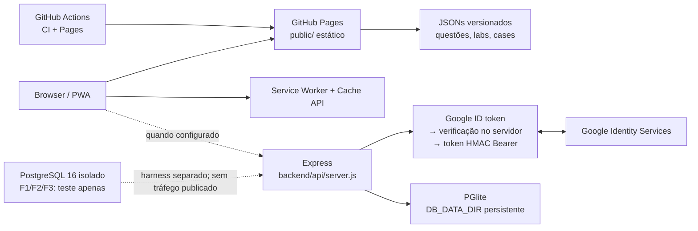
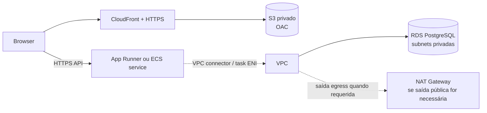

# Auditoria de prontidão para deploy AWS — Cloud Academy A3

Data da auditoria: 07/10/2026
Branch: `login-integracao`
HEAD observado: `b9dbc1711f3d245d4a4eb1b69ef85c85c148e0b4`

## A. Resumo executivo

O checkout atual contém uma SPA/PWA estática, publicação GitHub Pages configurada e uma API Express cujo runtime ativo continua baseado em PGlite persistente. O PostgreSQL F1/F2/F3 está isolado: adaptador, runner de migrations e runtime Express foram exercitados em PostgreSQL 16 de teste, mas `backend/database/postgres/runtime.js` só aceita `NODE_ENV=test`, loopback, banco/usuário/token identificados como teste. Portanto, não existe API PostgreSQL pronta para conectar a RDS, não há migração de dados e não há cutover.

O frontend já pode ser construído como artefato estático para um ambiente de staging desconectado (local-first). Para staging conectado ainda são necessários um runtime PostgreSQL explicitamente não-test, pipeline/imagem de API, hosting/API HTTPS, configuração pública de URL/Client ID, CORS e OAuth homologáveis e integração browser→API→PostgreSQL. A página de deploy atual publica apenas o frontend local-first.

Recomendação de desenho: manter Pages no primeiro staging visual/desconectado; para staging conectado usar frontend S3+CloudFront, Express em App Runner com saída VPC para RDS PostgreSQL Single-AZ em subnets privadas, se orçamento aceitar o custo fixo do NAT; avaliar ECS Fargate quando a necessidade de controle compensar seu setup adicional. Para produção, não escolher recurso nem autorizar publicação agora: alvo candidato é S3+CloudFront + runtime de containers (App Runner ou ECS decidido após ensaio) + RDS PostgreSQL, com Multi-AZ somente após decisão de disponibilidade/orçamento. Produção está bloqueada por F4, F5, F6, OAuth real, backup/restore, observabilidade, domínio/TLS, segurança operacional, rollback e decisões humanas.

Os valores de custo nesta auditoria são faixas de planejamento, não cotação. A região e o tráfego não foram escolhidos. O cálculo ilustrativo de serviços AWS usa principalmente preços oficiais em US East (N. Virginia); São Paulo pode diferir materialmente. Validar no AWS Pricing Calculator após decisões de região, tráfego, retenção e disponibilidade.

## B. Arquitetura atual



**Frontend.** SPA vanilla JS em `src/frontend/`, templates, CSS e assets são transformados por `scripts/build.cjs` em `public/`. O build copia `data/` para `public/data/`, injeta `public/js/runtimeConfig.js`, calcula versão de cache e valida que valores secretos não vazaram para o artefato. Não editar `public/` como fonte. O checkout mede 213 arquivos e 7.347.023 bytes em `src/frontend/assets` (o script tratou esse caminho como assets; verificar o alvo real antes de qualquer dimensionamento de S3). A pasta `data/` tem 44 arquivos e 4.876.855 bytes; os oito bancos principais PT/EN somam aproximadamente 4,36 MB. Não é o tamanho total do artefato `public/` e não substitui medição do artefato de release.

`PUBLIC_API_BASE_URL` configura o endpoint público; vazio em execução local permite inferência `hostname:3001`, mas uma distribuição conectada exige URL HTTPS não-loopback. `GOOGLE_CLIENT_ID` é público e exigido em build `pages`/`connected`; `local-first` pode ser construído sem conexão. O workflow `deploy-pages.yml` sempre define `PUBLIC_BUILD_TARGET=local-first`, publica em `main`, valida PWA e faz smoke HTTP. Logo, a publicação Pages existente não ativa API/OAuth conectados.

O Service Worker (`src/frontend/pwa/sw.js`) pré-cacheia shell e HTML selecionados, usa cache-first com atualização em segundo plano para páginas, network-first para JSON de uma lista lazy, não intercepta requests `/api/` nem cross-origin e retorna fallback offline. `manifest.json` usa paths relativos e scope `./`, adequados à subpasta atual do Pages. S3/CloudFront ou domínio raiz precisam testar escopo/base paths, rewrite SPA, atualização do SW, headers de cache distintos para `sw.js`, `index.html`, runtime config e assets/JSON versionados, além de invalidação de conteúdo atualizado. JSON lazy pode permanecer cacheado no dispositivo; atualizar conteúdo precisa versionamento/cache busting coerente.

**Backend.** Aplicação Express 4 em `backend/api/server.js`; `npm run api:start` inicia `node backend/api/server.js`, padrão porta 3001 e bind `0.0.0.0` fora do harness PostgreSQL. `startServer()` valida config, inicializa DB antes de abrir socket; `/api/health` verifica liveness HTTP e `/api/ready` depende da API inicializada e `SELECT 1`, limite de 1 segundo. `backend/api/lifecycle.js` trata SIGINT/SIGTERM/SIGHUP, drena HTTP e fecha o DB, com deadline total documentado de 15 s. O host de produção e o grace period precisam respeitar esse contrato.

Helmet, CORS allowlist estática (localhost e `https://karlarenatadev.github.io`), `express-rate-limit` 300 requests/15 min por IP para `/api`, body parser até 10 MB e middleware de sessão/roles estão implementados. Produção precisa incluir a origem final do frontend em CORS e definir `TRUST_PROXY` somente após conhecer o proxy, senão o rate limit pode operar com IP incorreto. Sessão é stateless: Bearer HMAC assinado com `AUTH_SESSION_SECRET`, TTL de 8 horas; alterações desse segredo invalidam sessões. A API ainda tem rota pública `POST /api/users`, registrada como risco no `docs/API_OPERATIONS.md`; compatibilidade e mitigação precisam ser decididas antes de exposição ampla.

Não existe `Dockerfile` no checkout, nem pacote de imagem configurado. A API PGlite precisa de diretório gravável persistente; o filesystem efêmero de containers não é substituto. `docs/API_OPERATIONS.md` prescreve Node 22, uma réplica/processo, sem cluster/PM2, volume persistente e migrations/startup PGlite. Esses requisitos aplicam-se ao runtime PGlite atual, não resolvem o runtime PostgreSQL futuro.

**Banco.** `backend/database/db.js` é runtime PGlite por padrão (`DB_ENGINE=pglite`), incluindo schema/migrations JS e APIs. Dados editoriais vêm de JSONs versionados e são copiados para o site estático; scripts de seed também podem carregar conteúdo no PGlite para os fluxos API/editoriais. `data/` inclui questões, diagnóstico, labs, cases e material de estudo. Não há evidência de banco remoto ou dados reais migrados.

F1 criou adaptador `pg` isolado. F2 criou baseline efetiva para PostgreSQL 16, ledger/checksum e runner explícito, mas não contém seeds nem upgrade/importação do legado. O baseline documenta `pgcrypto` e `pg_trgm`; RDS for PostgreSQL declara suporte a extensões e ambas constam entre extensões confiáveis, mas a versão disponibilizada deve ser confrontada no alvo escolhido. F3 integrou Express a um runtime PostgreSQL de teste, com verificação estrita de banco/role/marcador/schema. `backend/database/migrations/README.md` e `backend/database/postgres/README.md` deixam claro que o runtime e migrations não são produção. PostgreSQL 16 é requisito testado; versão exata menor, região e classe do serviço AWS não foram escolhidas.

**Serviços externos.** Google Identity Services entrega credencial ao browser; API usa `google-auth-library` para validar e criar/vincular identidade. Login real/domínios/client publicado não foram homologados nesta auditoria. GitHub Pages e Actions são a superfície de publicação/CI atual; nenhum workflow configura AWS OIDC ou deploy AWS. `railway.toml` não existe; Railway aparece em documentação histórica e não foi consultado. Não existe inventário de recursos AWS neste checkout, e nenhuma conta/infra externa foi consultada: portanto recurso criado/operacional é **não verificável**, não “ausente” em contas às quais não temos acesso.

## C. Requisitos reais do projeto

| Componente | Requisitos derivados do código/documentação |
| --- | --- |
| Frontend | HTTPS para instalação PWA e API segura; domínio/origem definitiva; URL pública HTTPS em `PUBLIC_API_BASE_URL`; Client ID público em build conectado; SPA estática, paths relativos, `public/` gerado; `sw.js`/HTML/runtime config precisam política curta de cache; assets e JSON podem usar cache versionado; fallback local-first preservado. |
| API Node | Node 22 conforme `docs/API_OPERATIONS.md` e CI; porta `PORT` (default 3001), bind 0.0.0.0; secrets de sessão; readiness separado de health; shutdown/grace de 15 s no Express atual; tamanho body 10MB; logs sanitizados; CORS e proxy allowlist; pool PostgreSQL planejado max 5 conexões por processo no adapter F1, mas nenhum limite total acordado; migrations executadas por tarefa administrativa fora do startup; filesystem gravável persistente só se permanecer PGlite. |
| PostgreSQL | PostgreSQL 16 comprovado em testes; extensões `pgcrypto`, `pg_trgm`; TLS `verify-full` no adapter; limites de statement 5 s/query 6 s por padrão, pool máx 5; papel runtime sem DDL e papel administrativo separado; schema vazio pelo baseline não inclui dados/seeds/backfills; backup/restore e upgrade gerenciados ainda não exercitados em AWS. |
| OAuth/segurança | `GOOGLE_CLIENT_ID` é público; Client ID igual em frontend/API e origens/domínios configurados no Google. `AUTH_SESSION_SECRET`, `DATABASE_URL` e futura credencial administrativa são segredos. HTTPS obrigatório, CORS mínimo, trust proxy explícito, IAM mínimo, logging sem tokens/PII, proteção de rota pública users e revisão de retenção de dados pessoais. |

O pool configurado em F1 tem default máximo 5, connection timeout 3 s, statement timeout 5 s, query timeout 6 s, idle-in-transaction 10 s e shutdown 10 s. Múltiplas réplicas multiplicam potencial de conexões; dimensionar `replicas × DB_POOL_MAX + migrations/ops` abaixo do limite da instância, com margem e medição. O F3 atual tem outro guard estrito e não usa isso como runtime aceito.

## D. Bloqueadores staging x produção

| Bloqueador | Severidade | Staging | Produção | Fase que resolve |
| --- | --- | --- | --- | --- |
| Runtime PostgreSQL ainda aceita apenas `postgres-test`; exige `NODE_ENV=test`, loopback e marcador | Crítico | **Bloqueia staging conectado** | Bloqueia | D4.4 novo incremento: runtime de staging, após F4/F5 e decisão de integração; não remover guards do harness F3. |
| Express ativo usa PGlite persistente e requer `DB_DATA_DIR` gravável | Alto | Bloqueia staging em RDS; staging PGlite é possível apenas como ensaio separado com volume validado | Bloqueia decisão PostgreSQL/cutover | D4.2.6/F7 para PGlite controlado; D4.4 runtime aprovado para PostgreSQL. |
| Sem Dockerfile/image e sem pipeline de API AWS | Alto | Bloqueia deploy repetível de API | Bloqueia | P1 hardening + P3 IaC + P4 staging. |
| F4 concorrência, RBAC, identidade/CAS e autorização editorial não iniciada | Crítico | Pode limitar staging estritamente sintético/privado; bloqueia homologação de fluxos de dados e qualquer abertura a usuários reais | **Bloqueia** | F4. |
| F5 browser→API→PostgreSQL ainda não provada no target; sync tem contratos limitados | Alto | **Bloqueia staging funcional conectado** | Bloqueia | F5, após F3/F4. |
| F6 export/import PGlite→PostgreSQL e reconciliação não feitos; dados reais não migrados | Crítico | Pode usar banco sintético; não bloqueia staging sem dados reais | **Bloqueia cutover** | F6, autorizada separadamente e depois de F2. |
| F4/F5 não concluídas e D4.2.3/.4 não especificadas/verificáveis no contexto anterior | Alto | Não bloqueia site local-first | Bloqueia homologação completa da D4.2 | F4/F5 e definição humana dos requisitos 3/.4. |
| OAuth Google real, domínio autorizado e origins ainda sem homologação | Alto | Bloqueia staging autenticado até autorização/configuração | Bloqueia | Homologação externa (credenciais e origens aprovadas) + F5/F7. |
| Sem API pública/DB AWS, DNS/domínio/TLS escolhidos | Alto | Bloqueia cadeia staging real | Bloqueia | P0/P4; ACM e endpoint conforme solução escolhida. |
| Backup/restore de PostgreSQL target e PGlite não ensaiados; RPO/RTO/retention indefinidos | Crítico | Banco sintético pode ser descartável, mas staging funcional deve provar backup/restore | **Bloqueia** | P0 decisões + F6/F7. |
| Observabilidade/alarmes e rollback de aplicação/dados não ensaiados | Alto | Não bloqueia protótipo isolado, bloqueia staging operacional aceito | Bloqueia | P1/P4/F7. |
| F4/F5/F6 pendentes; F7/F8 não iniciadas | Crítico | Staging técnico isolado é possível após adaptação runtime; não autoriza usuário/dados reais | **Bloqueia** | Sequência F4→F5 e F6 em trilha autorizada; F7→F8. |

`NODE_ENV=test` e loopback são validações de segurança do harness F3, não meras variáveis para contornar. Não mudar esses valores para fazer o harness aceitar RDS. A solução é um runtime operacional separado, com migrações administrativas segregadas e testes de segurança equivalentes.

## E. Comparação de arquiteturas AWS

### Frontend

| Opção | Complexidade/cache/PWA/domínio | CI/CD e rollback | Custo/lock-in/JSON |
| --- | --- | --- | --- |
| A. GitHub Pages | Menor mudança; PWA já usa paths relativos e há smoke test. Controle limitado sobre headers, cache rules e CDN invalidation; domínio/TLS e SPA fallback dependem Pages. | Workflow atual deploya `main` por Pages e smoke test; rollback depende de reverter artefato/commit no GitHub. Sem integração AWS. | Baixo custo incremental/sem serviço AWS dedicado; lock-in de Pages baixo-médio. JSONs atuais permanecem no repo/artefato, aumento de ~900 itens não exige DB. Permanece dependência GitHub Pages. |
| B. S3 privado + CloudFront | CDN HTTP(S), cache control e invalidação controláveis, bucket privado com origin access control, domínio/TLS integrado; rewrite SPA e base path devem ser configurados. Alinha com build estático atual e JSONs. | Ação AWS via OIDC, sync versionado, invalidação; releases podem ser imutáveis com promoção e retorno de distribution/origin/release. Implementação ainda não existe. | Custo por storage/requests/transferência ou CloudFront flat plan; plano CloudFront Free hoje anuncia $0, 1M requests/100GB e crédito S3 5GB; limites/eligibilidade devem ser revalidados. Lock-in AWS moderado, saída fácil porque são arquivos estáticos. |
| C. Amplify Hosting | CI/branch previews e hosting gerenciado; tecnicamente adequado à SPA estática. Validar rewrite/cache headers do SW, runtimeConfig no build, subpath e fallback. Mais acoplado ao serviço que S3+CloudFront simples. | Integra repositório e deploy/rollback gerenciados; configuração/release precisa promoção explícita entre ambientes. | Pricing oficial consultado: $0.01/min build, storage $0.023/GB-mês e saída $0.15/GB (fora de tier/free eligibility); maior previsibilidade inicial simples, mas custo de tráfego escala. Menor operação manual, maior lock-in que S3. |

### API Express

| Opção | Aderência técnica | Operação/rede/custo | Julgamento |
| --- | --- | --- | --- |
| A. App Runner | Container Express persistente e health endpoint são compatíveis; precisa state externo, então PGlite local não serve. F3 runtime PostgreSQL ainda deve ser adaptado. App Runner tem startup de container, health, autoscaling e logs integrados; aplicação deve ser stateless. Shutdown de 15s deve casar com stop grace. | Menos conceitos que ECS. VPC connector dá acesso privado ao RDS; saída para Google/serviços públicos através de subnet/NAT precisa ser testada. Instância provisionada mantém memória quente e custa mesmo idle. Pricing oficial exemplifica 1 vCPU/2GB por 24x7 mais 8h ativas/dia em ~$25.50/mês; uso de VPC/NAT/DB separado. | Melhor candidato inicial se reduzir operação for prioridade e o runtime PostgreSQL ficar stateless. Validar disponibilidade/limites/região, VPC e custos antes. |
| B. ECS Fargate | Express roda em container Linux sem gerenciar hosts; bom controle de task, health check, deployment circuit breaker e stop timeout. Requer Dockerfile, task definition, service, registry e load balancer/endpoint. Pool por processo; graceful shutdown já trata SIGTERM. | Mais flexível para subnets/SGs/secrets/logging e política de escala, maior complexidade de IaC. Fargate Linux/x86 em us-east-1 publica $0.000011244/vCPU-s e $0.000001235/GB-s: task contínua mínima 0.25 vCPU/0.5 GB dá cerca de $8.90/m de compute, antes de ALB, IPv4, NAT, logs e DB. | Adequado se controle/reprodutibilidade e pipeline declarativo compensarem. A arquitetura ECS privada com NAT+ALB pode ter custo fixo maior que compute. |
| C. EC2 | Express totalmente compatível; fácil persistir PGlite em EBS se mantido. | Menor serviço de plataforma no papel, maior responsabilidade por OS patching, hardening, scaling, supervisão, backup de disco, deploy, health, host e HA. IP/EBS e operação. | Só candidato transitório/lab ou se equipe aceitar operar VM; não recomendação de produção. |
| D. Lambda + API Gateway | Não é compatível “como está”: entrypoint é servidor Express com sockets e shutdown; adaptador usa pool por processo e rotas de ciclo longo; seria preciso adapter Lambda, teste de body/CORS/errors/timeouts, cold starts e dimensionamento de conexões. PGlite não serve em /tmp como banco durável. Com RDS requer RDS Proxy ou disciplina de pool/concurrency. | Pode escalar request e cobrar por invocação, mas exige reestruturar ciclo HTTP/observabilidade, VPC e proxy (custos/complexidade). AWS recomenda proxy para frequentes conexões curtas/concurrency. | Não escolher nesta fase; serverless não simplifica o runtime atual. |

### PostgreSQL

| Opção | Aderência e operação | Custo/decisão |
| --- | --- | --- |
| A. RDS for PostgreSQL 16 | Candidato direto: PostgreSQL gerenciado, backups automáticos/snapshots, janela de manutenção, Single/Multi-AZ; confirmar suporte às versões de `pgcrypto`/`pg_trgm` e baseline no alvo. Runtime role sem DDL; migrations com role administrativo temporária. | Preferido ao porte atual: custo contínuo de instância+storage+backup, Multi-AZ eleva custo. T4g micro é classe elegível de partida para baixo volume somente se testes de memória/CPU e conexões passarem; não fixar classe agora. |
| B. Aurora PostgreSQL | Compatível em protocolo/ecossistema, extensões e limites precisam ser avaliados; separa compute/storage e escala de forma diferente. Mais peças/custos, opções serverless e alta disponibilidade. | Não justificado pelo tráfego/escala conhecido. Pode elevar custo mínimo/complexidade; considerar apenas se requisito medido de disponibilidade/escala/replicas justificar. |
| C. Alternativa AWS | Nenhuma alternativa documentada oferece vantagem forte sobre RDS para este schema e SQL PostgreSQL. | Não recomendar DynamoDB/DocumentDB nem substituir para ganhar “cloud-native”; manter PostgreSQL. |

## F. Arquitetura recomendada para staging

Ambiente não produtivo, dados sintéticos, protegido por acesso e sem write de dados reais:

- Frontend estático S3 privado + CloudFront (ou Pages local-first como primeiro smoke desconectado, sem confundir com staging integrado).
- API Express containerizada em App Runner, conectada ao VPC via connector quando tiver de alcançar RDS privado; alternativa ECS Fargate se IaC priorizar controle fino. Executar uma réplica, escala limitada, deployment manual/aprovado.
- RDS PostgreSQL 16 Single-AZ em subnet privada, dados sintéticos e baseline/migrations aprovadas; usuário runtime sem DDL.
- HTTPS por serviço/domínio provisório autorizado ou domínio final após decisão; CORS limitado ao frontend de staging; Google login somente depois de configurar origem/client de homologação e autorização humana.
- CloudWatch Logs com retenção limitada, alarmes mínimos e snapshot/backup staging com restauração realmente ensaiada.
- Secrets Manager para `DATABASE_URL` ou composição segura de credencial, session secret; SSM Parameter Store para config não secreta se apropriado. Pipeline GitHub Actions usando OIDC, role restrita ao repo/branch/environment e só ao deployment do ambiente.

Staging só é funcional quando browser real carrega Pages/CDN HTTPS, faz login Google homologado ou identidade sintética autorizada, chama API pública TLS, persiste/hidrata no PostgreSQL AWS, conserva offline/local-first em falha 503, loga sem segredo, reinicia, restaura backup e tem rollback da release ensaiado. Criar recursos antes da adaptação não prova esses itens.

## G. Arquitetura recomendada para produção

Candidato, condicionado a decisões e gates: S3+CloudFront para frontend; API Express em containers com App Runner ou ECS Fargate escolhido pelo ensaio e custo; RDS PostgreSQL 16 em subnets privadas; HTTPS/ACM; CloudWatch; Secrets Manager/SSM; GitHub Actions OIDC com promoção dev→staging→production e aprovação humana. Sem Aurora inicialmente. Single-AZ só pode ser selecionado se dono do serviço aprovar janela de indisponibilidade e recuperação; Multi-AZ é decisão humana de disponibilidade/custo e recomendação provável para produção, não condição assumida nesta auditoria.

Nenhum tráfego de produção ou dado migrado antes de F4–F7 e autorização explícita de cutover. Staging aprovado não concede autorização para produção.

## H. Rede e segurança

Topologia candidata:



API precisa endpoint acessível pelo browser; limitar a origem pelo edge/service e TLS, não expor porta DB. RDS sem endereço público e Security Group permitindo 5432 apenas do SG da API e role administrativa controlada. Para ECS: duas subnets AZ para opções HA; tasks públicas com acesso ingress somente via ALB, ou tasks privadas + NAT para egress. Para App Runner VPC egress: subnet routing/egress à Internet precisa ser desenhado; NAT Gateway tem custo horário e por GB. AWS documenta exemplo de NAT em Ohio a $0.045/h + $0.045/GB processado (aprox. $32.85/m por gateway de 730h antes de tráfego e IPv4); custo fixo relevante. Avaliar VPC endpoints para tráfego compatível e evitar NAT quando arquitetura permitir, sem bloquear validação Google/outras saídas necessárias.

Security Groups: origem pública somente nos endpoints web/API necessários; DB SG recebe apenas API/migration. Migrations devem ser job administrativo restrito, usar role separada, jamais conceder DDL ao runtime. Aplicar IAM least privilege, criptografia em trânsito/repouso, secret rotation conforme impacto validado, logs sem tokens/PII e rate-limit atrás de proxy confiável. S3 bucket sem acesso público, OAC do CloudFront; publicação não concede leitura geral do bucket.

## I. PostgreSQL

RDS for PostgreSQL é o melhor encaixe inicial por aderência direta ao PostgreSQL 16, extensões necessárias e manutenção gerenciada. Testar na versão/parameter group de destino: baseline exata, disponibilidade das duas extensões, privilégios `CREATE EXTENSION`, triggers/functions/views, timeouts, TLS `verify-full`, pool e BIGINT. O catálogo F2 é uma baseline de banco vazio, não upgrade do PGlite legado; não contém conteúdo editorial, users/progress, backfills, seeds ou reconciliação.

Usar três classes de credencial: bootstrap/owner controlado; migrations/admin temporária; runtime sem DDL/CREATE/TEMP e sem associação a role elevada. O startup de API não pode aplicar migrations. Executar migration como etapa aprovada e registrada, validar readiness depois. `DB_POOL_MAX` padrão 5 na configuração adapter F1; estabelecer soma máxima de conexões e teste de pool exhaustion antes de configurar réplicas. Escolher storage/tamanho após medir dados reais na cópia, não pelo volume de JSON estático.

RDS suporta extensões listadas por versão e declara `pg_trgm` e `pgcrypto` como confiáveis; existência e versão alvo ainda são gate. Aurora só se requisitos operacionais medidos justificarem seus mecanismos/custo adicional.

## J. Frontend/PWA

Manter fonte em `src/frontend/`, `data/`; build reproduz `public/`. Deployment deve guardar artefato de release e manifest/checksum para rollback. Criar comportamento de cache explícito: HTML/runtime config/SW revalidáveis ou no-cache; assets com hash/cache imutável apenas se nomes realmente versionados; JSON com ETag/versionoamento e janela acordada. Hoje build muda nome lógico de cache SW baseado em hash do conjunto; cache HTTP do CDN não está codificado/testado. Invalidar CDN só quando necessário e nunca pressupor que limpeza do cache do usuário remove progresso em localStorage.

Pages continua opção funcional para local-first e reduz mudança. S3+CloudFront ganha governança de headers/cache e distribuição JSON sem mudar modelo de conteúdo; avaliar Flat-rate Free $0 conforme limites atuais ou PAYG conforme custo/necessidade. Amplify também tecnicamente aplicável, porém custo por GB servido e build minutes pode crescer com bancos grandes/download recorrente. Conteúdo permanece separado do banco operacional; não inserir JSON estático no PostgreSQL apenas por conveniência.

## K. API Express

O código atual é servidor HTTP Express tradicional, Node 22 no contrato operacional e CI, uma instância/processo por PGlite. O runtime PostgreSQL futuro pode admitir horizontalidade somente após F4/F5, store compartilhado confirmado, pool agregado, idempotência e health/scale ensaiados; não assumir statelessidade completa sem conferir estado/middleware da sessão e fluxos de sync. Bearer HMAC é stateless, mas dados ficam no banco; process-local locks e lifecycle/readiness precisam revisão com múltiplas instâncias.

App Runner reduz operação e é compatível com container; ECS Fargate fornece controle de task/rede/deploy e exige Dockerfile/IaC/mais componentes; EC2 aumenta manutenção da plataforma. Lambda/API Gateway não é opção “direta”: precisa adaptar entrypoint e testar Express adapter, timeout/body/CORS, pool/conexões, cold start, SIGTERM e RDS Proxy.

Imagem futura deve usar multi-stage, Node 22 fixado, dependências de produção, usuário não-root, filesystem read-only quando PostgreSQL (fora temporários necessários), nenhum secret em layer/build args, health route, sinal SIGTERM entregue ao Node e grace ≥15s, scanner/geração SBOM e tag imutável por commit. Não há Dockerfile atual para auditar; tudo isso é requisito proposto, não implementação.

## L. OAuth

Implementado localmente: GIS/browser entrega ID token; Express valida issuer/audience/email_verified via `google-auth-library`, resolve provider subject/usuário, aplica identidade/role e devolve sessão HMAC de 8h. Client ID publicado é config pública. Os testes existentes com provider/verificador mockado ou tokens sintéticos não provam Google real.

Antes de staging autenticado: decisão do domínio permitido, ambiente/Client ID e origins authorized no Google Console, HTTPS origin do frontend, callback/consent se aplicável e API URL HTTPS/CORS. Login real deverá testar usuário permitido, domínio não permitido, conta inativa, identidade existente/novo vínculo e falhas Google. Google Console permanece fora desta auditoria e não foi alterado. Não confundir origin OAuth com CORS.

## M. Secrets e configuração

| Nome/ grupo | Classificação | Tratamento |
| --- | --- | --- |
| `GOOGLE_CLIENT_ID` | PUBLIC + environment-specific | Injetado em build `runtimeConfig.js`; mesmo Client ID precisa corresponder ao API. Não é client secret. |
| `PUBLIC_API_BASE_URL`, `PUBLIC_BUILD_TARGET` | PUBLIC + environment-specific | Build settings por dev/staging/prod; URL HTTPS pública no connected build. Não incluir credenciais. |
| `AUTH_SESSION_SECRET` | SECRET + environment-specific | 32 bytes aleatórios, estável por ambiente e protegido; rotação encerra sessões. Secrets Manager ou secret injection do runtime. |
| `DATABASE_URL` e senha DB | SECRET + environment-specific | Só no backend/job de migrations; TLS verificado; runtime vs admin separados. Preferir Secrets Manager se gerenciar credencial/rotação. |
| `PORT`, `NODE_ENV`, `TRUST_PROXY`, `DB_POOL_MAX`, timeouts | ENVIRONMENT-SPECIFIC | Env do serviço/SSM; não confundir config operacional com secret. Proxy trust exato da topologia. |
| `AUTH_ALLOWED_DOMAINS`, allowlist CORS, `ALLOW_DEV_EMAIL_LOGIN` | ENVIRONMENT-SPECIFIC | Política explícita por ambiente; email-only login permanece proibido em produção. |
| `GOOGLE_API_KEY`, `GROQ_API_KEY`, `BOOTSTRAP_*` | SECRET ou configuração privilegiada | `.env.example` lista exemplos; não assumir uso no caminho público. Mapear consumers antes de expor; nunca enviar para frontend. |

Secrets Manager cobra por secret-hora/mês e API calls; preço oficial consultado informa $0.40/secret/mês e $0.05 por 10.000 chamadas. SSM Parameter Store Standard pode reduzir custo para parâmetros não sigilosos; decidir rotação e threat model. AWS-managed KMS key evita taxa de chave customer-managed no Secrets Manager conforme documentação oficial. Nenhum `.env` real foi lido.

## N. CI/CD

Existem workflows de CI, contribuição, validação, geração e deploy Pages. `ci.yml` usa Node 22, audit de prod dependencies, lint/format, valida dados, seed, coverage, build, PWA e Playwright. `deploy-pages.yml` usa permissões Pages e ID token de GitHub Pages, mas não AWS; deploya `main` como `local-first` e faz smoke test. Não há Dockerfile, build/push para registry, IaC pipeline ou AWS OIDC configurado.

Pipeline planejado:

```text
GitHub Actions → testes + audit + build/test image + SBOM
              → assume role temporária AWS via OIDC
              → deploy STAGING (scope mínimo; artifacts imutáveis)
              → smoke/E2E/health/restore gates
              → aprovação environment humana
              → deploy PRODUCTION + smoke + alarmas/rollback
```

Usar OIDC e STS temporário, sem IAM access keys persistentes no GitHub. Role trust deve restringir `aud=sts.amazonaws.com`, repo, branch e environment `sub`; permissões separadas frontend/API/IaC e staging/prod, e environments com protection branch/review. CI pode validar IaC sem credencial; criar/alterar recursos requer aprovação. Migrations como job separado e permissionado, sem execução automática pelo `api:start`.

## O. Observabilidade

Não há integração CloudWatch configurada. API tem log console/minimal e sanitizador operacional; adicionar correlação request ID, JSON estruturado e retenção aprovada sem registrar Authorization, token, email/PII, body ou SQL. CloudWatch Logs, métricas de serviço, dashboard e alarmes são requisito de staging operacional.

Alertas mínimos: health endpoint/API unavailable; readiness 503; taxa 5xx separando 500/503; taxa 401/403 sem classificar como erro de infraestrutura; 409 CAS separado como conflito esperado; latência p95; CPU/memória/task count; conexões/pool e DB connections; DB CPU/storage/free space; falha/atraso de backup. Thresholds devem vir de SLO e baseline de carga, não inventar valores. Tracing distribuído não é necessário no primeiro passo; adicionar só se logs/metrics não bastarem.

CloudWatch pricing é variável; pricing oficial consultado mostra ingestão de logs em US East $0.50/GB após free tier aplicável, armazenamento e consultas adicionais. Limitar volume, retenção e payloads para evitar custo sem controle.

## P. Backup e restore

**PGlite original:** preservar volume sem abrir/alterar; fazer cópia consistente com processo parado e exclusividade comprovada; dump/export lógico independente; SHA-256, bytes, contagens/versão/app e cópia criptografada externa; teste de restore em diretório vazio e conferência de users, identities, `user_module_state`, local links e relações. O procedimento local em `docs/API_OPERATIONS.md` descreve dump, mas não é política AWS nem prova de restore executado nesta auditoria.

**Staging PostgreSQL:** snapshots/backups automáticos configurados e restore em instância isolada; validar checks de FQ/UUID, migrations/schema checksum, perfis e sync. Usar dados sintéticos na primeira etapa.

**Produção:** automated backups + snapshots pré-deploy/migration, retenção, cópia entre AZ/região somente se aprovada, criptografia, IAM restrito, restore periódico medido e runbook. `RPO`, `RTO`, frequência e retenção são decisões humanas pendentes. RDS backup habilitado sem restore executado não satisfaz gate. Rollback de código não reverte schema nem recupera writes; migration backward-compatible e plano de recuperação/reconciliação são necessários.

## Q. Migração de dados

Não feita; não ler nem tocar o volume neste trabalho. Plano futuro, dentro principalmente da F6:

```text
PGlite original (preservado e fechado)
  → cópia verificada/checksum
  → export lógico + manifesto
  → PostgreSQL staging novo (F2 baseline)
  → import/reconciliação idempotente
  → validação integral + restore/replay de teste
  → aprovação humana e janela
  → PostgreSQL produção (somente após F4/F5/F7)
```

Validar contagens e relações para UUIDs/users/identities/provider subject/roles, `validator_certifications`, versões CAS de `user_module_state`, local links pending/completed/receipts (20 escopos existentes), progresso e namespaces, quizzes/answers/membership, XP/gamificação, cases/progress, FKs/orphans, domínios e questões editoriais. Distinguir conteúdo importado dos bancos estáticos de dados operacionais. Seed de JSON não é cópia de usuários/progresso. Conferir que não haja promoção de ADMIN por seed, perda de recibos/pendências, truncamento BIGINT ou duplicata de identidade.

F2 é baseline para banco vazio, não importador PGlite. Importação e reconciliação real pertencem à F6 e exigem autorização de dados/acesso/espaço/janela. Conservar origem intacta até restore comprovado e retenção aprovada; aposentadoria é F8 e outra decisão.

## R. Conteúdo e ~900 questões

No estado observado, bancos JSON versionados já existem e o workflow de Pages copia `data/` inteira em `public/data`; build/CI valida alguns JSONs e a governança tem workflows de geração/validação/contribuições. O contexto anterior diz que ~900 questões não foram importadas; não há evidência deste checkout de recebimento/auditoria/deduplicação/staging/publicação de um novo lote, então status do lote: **não verificável no repositório atual; não contar como importado**. Nenhuma importação foi feita.

Impacto: cada novo lote amplia build artifact, transferências frias e cache local. Antes de incluir, validar licença/origem, schema, respostas, referências, traduções, duplicatas e IDs; medir gzip/brotli, total `public`, requests e taxa de acesso. Um lote aproximado de 900 itens pode ser servido como JSON versionado ou shards por certificação/língua; S3/CloudFront facilita cache e entrega, mas o Service Worker lista explicitamente nomes lazy (será necessário atualizar/validar essa lista em implementação futura). Conteúdo estático é distribuição de leitura, não exige Postgres. Dados editoriais que precisam de CRUD/roles/auditoria podem permanecer em PostgreSQL conforme contrato separado.

## S. Estimativa inicial de custos

Sem região/tráfego escolhidos não existe total preciso. Faixas abaixo são cenários indicativos em USD/mês para planejamento; não incluem suporte, impostos, trabalho humano, tráfego extraordinário, IPv4 não listado, free tier/créditos variáveis nem região São Paulo. Validar no Pricing Calculator. RDS e NAT são custos contínuos mesmo com tráfego baixo; NAT é custo fixo especialmente relevante.

Premissas/âncoras oficiais consultadas em 07/10/2026:

- Fargate Linux/x86 us-east-1: $0.000011244 por vCPU-s e $0.000001235 por GB-s; uma task 0.25 vCPU/0.5 GB 24×7 ≈ **$8.90/m** só compute.
- App Runner pricing oficial dá exemplo leve de 1 vCPU/2 GB, serviço warm 24h e tráfego 8h/dia em **$25.50/m** só serviço (log/DB/VPC fora).
- NAT em exemplo oficial AWS Ohio: $0.045/h + $0.045/GB, ≈ **$32.85/m** por 730h antes de processamento/transferência; uma NAT por AZ eleva o fixo.
- Amplify: $0.01/min build, $0.023/GB-mês storage, $0.15/GB saída na página oficial; plano AWS Free Tier/credit depende de elegibilidade e limites. CloudFront publica Free flat plan $0, 1M requests/100GB mensais e 5GB crédito S3; conferir condições na criação.
- Secrets Manager: $0.40/secret/mês + $0.05/10k chamadas. CloudWatch Logs: primeiros 5GB gratuitos na página consultada; depois exemplo de $0.50/GB em us-east.
- RDS: um post técnico oficial AWS publica cenário us-east-1 com dois `db.t4g.micro`+20GB gp3 por ~ $28/m total, aproximando ~$14/unidade; isso é exemplo orientativo do post, não tarifa universal vigente/garantia. RDS calculator precisa refletir região e storage/backups escolhidos.

| Faixa | Cenário de arquitetura | Estimativa inicial mensal | Itens dominantes/limites |
| --- | --- | --- | --- |
| BAIXO TRÁFEGO / staging | CloudFront Free; 1 App Runner pequeno ou 1 Fargate task; RDS PostgreSQL Single-AZ pequeno; 1 secret; logs baixos; NAT se API privada precisar outbound. | **~$60–120/m** em região econômica (us-east-1 ilustrativo), podendo ficar acima em outra região. Soma indicativa: app ~ $9–26 + RDS ~ $14+ + NAT ~$33 + secrets/logs/domínio/storage/transfer. | RDS e NAT são piso contínuo; excluir NAT exige redesenhar e provar egress/segurança, não abrir RDS publicamente. Não inclui snapshots além da franquia, ALB se ECS usar, nem tráfego elevado. |
| CRESCIMENTO INICIAL | 1–2 tasks/App Runner instances, RDS maior Single-AZ ou Multi-AZ conforme decisão, CloudFront/Amplify com downloads JSON crescentes, logs 5–20GB, backups. | **~$120–350/m** como faixa de orçamento para calculadora, dependente da escolha Multi-AZ/NAT/ALB e GB servidos. | DB, NAT gateway(s), runtime sempre ligado, transfer e logs passam a dominar; cache CloudFront pode reduzir request ao origin, não o download ao usuário. |
| MAIOR DISPONIBILIDADE | API ≥2 instâncias/replicas em AZs distintas, balanceamento se ECS, RDS Multi-AZ, backups/restore, alarmes, NAT por AZ ou egress equivalente, maior armazenamento/tráfego. | **~$300–900+/m**, sem SLO/carga não cabe estreitar com evidência. | Multi-AZ DB, duas NAT/egress, load balancer, réplica/compute, transferência, logs e backup; não adotar sem orçamento/objetivo RPO/RTO. |

Essas faixas são **estimativas de ordem de grandeza**, inferidas por componentes e premissas acima, não resultado de AWS Calculator nem quote oficial. A faixa de staging deve ser recalculada com região escolhida antes de autorizar cobrança. A opção Pages local-first atual evita novos custos AWS de frontend/API, mas não entrega conexão persistente.

## T. IaC

Não existe IaC AWS no checkout. Para equipe/projeto com workflow já em GitHub Actions e arquitetura AWS proposta, Terraform tem ecossistema/provider amplamente conhecido, review de plano e separação state; exige backend remoto/locking e proteção de state (pode conter metadata sensível). AWS CDK usa JS/TS e constrói recursos AWS com abstrações, útil para reuso e pipelines, mas adiciona runtime/synth/test e mais lógica. CloudFormation é AWS-native e sem toolchain externa, mas templates podem ficar verbosos; lock-in AWS alto. Recomendo escolher **Terraform ou CDK após P0**, não misturar. Para primeira implantação AWS pequena, preferir IaC revisável com plan/diff, state protegido e environments; se não há experiência Terraform/CDK do time registrada, essa decisão exige piloto sem apply e escolha humana. Nada foi implementado.

## U. Roadmap de implementação

As fases abaixo preservam F1–F8 do documento D4.4; P0–P9 são trilha de prontidão AWS e não as substituem.

| Etapa | Trabalho/resultado | Dependência / gate |
| --- | --- | --- |
| P0 — requisitos/gates | Aprovar região, orçamento, domínio, RPO/RTO, HA, retenção, OAuth, staging sem dados reais; formalizar critérios D4.2.3/.4 e staging | Antes de criar recursos/gerar cobrança. Decisão humana. |
| P1 — hardening | Corrigir/adaptar endpoint público legado, config de CORS/proxy, políticas de cache, logging/metrics, pacote container e runtime PostgreSQL operacional fora de test; security review | F4 ainda precisa preceder validação de autorização; não alterar harness F3. |
| P2 — runtime PostgreSQL staging | Integrar Express com adapter/migrations sem DDL no startup, role runtime não-DDL, readiness PostgreSQL, scale/pool test | F1/F2/F3 como base aceita local; criar novo incremento F3-operacional após testes de contrato, F4 começa em ambiente isolado. |
| P3 — IaC | Implementar plano versionado para DNS/edge/API/RDS/secret/log/alarms e ambientes; CI plan-only | P0 e arquitetura aprovada. Sem apply até autorização. |
| P4 — staging AWS | Provisionamento autorizado, dados sintéticos, HTTPS, logs, backup/restore básico, restart/readiness/rollback e smoke browser→API→PG | P2/P3; essa é primeira atividade que cria cobrança, necessita aprovação expressa. |
| P5 — F5 integração ponta a ponta | Continuidade login A/B, local-first, 401/403/409/503, CAS, sync e E2E no staging real | Contratos F3/F4 estáveis; nunca fazer dados reais. |
| P6 — F6 migração/restore | Snapshot/cópia PGlite preservada, export/import staging, reconciliação e checks completos; ensaios repetidos | F2 + autorização de dados/acesso; independente parcialmente, mas antes F7. |
| P7 — homologação | OAuth real, domínio/TLS, security/carga, migration job, backup restore, observability, failover se prometido e rollback de release/dados | F3–F6 aceitos e decisões aprovadas (D4.4 F7). |
| P8 — produção/cutover | Provisionar/promover ambiente, freeze, export final, validação e roteamento; uma autoridade de escrita | F7 aceito + autorização humana específica para recursos/dados/cutover. |
| P9 — pós-deploy | Monitorar alarmes, sync pendente, custos, backup/restore, incidentes; não aposentar PGlite ainda | P8 e janela/retention. D4.4 F8 apenas depois de retenção/consumidores aprovados. |

Ordem crítica da trilha D4.4: F1 → F2 → F3 → F4 → F5; F6 pode avançar em trilha de recuperação aprovada após F2; F7 depende de F3–F6; F8 depois de estabilização/retention. Não iniciar F4 foi respeitado; esta auditoria não muda esse estado.

## V. Pronto / adaptar / bloqueia produção

| Componente | Estado | Evidência/condição |
| --- | --- | --- |
| Frontend | **PRONTO PARA STAGING desconectado; PRECISA DE ADAPTAÇÃO para staging conectado** | Build/PWA/Pages existem; `PUBLIC_BUILD_TARGET=local-first`; domínio/API/CORS/cache final não existe. |
| API | **PRECISA DE ADAPTAÇÃO PARA STAGING** | Express, health/readiness/shutdown existem; container ausente; runtime ativo PGlite e F3 PG restrito a teste. |
| Banco | **PRONTO só para teste isolado; BLOQUEIA staging conectado até runtime** | PostgreSQL 16 F1/F2/F3 testado localmente; nenhuma RDS criada/conectada; sem dados reais. |
| OAuth | **PRECISA DE ADAPTAÇÃO/homologação; BLOQUEIA login real de staging/prod** | Código local e mocks existem; Console/domínio/login real não verificados. |
| Sincronização | **PRECISA DE HOMOLOGAÇÃO; bloqueia produção para módulos/promessas incompletos** | Correções locais recentes existem, v1 limitado a 20 escopos; F5 staging integrado não feito; Quiz/Pomodoro local segundo contrato atual. |
| Migrations | **PRONTO para PG descartável; precisa de adaptação operacional; bloqueia produção sem runner/job seguro** | F2 baseline/ledger/runner existem e são explicitamente test-only; dados/upgrade legacy ausentes. |
| Backup | **NÃO PRONTO; BLOQUEIA produção** | procedimento PGlite documentado; nenhuma política ou restore PostgreSQL AWS comprovado. |
| Observabilidade | **PRECISA DE ADAPTAÇÃO para staging; bloqueia aceite operacional/produção** | logs sanitizados no app; CloudWatch, alarmes/SLOs não implementados. |
| Conteúdo | **PRONTO como estático; não necessário migrar para DB** | JSON versionado copiado a `public/data`; lote ~900 não comprovadamente processado. |
| CI/CD | **PRONTO para testes/Pages; PRECISA DE ADAPTAÇÃO AWS; bloqueia deploy repetível** | Actions têm CI/Pages; sem Docker build, AWS OIDC, IaC, promoção staging/prod. |

## W. Riscos sustentados

**Críticos:** F4/F5/F6 não encerradas; nenhum runtime PostgreSQL produtivo; nenhuma migração de dados real; backup/restore e RPO/RTO sem prova/decisão; migration baseline para banco vazio não upgrade de origem; não há evidência de rollback de dados; conteúdo pessoal/progresso requer reconciliação correta.

**Altos:** falta Dockerfile e pipeline API; OAuth e domínio final sem homologação; CORS hoje fixo para localhost/GitHub Pages; API tem `POST /api/users` público (risco já apontado no contrato operacional); ausência CloudWatch/alarms; proxy trust depende de topologia; custo NAT pode superar compute; dependência Pages atual é local-first e não conectada.

**Médios:** política de cache CDN/runtime config/SW não testada; aumento JSON pode alongar artifact/download e versionamento SW; rate limit usa configuração proxy dependente de IP; replicação horizontal multiplica pool e pode expor locks process-local; valores de pricing variam por região e descontos.

**Baixos/condicionais:** Amplify/S3/CloudFront lock-in de hosting relativamente reversível por artefatos estáticos; classe pequena de RDS pode ser insuficiente, mas workload real não foi medido. Não afirmar esses pontos como defeitos observados em produção.

## X. Decisões que exigem aprovação humana

- orçamento mensal e limite de alarme/custos;
- domínio e controle do DNS;
- região AWS (latência, dados e preço);
- RPO/RTO e frequência de restore;
- nível de HA; RDS Single-AZ ou Multi-AZ;
- retention de logs/backups e cópias cross-region;
- política de domínio Google, Client ID e login corporativo;
- política de conteúdo/dados pessoais e exposição de usuários;
- quando executar F6 com acesso/cópia do PGlite;
- quando congelar escrita, executar cutover e aposentar PGlite;
- autorização para criar recursos que gerem cobrança;
- autorização de produção separada de aprovação staging.

## Y. Estado final do Git

Estado inicial observado antes da análise: branch `login-integracao`, HEAD `b9dbc1711f3d245d4a4eb1b69ef85c85c148e0b4`; `git status --short --branch` indicou branch alinhada a `origin/login-integracao` e nenhum arquivo staged, unstaged ou untracked. Não houve reset, clean, checkout, commit, push, pull, merge, deploy, AWS CLI, alteração Railway/Google, migração ou execução de build/testes.

O status final deve conter somente este novo relatório não rastreado, mantendo o estado anterior intacto. A listagem recursiva do Windows emitiu acesso negado em seis diretórios `scratch/python-data-test-*` já existentes; não foram lidos, alterados ou removidos. Relatórios D4.2.3/D4.2.4 não existem nesta auditoria como artefatos de especificação; `D4.2_CORRECAO_03_E2E.md` e `D4.2_REVALIDACAO_FINAL.md` também não estão no diretório atual de auditorias. O código recente de testes/commit não é usado como substituto de relatório ausente nem como homologação externa.

## Z. Próximo prompt recomendado

**“P0 — Decisões e contrato de staging AWS para Cloud Academy A3: definir região, orçamento mensal, domínio, RPO/RTO, retenção, nível de disponibilidade, política OAuth e critérios verificáveis de staging. Não criar recursos nem alterar código; registrar as decisões e o critério de entrada para um incremento separado de runtime PostgreSQL de staging.”**

## Fontes AWS consultadas

- [CloudFront pricing (planos flat rate e allowance)](https://aws.amazon.com/cloudfront/pricing/)
- [AWS Amplify Hosting pricing](https://aws.amazon.com/amplify/pricing/)
- [AWS Fargate pricing](https://aws.amazon.com/fargate/pricing/)
- [AWS App Runner pricing](https://aws.amazon.com/apprunner/pricing/)
- [App Runner: projetar aplicação stateless/startup](https://docs.aws.amazon.com/apprunner/latest/dg/develop.html)
- [Amazon RDS for PostgreSQL pricing](https://aws.amazon.com/rds/postgresql/pricing/)
- [RDS for PostgreSQL: extensões suportadas](https://docs.aws.amazon.com/AmazonRDS/latest/UserGuide/PostgreSQL.Concepts.General.FeatureSupport.Extensions.html)
- [Amazon VPC pricing/NAT Gateway](https://aws.amazon.com/vpc/pricing/)
- [NAT Gateway pricing documentation](https://docs.aws.amazon.com/vpc/latest/userguide/nat-gateway-pricing.html)
- [Secrets Manager pricing](https://aws.amazon.com/secrets-manager/pricing/)
- [CloudWatch pricing](https://aws.amazon.com/cloudwatch/pricing/)
- [OIDC federation in IAM](https://docs.aws.amazon.com/IAM/latest/UserGuide/id_roles_providers_oidc.html)
- [Using Lambda with RDS / RDS Proxy](https://docs.aws.amazon.com/lambda/latest/dg/services-rds.html)
- [AWS official blog cost example with db.t4g.micro + gp3](https://aws.amazon.com/blogs/china/rds-for-mysql-8-0-binlog-processing-2/)
