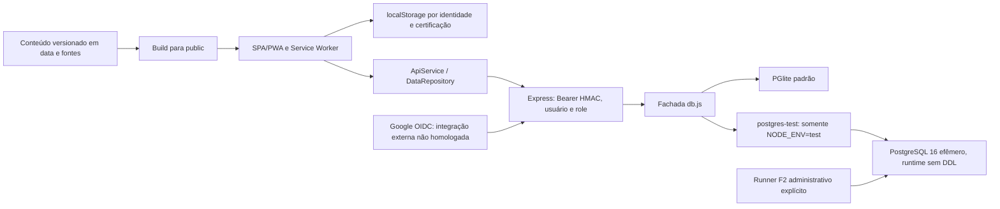
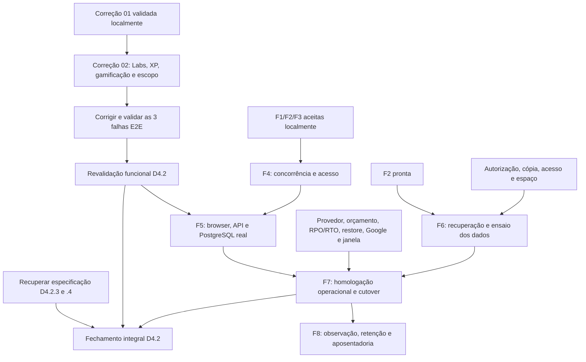

# Checkpoint geral — Cloud Academy A3

**Data:** 07/10/2026. **Branch:** `login-integracao`. **HEAD:** `f29c95f401d86e6ad9e4c27781f6cc6565085fef`.

Diagnóstico do checkout, incluindo alterações ainda não commitadas. Único arquivo criado nesta tarefa: este relatório. Não houve implementação, execução de suítes/build, instalação, abertura de banco, importação ou consulta/mutação de infraestrutura externa. Foram feitas leituras, contagem de JSONs e duas sondas de funções puras em memória.

## A. Resumo executivo

**Estamos aqui:** o produto local-first tem funcionalidades de estudo, identidade local, sessão, vínculo de conta e sincronização limitada. A D4.2 permanece **parcialmente concluída**. A **Correção 01 está VALIDADA localmente**, com código ainda fora do commit: indisponibilidade do banco retorna 503 e preserva sessão/progresso nos cenários testados. Isso supera o defeito de 401 por PGlite fechado descrito na validação anterior; não supera os demais bugs desse relatório.

Na D4.4, **F1, F2 e F3 têm implementação e aceite técnico local em PostgreSQL real de teste**. F3 está no HEAD; o runtime PostgreSQL é deliberadamente restrito a testes. **F4 não foi iniciada como fase de hardening**. Não há evidência de cutover, migração de dados reais ou PostgreSQL remoto operacional. PGlite continua sendo o motor padrão e o caminho de produção previsto no código; o deployment efetivamente em execução não foi verificado.

**Nosso próximo destino é este:** executar a **D4.2 Correção 02**, fechando a reconciliação de Labs/XP e o contrato de gamificação global, com escopo explícito para hooks sem API. Depois, resolver as três falhas E2E e revalidar D4.2. A especificação de D4.2.3/.4 continua ausente e precisa ser recuperada para encerrar a etapa inteira. Na trilha PostgreSQL, seguir para F4, depois F5. Recuperação F6 pode avançar em paralelo se autorizada; F7 só após os dois caminhos aceitos.

**Não fazer ainda:** tratar build como deploy, ligar PostgreSQL de teste em produção, importar o lote de ~900 questões sem inventário, alterar o volume original, publicar modo conectado ou criar AWS por inferência. Não há prova de homologação Google real, nem de publicação operacional do estado deste checkout.

### Preservação antes da análise

`git branch --show-current`, `git rev-parse HEAD`, `git status --short --branch`, `git diff --cached --name-status`, `git diff --name-status` e `git ls-files --others --exclude-standard` mostraram:

```text
## login-integracao...origin/login-integracao
 M __tests__/apiService.test.js
 M __tests__/postgresApi.integration.test.js
 M backend/api/middleware/requireRole.js
 M backend/database/db.js
?? __tests__/apiSessionAvailability.test.js
?? backend/database/errors.js
?? docs/audits/D4.2_CORRECAO_01_CONTINUIDADE_SESSAO.md
?? docs/audits/VALIDACAO_FUNCIONAL_D4_2.md
```

**Staged:** vazio. **Unstaged:** os quatro arquivos `M`. **Untracked:** os quatro `??`. **Auditorias não commitadas:** os dois relatórios D4.2 acima. Todos preexistiam. A referência `origin/login-integracao` é local; não houve fetch e não se afirma atualização em relação ao servidor.

Git/rg avisaram acesso negado a seis diretórios preexistentes `scratch/python-data-test-*`. Não foram abertos, corrigidos nem apagados. Esse limite impede afirmar inventário completo desses temporários, mas não impede ler os fontes e auditorias aqui citados.

### Como ler as evidências

**Atual:** fonte/diff lido ou sonda realizada neste checkpoint. **Histórico verificado:** saída original de execução relida. **Documentado:** resultado registrado em relatório anterior, sem nova execução. **Não comprovado:** falta evidência suficiente; não equivale a inexistência de recurso externo. Aceite técnico local não significa aceite operacional nem publicação.

Fontes principais: [validação D4.2](VALIDACAO_FUNCIONAL_D4_2.md), [Correção 01](D4.2_CORRECAO_01_CONTINUIDADE_SESSAO.md), [recuperação F1](D4.4.1_RECUPERACAO_F1.md), [F2](D4.4.2_MIGRATIONS_POSTGRESQL.md), [auditoria arquitetural](AUDITORIA_MIGRACAO_PGLITE_POSTGRESQL.md) e fontes/testes referenciados abaixo. Referências `arquivo:linha` apontam ao checkout analisado; números dos relatórios antigos podem refletir versões anteriores.

## B. Estado por frente

| Frente | Estado | Evidência | Bloqueio | Próxima ação |
| --- | --- | --- | --- | --- |
| D4.2.1 — continuidade durante sync | Implementada; aceite funcional parcial | `__tests__/accountSync.test.js:140,247,312,380`; validação D4.2 §3 | Cobertura integral entre módulos/dispositivos ainda incompleta | Revalidar após Correção 02/E2E |
| D4.2.2 — vínculo local aditivo/versionado | Validada no escopo v1 | `core/contracts/localLinkMigration.js:1`; `localLinks.test.js`, `localLinkSafety.test.js` | 20 escopos não cobrem todos os módulos | Preservar escopo e acknowledgements/CAS |
| D4.2.3 | NÃO VERIFICÁVEL | Ausência de especificação primária em docs/histórico consultados | Objetivo/aceite desconhecidos | Recuperar definição; não atribuir objetivo por inferência |
| D4.2.4 | NÃO VERIFICÁVEL | Mesmo limite de .3 | Objetivo/aceite desconhecidos | Recuperar definição |
| D4.2.5 — operação da API | Parcial | `docs/API_OPERATIONS.md`; `apiOperations.test.js`, `apiProduction.test.js` | Persistência, backup/restore e operação real não homologados | Executar gates operacionais em ambiente autorizado |
| D4.2.6 — publicação | Preparação parcial | `API_OPERATIONS.md:135`; workflow Pages; configuração pública | API/URL/Google/provedor reais não comprovados | Homologar somente após gates e configuração aprovada |
| Validação funcional D4.2 | Executada, resultado parcial | Relatório de 28/09; E2E 27/30, 3 falhas | Sync e interface; .3/.4 sem especificação | Revalidação após correções |
| D4.2 Correção 01 | **VALIDADA localmente; não commitada** | Diff atual, relatório e execuções originais relidas | Sem homologação externa; não bloqueia iniciar Correção 02 | Preservar e incluir na próxima regressão |
| D4.2 Correção 02 | **NÃO INICIADA** no checkout | Merge e contratos defeituosos ainda presentes | Decisão de escopo global/local | Próximo trabalho recomendado |
| D4.4 F1 — adaptador | Concluída/aceita localmente | `postgres/index.js`, `config.js`, `errors.js`; 44 testes; relatório F1 | Não comprova servidor remoto | Reutilizar |
| D4.4 F2 — migrations | Concluída/aceita localmente | Baseline, manifesto, ledger/runner; 30 testes reais | Runner exclusivamente de teste | Reutilizar sem startup DDL |
| D4.4 F3 — Express isolado | Concluída/aceita localmente | Commit `f29c95f`; `postgres/runtime.js`; 70 aprovados/1 skip | Não é runtime PostgreSQL produtivo | F4 |
| D4.4 F4 | **NÃO INICIADA como fase** | Auditoria §15; riscos ainda no código | Integridade concorrente e acesso | Incrementos de quiz, RBAC, identidade/CAS, editorial |
| D4.4 F5 | Planejada, não executada | Auditoria §15 | F3/F4 estáveis; sync corrigida ou explicitamente suspensa | Browser → API → PostgreSQL real |
| D4.4 F6 | Planejada, recuperação não comprovada | Auditoria §§13/17 | Autorização, cópia consistente, acesso e destino isolado | Recuperar/ensaiar preservando origem |
| D4.4 F7 | Planejada, não executada | Auditoria §15 | F3–F6 aceitas e gates operacionais | Homologação e eventual cutover autorizado |
| D4.4 F8 | Planejada, não executada | Auditoria §15 | Observação, retenção, consumidores e backups | Estabilizar e aposentar legado separadamente |
| ~900 novas questões | Nenhuma etapa demonstrada para esse lote | Catálogo atual e histórico de `data/`; sem manifesto do lote | Origem/inventário não localizados | Inventariar antes de auditar/importar |
| AWS/S3/CloudFront | Sem implementação específica encontrada | Sem IaC/workflow de publicação AWS; auditoria trata outras opções | Arquitetura/decisão ainda não demonstradas | Planejar separadamente, sem provisionar agora |

Os caminhos abreviados `core/...` são relativos a `src/frontend/js/`; `postgres/...` a `backend/database/`. Nenhum trabalho futuro foi iniciado neste checkpoint.

## C. Linha do tempo recente

Ordem obtida de `git log` e dos relatórios; datas de commit são de integração do código, não prova automática de aceite nem definição das subetapas ausentes.

| Data | Marco | Interpretação sustentada |
| --- | --- | --- |
| 14/09 | `a3d7dce`, `6189947`, `45571e5`: quizzes, gamificação/erros, Sprint | Base funcional anterior ao fechamento de contas; não prova sync completa |
| 15/09 | `ec54e1c`: Google OIDC; `5a97961`: expiração/vínculo offline | Implementação interna de autenticação/sessão |
| 16/09 | `6ab84ca`: vínculo/identidade local; `256f879`: orquestração Google/UX | Material relacionado a D4.2.1/.2, preservação e retomada |
| 22/09 | `b8b58f9`: captura da origem durante login | Continuidade durante mudança de identidade |
| 23/09 | `cdcb6fa`: configuração/logs operacionais; `95df0e4`: SW/cache | Material D4.2.5/PWA; não homologação externa |
| 24–25/09 | `b6c6015`, `1f5df0f`, `270e1ac`: acesso sem Google, Pages local-first, modo híbrido | Preparação de build/acesso; não atribuir a D4.2.3/.4 |
| 25/09 | `da0064f`, `b811899`: auditoria D4.4, adaptador/harness e testes de erro | F0/F1; falha histórica da regressão completa exigiu recuperação |
| 26/09 | Recuperação F1: 44 focados e 807 completos aprovados | Aceite local histórico; timeout anterior não foi retroativamente aprovado |
| 26/09 | `16e4fb2`: F2 baseline/ledger/runner; aceite final de 30 testes | Schema vazio de teste; sem importação |
| 28/09 | `f29c95f`: F3 Express/PostgreSQL de teste | Runtime restrito, readiness, BIGINT, papel sem DDL; 70 aprovados/1 skip |
| 28/09, após F3 | `VALIDACAO_FUNCIONAL_D4_2.md`, ainda untracked | D4.2 parcialmente concluída; identifica 401 indevido, merges, contrato global, hooks e 3 falhas E2E |
| 28/09, após validação | Correção 01, ainda fora do commit | Reproduziu 401 em vez de 503, corrigiu classificação e validou recuperação; execuções finais às 23:41/23:51 UTC |
| 07/10 | Este checkpoint | Diagnóstico; nenhuma implementação adicional |

Não há commit/relatório atual de Correção 02 ou F4. Ter transações, CAS ou testes de roles preexistentes não significa que os cenários concorrentes da F4 tenham sido implementados/aceitos.

## D. Estado funcional

### Correção 01 — conclusão e limites

**Classificação: VALIDADA**, restrita aos cenários locais PGlite/PostgreSQL descritos abaixo. Não está apenas em implementação: há reprodução antes, mudança concreta e execução posterior aprovada. Continua não commitada e não publicada.

| Item | Evidência atual / resultado |
| --- | --- |
| Mudanças de runtime | `backend/database/errors.js:1` define `DatabaseUnavailableError`, código `DATABASE_UNAVAILABLE`, status 503; `db.js:508` verifica instância ausente/fechada/em fechamento |
| 401 versus infraestrutura | `requireRole.js:25-72` responde 401 explicitamente a token inválido ou usuário inexistente/inativo e encaminha exceções; `server.js:151-164` separa 503 de 500 |
| Cliente | `src/frontend/js/services/api.js:150-160` expira apenas 401 da sessão que iniciou a requisição; 503 preserva token. Não houve alteração de produção nesse cliente na Correção 01 |
| Token e identidade | `apiSessionAvailability.test.js:104` verifica token original, mesmo UUID e modo online após indisponibilidade |
| Namespace e progresso | Mesmo teste conserva `aws_sim_user:<UUID>:journey`; logout remove sessão, não a chave de progresso. Armazenamento web simulado em `Map`, não navegador real |
| Banco volta | Reabre o mesmo diretório PGlite temporário persistente; `/auth/me` retorna 200 com a mesma sessão. F3 restaura conexão runtime e repete a continuidade |
| Troca A → B | Teste novo em `apiService.test.js:178` controla resposta 401 atrasada via `fetch` mockado e preserva B |
| Distinção HTTP | PGlite: 401/403/409/503; F3 acrescenta erro SQL de permissão 500 (`postgresApi.integration.test.js:271`) |
| Falha antes | Relatório registra exit 1, 1 falho/1 aprovado: esperado 503, recebido 401 |
| Aprovação depois | 5 suites/28 testes aprovados, mais execução isolada 2/2; F3 10 suites/70 aprovados/1 skip. Ver §E |

Não há falha pendente demonstrada no escopo corrigido. Isso não promete preservação universal em toda falha possível nem homologação de navegador + Google + infraestrutura pública. A regressão completa/E2E anterior não foi reexecutada depois dessa correção; deve integrar a revalidação D4.2.

### Matriz de sincronização dos módulos

**A:** local-only para o fluxo pessoal analisado. **B:** sync remoto validado no escopo indicado, em ambiente local de teste. **C:** sync parcial. **D:** contrato incompatível. **E:** não implementado. Nenhum B significa homologação remota pública. Vínculo v1 = diagnóstico, erros, flashcards, jornada e sprint × quatro certificações; Labs/XP/quiz/Pomodoro não entram automaticamente nesses 20 escopos.

| Módulo | Classe | O que existe / limite de validação |
| --- | --- | --- |
| Diagnóstico | **C** | Histórico reconciliável e sync versionada (`dataRepository.js:239`, `progressSync.js:232`); testes de tentativas/contas. Fluxo final E2E falhou pelo aviso de sessão; não é aceite integral |
| Erros | **B**, escopo vinculado | Merge por questão/certificação, snapshots e CAS; `progressSync.test.js:96,105`, `accountSync.test.js:411`, `localLinks.test.js`; validação D4.2 §6 |
| Flashcards | **C** | Catálogo local; progresso do deck tem sync (`dataRepository.js:295-317`, `mergeReviewDeck`). E2E flashcards aprovado, mas mesmo estado compartilhado com revisão não foi aprovado ponta a ponta |
| Revisão | **C** | Merge usa revisão mais recente e maior contador (`progressSync.test.js:121`); `review-deck.spec.js:53` falhou com botão “Já domino” desabilitado |
| Jornada | **B**, escopo vinculado | Merge monotônico, versão e hidratação de novo dispositivo via API/PGlite documentada; `progressSync.test.js:146`; validação §5 |
| Sprint | **B**, snapshot vinculado | União dos dias e próximo dia derivados; `progressSync.test.js:157`, `study-sprint.spec.js`; não prova cenários remotos além desse contrato |
| Labs | **C** | Snapshot `completedLabIds` e endpoint genérico existem; merge usa helper de Jornada que não une esse campo (`progressSync.js:170-190,245`); perda do remoto confirmada em memória |
| Gamificação | **D**, global | Cliente chama `syncModuleState('gamification', null)` (`dataRepository.js:340,520`), PUT exige certificação exceto para preferences (`me.js:159-172`). Resultado anterior 400; contrato ainda incompatível |
| XP | **C**, dependente do contrato **D** global | Eventos e deduplicação locais existem (`storageManager.js:808-841`); merge remoto não une `events` e aplicação substitui o array (`storageManager.js:1234`). Nenhum aceite de sync XP |
| Histórico de simulados | **A** | `dataRepository.js:206` chama `syncQuizResult` somente se existir; método ausente no `ApiService`. API de quizzes online existe, mas não é importação/sync do histórico offline |
| Cases | **A**, progresso pessoal do fluxo analisado | Catálogo/avaliação e rotas de progresso no backend não provam reconciliação do estado pessoal local. E2E local de cases aprovado; não há sync pessoal validada |
| Pomodoro | **A** | Sessões locais; `dataRepository.js:420` condiciona envio a `syncFocusSession`, ausente no `ApiService`; E2E local aprovado |

`syncQuizResult`, `syncGamification` e `syncFocusSession` estão **E como métodos específicos do ApiService**. O hook ausente de gamificação convive com uma tentativa real pelo endpoint genérico; por isso o módulo global é D, não simplesmente ausente. Nenhum dos doze módulos de produto inteiro foi classificado E só porque seu hook está ausente.

As duas sondas deste checkpoint executaram `reconcileModuleState` sem banco/arquivos de saída:

```text
labs: local completedLabIds=[local], remoto=[remote] → [local]
gamification: local events=[local], remoto=[remote] → events=[local]
```

Elas confirmam o defeito da função atual; não afirmam perda observada em produção. A validação anterior também documenta o caminho Labs via API/PGlite.

### Autenticação

| Camada | Implementação local | Evidência e limite |
| --- | --- | --- |
| Google OIDC | `googleIdentity.js` verifica token, issuer, audience, expiração, email verificado e domínio; `/auth/google` resolve identidade e emite sessão da aplicação | `backend/api/services/googleIdentity.js:1-85`, `routes/auth.js:107`; Google real não exercitado |
| Sessão | Bearer HMAC, usuário carregado pelo `sub`, expiração e logout; identidade/namespaces separados | `sessionToken.js`, `sessionManager.js`, `auth401.test.js`; não aceita `X-User-Id` sozinho |
| STUDENT | Conta comum criada sem aceitar role enviada pelo cliente | `googleAuth.test.js:126`, `api.access.test.js:49`; persistência local real nos testes |
| VALIDATOR | Role e autorizações por certificação para fluxos de revisão | `api.access.test.js:104`; CRUD editorial ainda tem lacuna, ver §F |
| ADMIN | Gestão de acesso e bootstrap testados | `authRoles.test.js:59-103`; proteção sequencial do último ADMIN existe, atomicidade concorrente pendente |
| Vínculo local | Identificador local, proprietário da conta, pending/completed, receipts e 20 escopos | `localLinkMigration.js`, `backend/database/localLinks.js`, `localLinkSafety.test.js`; sem ampliar v1 |
| Persistência da identidade | `users`/`user_identities` no servidor e sessão/namespaces no navegador | `db.js:1534`, `userIsolation.test.js`, `offlineLinking.test.js`; primeiro login concorrente ainda não aceito |

**Mocks e bypass:** `googleAuth.test.js:13` mocka `google-auth-library`; `googleAuthRoute.test.js:13` mocka o verificador Google. F3 executa essas mesmas suites com banco real, mantendo Google mockado. `apiSessionAvailability`, `auth401` e F3 usam usuários/tokens HMAC sintéticos, não credenciais Google reais. `api.validation.test.js:66,147-155` usa DB mockado e `X-Test-Role`; o bypass em `requireRole.js:26` exige `NODE_ENV=test`. Login só por email é permitido em teste/dev autorizado e recusado em produção (`auth.js:43-47`). E2E de continuidade intercepta GIS/API (`e2e/auth-continuity.spec.js:19-31`); E2E local-first injeta runtime de teste.

**Não validado externamente:** login Google real; recuperação real de conta Google; autorização de origins/domínio no Console; correspondência Client ID frontend/backend publicados; OAuth num ambiente real; API pública real. A allowlist de email padrão do backend (`a3data.com.br,a3data.com`) é configuração de código, não prova de autorização do Google Console. Há Client ID no artefato local versionado; não há prova de que esteja publicado/autorizado.

## E. Estado dos testes

Nenhuma suite foi executada neste checkpoint. A tabela distingue registros anteriores de verificações atuais, sem somar testes de execuções distintas como uma única regressão.

| Execução | Resultado verificável | Fonte / alcance |
| --- | --- | --- |
| F1 `npm run test:postgres` | Histórico documentado: exit 0, 2 suites/44 testes | Relatório F1 §testes; PostgreSQL 16 descartável |
| F1 `npm run test:postgres -- --full` | Histórico documentado: exit 0, 94 suites/807 testes | Relatório F1:71-72; aprovação de 26/09, não deste worktree com Correção 01 |
| F2 `npm run test:postgres:migrations` | **Saída original relida:** exit 0, 1 suite/30 testes, 30,027 s | Registro original de 26/09 às 14:16:58 UTC; fonte complementar abaixo |
| D4.2 Jest integral em cópia isolada | Documentado: exit 0; 93 suites aprovadas/3 skipped; 789 testes aprovados/57 skipped (846 total) | Validação D4.2 §4. Os skipped são integrações PostgreSQL desativadas |
| D4.2 focused | Primeira execução: 6 falhas de `spawn EPERM`; repetição das 2 suites afetadas: 21 aprovados, exit 0 | Mesmo relatório; falha ambiental inicial não vira PASS retroativo |
| D4.2 E2E integrado selecionado | Documentado: exit 1; **27 aprovados/3 falhos**, 30 testes | Comando completo no relatório §4. Settings, resultado de diagnóstico e review deck falharam; não dizer “E2E verde” |
| Builds D4.2 local-first e híbrido | Documentado: exit 0 nos dois; configuração híbrida sintética e auditoria de segredos aprovadas | Cópia isolada; sem deploy |
| Sondas D4.2 anteriores | Documentado: 7 expectativas falharam entre 15 | Snapshot anterior à Correção 01; não reapresentar todas como defeitos atuais |
| Correção 01 focused | **Saída original relida:** exit 0; 5 suites/28 testes, 17,8 s | 28/09 às 23:41:41 UTC; comando no relatório Correção 01 §testes |
| Correção 01 isolada | Saída original relida: 1 suite/2 aprovados; relatório registra repetição final após asserção de payload | `apiSessionAvailability.test.js`; armazenamento simulado e PGlite temporário persistente |
| Correção 01/F3 `npm run test:postgres:api` | **Saída original relida:** exit 0, 10 suites/70 aprovados/1 skipped | 28/09 às 23:51:10 UTC; PostgreSQL real; mocks Google permanecem |
| Este checkpoint | Duas sondas puras reproduziram merges incompletos; leitura JSON confirmou contagens; `git diff --check` exit 0 | Não são testes de integração nem prova operacional |

**Detalhe dos 70 testes F3:** postgresApi 8; api.integration 16; accountPersistence 3; api.access 5; authRoles 5 + 1 skip; auth401 4; googleAuth 5; googleAuthRoute 4; localLinks 8; casesEvaluateAuth 12. O skip é `authRoles.test.js:119`, cenário legado que altera constraints e não pode rodar com o papel runtime sem DDL. Não conceder DDL ao runtime para eliminar esse skip.

**Rastreabilidade complementar:** os logs temporários citados nos relatórios não apareceram na consulta atual de `%TEMP%`. Para F2 e Correção 01/F3 foram lidos os registros originais de ferramentas em:

- `C:\Users\karla.rosario_a3data\.codex\sessions\2026\09\26\rollout-2026-09-26T10-32-46-01a0ddea-fcc8-7a32-82b6-1b3e705624e7.jsonl:445` — exit 0 e 30/30 F2.
- `C:\Users\karla.rosario_a3data\.codex\sessions\2026\09\28\rollout-2026-09-28T09-30-42-01a0e7fe-f758-78e1-90a2-e37eaef76c68.jsonl:1151` — 28/28; `:1206` — dez suites F3 e exit 0; `:1093` — indisponibilidade 2/2.

Esses registros são locais e não versionados neste repositório; foram usados apenas para conferir saídas históricas, sem anexar credenciais ou dados de sessão ao relatório. O relatório F2 ainda contém “resultado final registrado ao concluir” na tabela e números de rodadas intermediárias; **30 é a execução final conferida**, não uma dedução pela quantidade de testes no fonte. Não foi encontrado relatório F3 separado no checkout atual; código, commit, registros originais e relatórios D4.2 sustentam sua avaliação.

## F. Dívidas e bugs atuais

Severidade considera impacto quando o fluxo é usado/exposto; não afirma incidente produtivo.

| Criticidade | Risco atual sustentado | Evidência / estado |
| --- | --- | --- |
| **CRÍTICO, bloqueador de cutover/descarte** | Integridade/recuperação da única origem PGlite não comprovadas; troca ou descarte pode tornar dados irrecuperáveis | Auditoria §§17.1–17.3. Volume não inspecionado neste checkpoint; não há prova de corrupção/perda já ocorrida |
| **ALTO** | Reconciliação Labs pode apagar IDs remotos do estado resultante | `progressSync.js`, sonda atual e validação D4.2 |
| **ALTO** | Eventos XP remotos podem desaparecer do merge; gamificação global é recusada com 400 | `mergeGamificationState`, `storageManager.js:1234`, `me.js:164` |
| **ALTO** | Quizzes: answer/finish/abandon ainda sem prova de serialização concorrente | `db.js:3011,3189,3300` usa transações e leituras sem `FOR UPDATE`; estado/score podem disputar entre conexões. F3 não fecha F4 |
| **ALTO** | Último ADMIN e concessão/revisão de acesso não atômicos | `db.js:2220-2265`: COUNT separado de UPDATE; `:2110-2190`: request/grant/role/audit em operações separadas |
| **ALTO** | Identidade concorrente: primeiro login/mesmo email/subject sem aceite com conexões independentes | `resolveGoogleIdentity` tem transação e constraints, mas seleção/inserção ainda requer interleaving real; não afirmar ausência de qualquer proteção |
| **ALTO** | Autorização editorial incompleta por certificação | `questions.js:314,351` exige role, mas POST/PUT não fazem checagem de certificação como o fluxo de validação. F4 deve cobrir criação, edição/movimentação e campos operacionais |
| **ALTO, operacional** | Publicação/cutover sem restore e rollback de dados comprovados | Auditoria §17: voltar deploy não desfaz novas escritas; não há caminho reverso PostgreSQL → PGlite validado |
| **MÉDIO** | Aviso de sessão intercepta controles; revisão com botão desabilitado | 3 falhas E2E documentadas; CSS atual `style.css:995` continua fixo com z-index 1000. Causa do deck ainda não isolada |
| **MÉDIO** | Hooks opcionais sem implementação podem induzir expectativa de sync inexistente | `syncQuizResult`, `syncGamification`, `syncFocusSession`; preservar local e explicitar escopo |
| **MÉDIO** | Escrita sem versão continua aceita; cliente legado pode contornar CAS | `me.js:178`, `API_OPERATIONS.md:129`; não tornar obrigatória sem contrato/migração de consumidores |
| **MÉDIO** | Criação pública de usuário e superfícies legadas | `backend/api/routes/users.js`; `API_OPERATIONS.md:119`; FastAPI/socket sem confirmação de consumidores/exposição. Revisar antes da publicação, não remover por inferência |
| **MÉDIO** | Artefato `public` atual difere da intenção local-first do workflow | Runtime local com API vazia e sem flags; exposição real desconhecida, requer conferir artefato antes de publicar |
| **BAIXO** | Documentação histórica desatualizada e evidência dispersa | README do adaptador ainda diz que F2 está pendente; roadmap de junho usa contagens/resultados antigos; tabela F2 sem fechamento explícito |

**Resolvido localmente, não repetir como bug aberto:** PGlite fechado transformado em 401; resposta 401 atrasada de A invalidando B tem guarda existente e teste novo; erro de permissão SQL mascarado como autenticação agora chega como 500. A tabela antiga da auditoria descreve o estado anterior. BIGINT seguro e restrição de DDL foram tratados no F3 de teste; limites produtivos continuam sujeitos a F7.

## G. Arquitetura atual



Sync: a escrita local permanece disponível; módulo/conta/certificação formam o contexto. O repositório recaptura estado, reconcilia, usa versões e verifica identidade antes de aplicar respostas. `/api/me/state/:module` guarda snapshots JSONB; vínculo local registra pending/completed e comprovação por escopo. Isso não equivale a sincronização automática de cada tabela/feature.

### Banco: o que mudou e o que não está comprovado

**PGlite:** `backend/database/db.js:412` usa `pglite` por padrão, inicializa schema/migrations locais e atende Express. `backend/server.js`/socket e ferramentas de seed/diagnóstico também o usam. Testes de persistência, auth/contas/links, API, operação e a Correção 01 ainda dependem de PGlite (memória ou diretório temporário); parte dos testes usa mocks. O Jest comum deixa integrações PostgreSQL skipped. Não remover PGlite enquanto esses consumidores e a recuperação dependerem dele.

**PostgreSQL F1:** driver `pg@8.23.0`, pool, client reservado por transação, rollback, timeouts, shutdown e erros sanitizados. BIGINT do adaptador permanece string exata. Aceite local real consta do F1; não é só mock.

**PostgreSQL F2:** `0001-effective-baseline.sql`/manifesto representam schema efetivo (22 tabelas da aplicação, incluindo local links, enums/views/função/triggers/extensões). Ledger `cloudacademy_migrations.history`, checksums de SQL/schema, advisory lock e DDL transacional estão em `migrations/runner.js:77,119,161-179`. Testes cobrem baseline, idempotência, drift, rollback, concorrência/interrupção, FKs e tipos. CLI/target recusam produção e bases legadas sem ledger. Baseline não é importação de dados.

**PostgreSQL F3:** `db.js:427` chama `createTestPostgresRuntime`; `postgres/runtime.js:46-61` exige `NODE_ENV=test`, loopback, banco/role/marcador específicos. Valida schema/ledger/readiness sem DDL/seed; falha sem fallback. Papel `cloudacademy_f3_runtime` não é dono nem superusuário, não cria objetos e só lê ledger (`scripts/testing/postgres-api.mjs:27-40`). Conexão/timeout dão 503, token inválido 401, role 403, CAS 409, erro interno 500. BIGINT converte somente inteiros seguros para preservar contrato HTTP e recusa overflow, sem arredondar (`runtime.js:31-42`). Testes comprovam startup, readiness/liveness, transação/rollback e shutdown.

O harness usa PostgreSQL 16 fixado por digest, tmpfs e porta loopback, com preparação F2 separada. `docker-compose.yml` existe como configuração local legada; sua existência não comprova serviço em execução. FastAPI/`psycopg2` e importadores Python legados não são prova de cutover do Express.

**Confirmações com limite explícito:** não há migração de dados reais demonstrada nas entregas F1–F3/Correção 01; nenhum dado foi migrado aqui. Não há cutover nem banco PostgreSQL remoto operacional comprovado. Os relatórios anteriores registram preservação da origem; **o volume original não foi acessado nem alterado por esta tarefa**. Não é possível certificar, só pelo Git, que terceiros nunca o alteraram. Seu estado atual/integridade permanece não verificado. Tamanho informado (~32 MB) ou falha de memória relatada não provam vazio nem corrupção. O risco conhecido é recuperação/retenção ainda sem prova; o diagnóstico deve abrir cópia, nunca a única origem.

### Publicação e configuração

| Item | Implementado | Testado localmente | Publicado / operacionalmente validado |
| --- | --- | --- | --- |
| GitHub Pages | `.github/workflows/deploy-pages.yml`: push em main/manual, build/upload/deploy/smoke | Build e testes sob subpath documentados | Não se consultaram runs/deployment/site; workflow existente não prova último deploy |
| `PUBLIC_BUILD_TARGET` | `local-first`, `hybrid`, `pages`/`connected` em `scripts/public-runtime-config.cjs:12` | Local-first e hybrid sintéticos aprovados | Workflow deste checkout fixa `local-first`; branch analisada não é main |
| `PUBLIC_API_BASE_URL` | Variável pública efetivamente suportada, obrigatória em pages/connected; valida URL | Testes de config e build com `https://api.example.test` | `public/js/runtimeConfig.js:1` local contém API vazia; nenhuma URL real foi inventada |
| `GOOGLE_CLIENT_ID` | Suportado; Client ID presente no runtime versionado | Verificador/mock e builds sintéticos | Presença local não prova publicação, audience correspondente nem origins autorizadas |
| Entrada local-first | Dispensa GIS; continuidade local implementada | E2E local-first documentado | Disponibilidade do site publicado não verificada |
| Entrada híbrida | Local + Google quando há Client ID/API; fallback local preservado | Build/E2E com configuração sintética | Sem homologação externa |
| Service Worker | Fonte `src/frontend/pwa/sw.js`, artefato `public/sw.js`, validação PWA no workflow | PWA/E2E selecionado documentado | Versão/cache ativo nos navegadores publicados não conferidos |
| API pública / Railway | Contrato operacional Express/PGlite e referência histórica à origem Railway | Probes/shutdown e testes locais | Disponibilidade, deployment, volume, backups e configuração remota atuais não comprovados |
| PostgreSQL externo | Arquitetura planejada; integração apenas de teste | F1/F2/F3 reais locais | Sem banco remoto/cutover demonstrado |

**Divergência local concreta:** `public/js/runtimeConfig.js` possui Client ID, `apiBaseUrl: ""`, `allowDevEmailLogin: false`, sem `localFirst`/`hybrid`. Portanto esse arquivo não representa a saída local-first pretendida pelo workflow atual. Não foi regenerado: build está fora desta tarefa. Também não se assume que ele seja o arquivo servido por Pages.

### Conteúdo e lote de aproximadamente 900 questões

Leitura atual dos oito JSONs principais: CLF 394 PT + 394 EN; SAA 285 + 285; DVA 284 + 284; AIF 306 + 306 = **2.538 registros somando os arquivos PT/EN**, correspondendo a 1.269 por soma de uma língua, sem afirmar unicidade semântica entre registros. São dados existentes, não evidência de importação de 900 novos itens.

Últimos commits de conteúdo encontrados incluem `5700b87` (expansão AIF, 14/09) e `6faa223` (metadados/testes AIF, 14/09). Auditorias antigas de questões tratam outra fotografia (AIF 284/286), sem vincular um lote de ~900. `data/contributions` contém exemplo de contribuição; não foi localizado staging/manifesto identificável desse lote.

| Etapa do lote ~900 | Estado real demonstrável |
| --- | --- |
| Recebimento | Não comprovado: arquivos/origem/manifesto do lote não identificados; não afirmar “já recebido” |
| Auditoria/deduplicação | Não comprovadas para esse lote; relatórios antigos não servem como aceite dele |
| Conversão/staging | Não encontrados artefatos atribuíveis ao lote |
| Importação nos JSONs | Não demonstrada pelo histórico/inventário; conteúdo atual não deve ser rotulado como o lote |
| Entrada no banco | Não há execução/manifesto demonstrando importação; banco remoto não consultado |
| Publicação/Pages | Nenhuma publicação desse lote comprovada |
| Envio ao S3 | Nenhum workflow/log/recurso de envio identificado |

**Nenhuma dessas operações do novo lote foi executada nesta tarefa; no material inspecionado, nenhuma está demonstrada como concluída.** Não é possível excluir recebimento fora deste workspace.

### AWS / S3 / CloudFront

Não foram encontrados IaC, bucket/distribution IDs de hospedagem do projeto, OAC, política de origem, trust policy AWS/GitHub ou workflow `aws-actions`/upload S3/invalidação CloudFront. Menções a S3/CloudFront no conteúdo educacional não são infraestrutura implantada.

| Frente | Estado |
| --- | --- |
| Arquitetura proposta AWS específica | Não localizada; a auditoria de infraestrutura existente compara Railway/Render/Neon e separa API/banco (§12) |
| Auditoria AWS/S3/CloudFront | Não localizada como entrega específica; não confundir com auditoria PGlite/PostgreSQL |
| Recurso AWS criado / bucket / CloudFront / OAC | Nenhum recurso comprovado; conta AWS não foi consultada |
| Workflow AWS | Não encontrado no checkout |
| OIDC GitHub Actions → AWS | Não encontrado; `id-token: write` do workflow Pages não comprova federação AWS |
| Publicação real AWS | Não comprovada; nada criado/enviado nesta tarefa |

Portanto permanece uma frente futura a definir, não uma infraestrutura existente a apenas “ligar”. Conteúdo pode ser inventariado sem AWS; publicar em S3 depende de decisão arquitetural e pipeline próprio, não é pré-requisito automático da D4.2.

## H. Dependências



**Ajuste à sequência linear solicitada:** a auditoria §15 define F5 como continuidade local-first e F6 como recuperação/ensaio. F6 **não depende de F5 para começar**: depende de F2 e autorização/acesso/cópia/destino isolado; a auditoria permite trilha paralela. F7 exige F3–F6 aceitas. F8 exige observação, retenção, consumidores verificados e backups restauráveis; retirada de código não autoriza apagar volumes.

**Onde as trilhas se encontram:** Correção 01 fornece semântica de falhas; Correção 02 estabiliza estado/contratos; correções E2E e revalidação D4.2 preparam F5. F4 estabiliza concorrência e acesso da API que F5 exercita com browser e PostgreSQL reais. F7 reúne essa evidência com F6, operação, Google e publicação; daí pode sustentar D4.2.5/.6 em operação. Nem D4.2 local aprovada nem F3 sozinha dispensam esses gates.

Correção 02 é o nome recomendado para o próximo pacote de problemas descrito na validação, não uma especificação prévia encontrada. Quiz/Pomodoro devem permanecer explicitamente locais enquanto seus contratos não forem definidos; não ampliar o vínculo v1 silenciosamente. Recuperar .3/.4 pode acontecer em paralelo e não exige adiar a correção de perda já reproduzida.

## I. Roadmap atualizado

### AGORA

| Próximo trabalho | Motivo | Pré-requisito | Resultado esperado | Risco de fazer fora de ordem |
| --- | --- | --- | --- | --- |
| **D4.2 Correção 02 — reconciliação e contratos de sync** | Labs/XP ainda descartam remoto; gamificação global retorna 400 | Preservar Correção 01 e seu aceite; definir contrato global e escopo dos hooks antes de alterar comportamento | União determinística/idempotente de IDs/eventos, contrato cliente/API compatível ou suspensão explícita de sync; testes locais reais apropriados; sem expansão silenciosa do v1 | Revalidar/publicar antes mantém perda de estado e falso entendimento de sync |

### DEPOIS

| Trabalho | Motivo | Pré-requisito | Resultado esperado | Risco de fazer fora de ordem |
| --- | --- | --- | --- | --- |
| Corrigir aviso de sessão e investigar deck | 3 falhas E2E ainda abertas | Correção 02 estabilizada para fechar regressão coerente; investigação pode ser independente | Controles acessíveis e critério de revisão correto; E2E integrado selecionado verde | Mascarar produto com fixture ou passar spec isolada sem comando integrado |
| Revalidar D4.2 e fechar escopo .3/.4 | Resultado anterior parcial; especificações ausentes | Correções aceitas e requisitos recuperados/escopo formalizado | Matriz atualizada com testes, skips e limites externos separados | Declarar etapa completa sem requisitos ou com falhas antigas |
| D4.4 F4 em incrementos | Corridas e autorização impedem produção PostgreSQL | API F3; política editorial e casos de concorrência definidos | Quizzes, RBAC/último ADMIN, identidade/CAS e editorial comprovados com ≥2 conexões e interleaving observado | F5/cutover sobre API que mantém estados parciais/inconsistentes |
| D4.4 F5 | Falta integração browser → API → PostgreSQL real | F3/F4 estabilizadas; Correção 02 e E2E aceitos | Login/conta A/B, 503/reload/offline, pending/complete com dados preservados | Confundir mocks/browser estático com continuidade real |

### MAIS ADIANTE

| Trabalho | Motivo | Pré-requisito | Resultado esperado | Risco de fazer fora de ordem |
| --- | --- | --- | --- | --- |
| F6 — preservar e recuperar origem; pode antecipar em paralelo autorizado | Dados originais não recuperados/validados | Autorização específica, cópia consistente/imutável, espaço, runtime compatível e F2/destino isolado | Export lógico/manifesto e ensaio repetido conferindo UUIDs/FKs/versões/pending, restore e tempos | Abrir/migrar a única cópia ou substituir contas por seed |
| Planejamento de infraestrutura, incluindo decisão AWS se mantida | Provedor/topologia/publicação não comprovados | Requisitos, orçamento, retenção e arquitetura aprovados | Decisão API/banco/estático, TLS, backups, identidade, rollback; eventual S3/CloudFront/OAC/OIDC com escopo próprio | Custo/exposição antes de integridade e recuperação estarem definidas |
| Inventariar e preparar lote ~900 | Não há rastreabilidade de origem/estado | Receber/localizar arquivos, preservar originais, definir schema/fonte editorial | Auditoria, deduplicação, conversão/staging e manifesto aprovados antes de importar | Duplicar/substituir conteúdo ou confundir JSON/S3 com restauração de dados pessoais |
| F7 — homologação e publicação/cutover | Converter validação local em operação comprovada | F3–F6; restore aprovado; Google/URL/TLS; provedor/RPO/RTO/janela e autorização de publicação | API pública e login reais, tráfego/autoridade de escrita controlados e rollback ensaiado | Perder novas escritas, publicar cliente sem API ou autenticação autorizada |
| Publicar conteúdo aprovado | Disponibilizar lote auditado no canal decidido | Aceite editorial, build/checks e pipeline de publicação; importação DB com decisão separada | Artefato/manifesto publicado e verificado; S3 somente se escolhido | Enviar material não auditado ou dar por importado só por upload |
| F8 — estabilização/aposentadoria | Retirar legado com segurança | Janela e retenção cumpridas; consumidores e backups independentes confirmados | Remoção revisável de código legado; decisão específica sobre dados/volumes | Perder toolkit de recuperação ou consumidores ainda ativos |

## K. Estado final do Git

A seção K antecede J para que o relatório termine exclusivamente com a descrição da próxima tarefa recomendada.

Branch e HEAD permaneceram `login-integracao` / `f29c95f401d86e6ad9e4c27781f6cc6565085fef`. Staged permaneceu vazio. Os quatro unstaged e quatro untracked iniciais foram preservados; o único acréscimo é:

```text
?? docs/audits/CHECKPOINT_GERAL_PROJETO.md
```

Verificação de preservação concluída: fingerprint SHA-256 agregado dos **710 arquivos enumeráveis pelo Git**, excluído este relatório, idêntico antes/depois: `2ec2eced8faafbbba95f64654cd1778eea3069eb8e3fb7a615e3c7552661f200`. Conjunto e conteúdo preexistentes permaneceram idênticos. A leitura não alcança os temporários `scratch` com acesso negado já citados. A execução de hash via subprocesso foi inicialmente bloqueada com `spawnSync git EPERM`; a repetição de leitura autorizada fora do sandbox calculou o fingerprint, sem modificar arquivos.

Não houve reset, clean, checkout, commit, push, pull, merge, deploy, mudanças de dependências, frontend, testes, schema, dados, Railway, AWS, Pages ou OAuth. O worktree continua sujo pelas alterações **preexistentes**, não por implementação desta tarefa.

## J. Próximo prompt recomendado

Executar D4.2 — Correção 02: auditar e corrigir a reconciliação de Labs (`completedLabIds`) e eventos XP para preservar a união local/remota com idempotência e ordem determinística; definir e alinhar o contrato de gamificação global entre DataRepository, ApiService e Express, ou suspender explicitamente esse sync até haver contrato aprovado. Preservar integralmente a Correção 01, tokens, identidades, namespaces, progresso e o vínculo v1 de 20 escopos. Explicitar `syncQuizResult`, `syncGamification` e `syncFocusSession` ausentes e manter quiz/Pomodoro locais enquanto não houver escopo remoto aprovado. Reaproveitar os testes existentes, adicionar os cenários de perda/retomada/CAS pertinentes, validar com bancos locais isolados e registrar resultados e limites em relatório próprio. Não iniciar F4, migração de dados, importação de questões, infraestrutura, OAuth, publicação, commit, push ou deploy.
