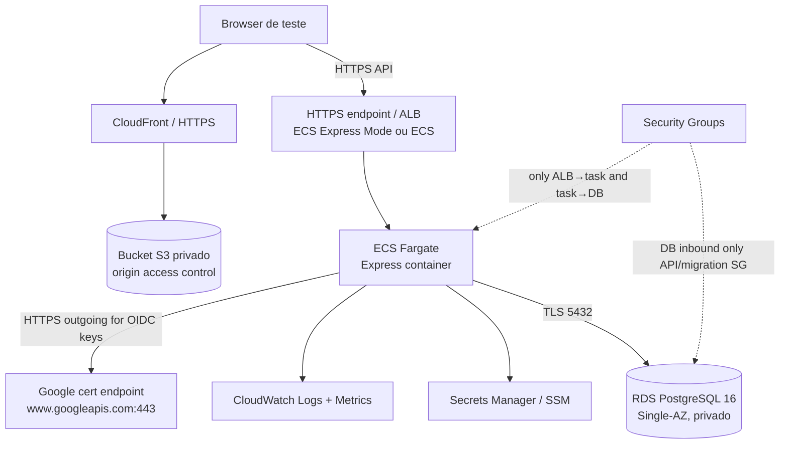

# P0 — Decisões e contrato de staging AWS — Cloud Academy A3

Data: 07/10/2026
Branch: `login-integracao`
HEAD: `b9dbc1711f3d245d4a4eb1b69ef85c85c148e0b4`

Este documento define o contrato e os gates de staging. É planejamento, não autorização para criar recursos. Nenhum código, serviço, conta, domínio, Google Console ou banco foi alterado.

## A. Estado inicial

- Branch: `login-integracao`.
- HEAD: `b9dbc1711f3d245d4a4eb1b69ef85c85c148e0b4` (`feat: enhance settings and diagnostic tests; update CSS for session notice handling`).
- `git status --short --branch`: branch alinhada a `origin/login-integracao`; único arquivo não rastreado preexistente era `docs/audits/AUDITORIA_PRONTIDAO_DEPLOY_AWS.md`.
- Staged: nenhum. Unstaged rastreado: nenhum. Untracked inicial: somente o relatório AWS anterior.
- Os diretórios `scratch/python-data-test-*` geraram mensagens de acesso negado em comandos de inventário; foram deixados intactos.

## B. Verificação documental D4.2

| Relatório | Existe no worktree | Rastreado no HEAD | Commit localizado por caminho | Conclusão |
| --- | --- | --- | --- | --- |
| `VALIDACAO_FUNCIONAL_D4_2.md` | Sim | Sim | `a25c6b9` | Histórico documental localizável; contém a validação histórica e deve ser lido junto às correções posteriores. |
| `D4.2_CORRECAO_01_CONTINUIDADE_SESSAO.md` | Sim | Sim | `a25c6b9` | Histórico documental localizável. |
| `D4.2_CORRECAO_02_LABS_XP_GAMIFICACAO.md` | Sim | Sim | `a25c6b9` | Histórico documental localizável. |
| `D4.2_CORRECAO_03_E2E.md` | **Não** | **Não** | Nenhum commit encontrado em refs locais | Ausente do worktree e do histórico Git disponível; não há prova documental recuperável pelo caminho atual. |
| `D4.2_REVALIDACAO_FINAL.md` | **Não** | **Não** | Nenhum commit encontrado em refs locais | Ausente do worktree e do histórico Git disponível; não há prova documental recuperável pelo caminho atual. |

Os dois relatórios não foram recriados ou editados. A história contém commits de código recentes (`f29c95f`, `a25c6b9`, `b9dbc17`) e relatórios 01/02/validação, mas o commit/caminho ausente não fornece os resultados completos das execuções E2E da Correção 03 ou da revalidação final. Isso é lacuna documental, não evidência de perda de implementação. Não bloqueia planejamento P0 nem staging técnico sintético; impede afirmar, por esses arquivos, a comprovação histórica final. Para staging funcional, os gates serão executados novamente no alvo real.

## C. Região

| Critério | `sa-east-1` — São Paulo | `us-east-1` — N. Virginia |
| --- | --- | --- |
| Usuários principais no Brasil / latência | Menores RTTs prováveis para chamadas dinâmicas Browser→API→DB; reduz viagens de rede interativas. | Maior latência transatlântica para API/DB. CloudFront aproxima conteúdo estático, mas não remove latência de API. |
| Serviços candidatos | RDS (incluindo PostgreSQL), ECS/Fargate, S3, Secrets Manager e CloudWatch têm suporte regional documentado; CloudFront é serviço global. ECS Express Mode está disponível nas regiões ECS/Fargate. | Os mesmos serviços candidatos estão disponíveis; ECS/Fargate e ECS Express Mode também. |
| App Runner | A tabela atual de endpoints/regiões não lista `sa-east-1`; além disso, App Runner fechou a novos clientes em 31/03/2026. | Região aparece na tabela atual, mas novos clientes também estão sujeitos ao encerramento de onboarding. Só considerar se a conta já tinha elegibilidade anterior confirmada; não há essa evidência no projeto. |
| Preço | Espera-se custo unitário superior em vários serviços; a comparação final deve usar Pricing Calculator com classe/horas/storage concretos. Preço mais alto é trade-off por menor latência/região. | Em geral é candidato de menor custo e tem mais exemplos públicos de preço; confirmar serviço a serviço e não assumir diferença percentual fixa. |
| Residência de dados | Banco/segredos/logs na região brasileira se contratos/política exigirem residência no Brasil. Não há requisito de residência documentado no repositório. | Dados operacionais ficariam fora do Brasil; não escolher sem a decisão de negócio/privacidade e eventual análise jurídica aplicável. |

**REGIÃO RECOMENDADA PARA STAGING: `sa-east-1`, como recomendação técnica, sujeita a decisão humana.** Um staging no mesmo território da produção candidata revela latência real e diferenças regionais de serviço/preço antes da homologação. `us-east-1` é alternativa econômica para laboratório sintético se o orçamento impedir São Paulo, mas esse staging não representa fielmente latência/região de produção.

**REGIÃO RECOMENDADA PARA PRODUÇÃO: `sa-east-1`, condicional, sujeita a decisão humana.** É a escolha técnica inicial para audiência brasileira e se houver exigência de residência. `us-east-1` continua alternativa se custo/serviços disponíveis prevalecerem e a proprietária aprovar localização e latência. Não existe requisito de residência ou decisão de localização registrado, portanto nenhuma região está aprovada.

CloudFront é global; S3, RDS, ECS/Fargate, Secrets Manager e CloudWatch têm endpoints/disponibilidade para as duas regiões candidatas. A AWS confirma RDS em São Paulo e N. Virginia, e ECS/Fargate inclui São Paulo. A matriz regional do RDS também lista PostgreSQL 16 para `sa-east-1` e `us-east-1` nas opções Multi-AZ cobertas; a versão/engine/class exata, extensões, quotas e tipos de instância deve ser revalidada na região escolhida imediatamente antes do desenho executável. Fontes: [regiões RDS](https://docs.aws.amazon.com/AmazonRDS/latest/UserGuide/Concepts.RegionsAndAvailabilityZones.html), [matriz regional Multi-AZ PostgreSQL 16](https://docs.aws.amazon.com/AmazonRDS/latest/UserGuide/Concepts.RDS_Fea_Regions_DB-eng.Feature.MultiAZDBClusters.html), [regiões ECS/Fargate](https://docs.aws.amazon.com/AmazonECS/latest/developerguide/AWS_Fargate-Regions.html), [endpoints Secrets Manager](https://docs.aws.amazon.com/secretsmanager/latest/userguide/asm_access.html), [endpoints CloudWatch](https://docs.aws.amazon.com/general/latest/gr/cw_region.html), [App Runner availability change](https://docs.aws.amazon.com/apprunner/latest/dg/apprunner-availability-change.html), [ECS Express Mode](https://docs.aws.amazon.com/AmazonECS/latest/developerguide/express-service-overview.html).

**Atualização material da auditoria AWS anterior:** sua recomendação de App Runner como candidato simples não pode ser aplicada a uma conta nova no estado atual. AWS fechou o serviço para novos clientes em 31/03/2026 e recomenda ECS Express Mode. App Runner também não consta na lista de regiões do serviço para São Paulo. O relatório anterior permanece preservado; este contrato o supersede nesses pontos. [Comunicado oficial](https://docs.aws.amazon.com/apprunner/latest/dg/apprunner-availability-change.html).

## D. Orçamento de staging

Valores são faixas da auditoria anterior usadas como envelope de planejamento, não cotação nem compromisso. Foram ajustadas qualitativamente porque a opção viável agora é ECS/Fargate + load balancer, não App Runner. São estimativas ilustrativas sobretudo para `us-east-1`; `sa-east-1`, imposto, câmbio, free tier/credits, volume real, IPv4, armazenamento, logs e uso entre AZs podem alterar o total. Antes de criar recursos, gerar cenário na [AWS Pricing Calculator](https://calculator.aws/) com a região e configurações aprovadas.

| Opção | Serviços e topologia | Envelope inicial | Principais custos e limites |
| --- | --- | --- | --- |
| ECONÔMICO | S3 privado + CloudFront; uma task ECS/Fargate pública com IP, ALB/ECS Express Mode, SG liberando ingress à task somente do ALB; RDS PostgreSQL Single-AZ pequeno em subnets privadas; uma secret; logs curtos/baixo volume; sem NAT. Dados sintéticos. | **~US$ 60–150/mês** em região de menor custo; recotar em São Paulo antes de aprovação. | RDS, task, ALB e endereços IPv4/logs; CloudFront pode caber no plano Free nos limites vigentes. Evita NAT, mas a task tem IP público e depende rigorosamente de SG, imagem e patching. Sem alta disponibilidade, réplica, retenção longa, snapshots fora da política mínima ou carga real. |
| EQUILIBRADO | S3+CloudFront; task(s) privadas ECS/Fargate atrás de ALB; RDS Single-AZ com classe definida por medição; um NAT Gateway para egress Google e destinos públicos; Secrets Manager/SSM, CloudWatch com alarmes e retenção; backup e restore de staging. | **~US$ 150–350/mês** como faixa de planejamento; região brasileira deve ser recalculada. | RDS, NAT, ALB e runtime ligado. NAT cobra hora + GB + transferência; exemplo AWS em Ohio é US$ 0,045/h e US$ 0,045/GB, ou ~US$ 32,85/mês só hora em 730h. Uma NAT não é redundância multi-AZ. |
| MAIOR FIDELIDADE À PRODUÇÃO | Mesmo pipeline; duas tasks em AZs diferentes; RDS Multi-AZ; egress distribuído (NAT por AZ ou alternativa aprovada); alertas/backup/restore/retention e promoção de release semelhantes ao desenho prod. | **~US$ 350–1.000+/mês**; intervalo deliberadamente amplo até região, RDS, tasks, logs e tráfego serem medidos. | Multi-AZ RDS, compute duplicado, ALB, NAT por AZ, tráfego inter-AZ, logs/backups e snapshots. Continua sendo staging sintético, não produção nem autorização de cutover. |

No plano de CloudFront Free anunciado atualmente, AWS lista $0/mês, allowance de requests/transferência e crédito de storage S3; quotas/termos precisam ser confirmados no momento da criação. O preço de NAT em São Paulo não deve ser inferido do exemplo Ohio; o calculator regional é obrigatório. Referências: [CloudFront pricing](https://aws.amazon.com/cloudfront/pricing/), [NAT gateway pricing e exemplo Ohio](https://aws.amazon.com/vpc/pricing/), [AWS Pricing Calculator](https://calculator.aws/). Secrets Manager, RDS, CloudWatch e compute são itens contínuos. A opção econômica não significa tornar RDS público.

## E. Arquitetura de staging



**A arquitetura inicial com App Runner não é a candidata padrão.** Para uma conta nova, usar ECS Express Mode (menos configuração manual de ECS) ou ECS/Fargate explícito quando for necessário controlar tasks/rede/deploy. Express Mode não cobra taxa de serviço separada, mas cobra os recursos subjacentes, incluindo Fargate, ALB, CloudWatch e transferência. A existência da região e a quota não substituem validação de rede/feature.

### Egress externo e NAT

O fluxo externo comprovado no caminho de autenticação é `OAuth2Client.verifyIdToken()` em `backend/api/services/googleIdentity.js`. A versão instalada `google-auth-library` (11.0.2) consulta certificados federados em `https://www.googleapis.com/oauth2/v3/certs` (tem URL PEM alternativa `https://www.googleapis.com/oauth2/v1/certs`) via `getFederatedSignonCertsAsync`; há cache de certificados, mas atualização/rotação precisa poder obter a chave nova. O browser também carrega GIS de `https://accounts.google.com/gsi/client`; essa conexão é do browser, não egress da API.

Não encontrei chamada ativa da API Express a Gemini, Groq ou outro serviço de geração no código de rotas/serviços; `GOOGLE_API_KEY`, `GROQ_API_KEY` aparecem em `.env.example` e a dependência GenAI consta em `package.json`, mas isso não prova consumo no backend ativo. AWS Secrets Manager/CloudWatch são integrados pelo serviço/agent de plataforma ou interface AWS, não há chamadas AWS SDK no caminho de request Express hoje. Uma futura integração direta a API AWS pode usar VPC endpoints/PrivateLink por serviço, sem Internet/NAT, se suportado.

Com App Runner VPC connector, todo egress do app passa pela VPC; sem NAT não há Internet pública. VPC endpoints ajudam a alcançar APIs AWS, mas não `www.googleapis.com`. Logo, App Runner + VPC + RDS exigiria NAT (ou proxy/egress dedicado) para OIDC, e de toda forma está indisponível para novo cliente e não oferecido em São Paulo. [Documentação App Runner VPC](https://docs.aws.amazon.com/apprunner/latest/dg/network-vpc.html).

ECS permite alternativa **sem NAT e sem RDS público**: task em subnet pública com IP público, ALB público e SG da task aceitando tráfego somente do SG do ALB; SG do RDS privado aceita somente SG da task/migration. Egress da task segue IGW e precisa ser restrito/documentado; o endereço público da task é roteável, então a segurança depende de SG, configuração do serviço e prova de que não há ingress direto. Isso pode reduzir custo fixo de staging, mas é menos isolado. Alternativa preferida para produção é task privada + NAT/egress controlado por AZ. Qual alternativa será usada em staging é decisão humana de segurança/custo. AWS descreve ambas as topologias ECS em [outbound networking](https://docs.aws.amazon.com/AmazonECS/latest/developerguide/networking-outbound.html) e o comportamento de subnets em [ECS Express Mode](https://docs.aws.amazon.com/AmazonECS/latest/developerguide/express-service-work.html).

## F. Banco staging

Contrato inicial, ainda não aplicado:

- RDS for PostgreSQL 16 em banco **novo**, Single-AZ e subnet privada.
- Menor classe/storage que passar testes de startup, carga representativa sintética, memória, CPU, conexões e restore; sem tamanho fixo nesta decisão.
- Verificar presença/versões de `pgcrypto` e `pg_trgm`, baseline e `schema_checksum` de F2 na versão/região escolhidas.
- TLS obrigatório com verificação de certificado (`verify-full`), SG somente da API e do job de migrations.
- Papel runtime sem DDL, `CREATE`, `TEMP`, privilégios elevados ou membership de role proprietária. Papel de migration separado, credencial de curta duração/restrita e job sob aprovação.
- Backup habilitado. Um restore real em destino separado é requisito de aceite, ainda que staging seja Single-AZ.
- Nenhuma carga de PGlite real, usuários reais, tokens, e-mails pessoais, histórico ou cópia de produção.

Dimensionar depois de executar benchmark com schema e fixtures sintéticas: conexões simultâneas × `DB_POOL_MAX` por task, queries p95/timeout, CPU, memória, IOPS/throughput, armazenamento inicial/crescimento e janela de restore. F1 default pool é 5/processo, mas runtime futuro deve limitar soma entre tasks, migration job e operadores. Não dimensionar a partir dos ~4,9 MB de conteúdo JSON; conteúdo estático não vai ao DB automaticamente.

## G. API/runtime staging

O contrato futuro deve separar três modos sem enfraquecer o harness:

| `DB_ENGINE` | Uso | Guard |
| --- | --- | --- |
| `pglite` (default atual) | Desenvolvimento e runtime legado configurado | Mantém requisitos `DB_DATA_DIR` persistente no runtime publicado PGlite. |
| `postgres-test` | Harness F3 e testes | Continua limitado a `NODE_ENV=test`, loopback, banco/role/token/marcador sintéticos e validação estrita do schema. **Não alterar.** |
| `postgres` | Futuro runtime operacional de staging/prod | Novo adapter/entrypoint explícito, sem importar guard do harness como escape hatch; só habilitar após gates de segurança, migrations, API e testes reais. **Não implementado.** |

Requisitos para o futuro `postgres`:

- `NODE_ENV=staging` ou `production`; nunca depender de `NODE_ENV=test` para runtime operacional.
- `DATABASE_URL` secreta, host/db/user explícitos, TLS `verify-full` e CA validada quando exigida; sem `localhost`/loopback; sem fallback para PGlite em falha.
- Runtime role sem DDL; startup valida configuração e readiness, mas não executa migrations, seeds ou bootstrap administrativo.
- Migrations executadas por job administrativo separado, audível, serializado, com checksum/lock, conexão própria e revisão antes de aplicar.
- Pool por processo limitado; limites agregados antes de aumentar tasks; timeouts, fechamento de pool e sinalização de shutdown testados.
- `/api/health` mede liveness; `/api/ready` retorna 200 apenas após DB validado e 503 na indisponibilidade/draining.
- Contratos HTTP distintos e regressão com API/PG real: 401 inválido/expirado; 403 sem autorização; 409 CAS; 500 erro interno sanitizado; 503 indisponibilidade preservando identidade/token/progresso local.
- Logs JSON sanitizados, request ID, sem Authorization, token, corpo pessoal, segredo, SQL ou parâmetros.
- Sem fallback para `postgres-test`; sem alteração de `DB_ENGINE` via env para contornar recusas do harness.

Esse trabalho é adaptação de runtime, não está autorizado/implementado nesta tarefa.

## H. Container da API

Dockerfile futuro, critérios de review:

- Node 22 com versão minor/patch e imagem base fixadas/digest controlado; build multi-stage e somente dependencies de produção na imagem runtime.
- User não-root, `exec` do processo Node como PID 1 ou init mínimo que encaminhe sinais corretamente; SIGTERM deve chegar ao `installShutdown` atual e período do task superior ao deadline de 15s (margem definida no desenho).
- Endpoint health/readiness acessível ao target group/probe; grace period deve cobrir startup PG e shutdown.
- Secrets injetados em runtime; nenhum `ARG`, `ENV` persistente, `.env`, token, URL com senha ou artifact de dado em layer.
- Filesystem read-only quando runtime PostgreSQL permitir, com `/tmp` limitado; se PGlite temporário ou upload surgir, definir volume/permissão separada. Não persistir DB no filesystem de container.
- Imagem identificada imutavelmente por digest + commit SHA; proibir deploy de tag mutável `latest` como referência única.
- SBOM e scan de dependências/base image, política de CVE e rebuild/release documentados.

Não há Dockerfile atual. Esses itens são requisitos, não validação feita.

## I. Domínio/TLS

Estrutura lógica sugerida (sem domínio real aprovado):

- Staging: `staging.<dominio>` para frontend; `api-staging.<dominio>` para API.
- Produção: `app.<dominio>` ou `<dominio>` para frontend; `api.<dominio>` para API.

DNS pode ser Route 53 ou provedor atual, a decidir após confirmar propriedade/controle do domínio. CloudFront requer certificado ACM apropriado em `us-east-1`; TLS para ALB/API é certificado ACM na região do ALB. Confirmar DNS validation e renovação automática. No frontend configurar `PUBLIC_API_BASE_URL=https://api-staging.<dominio>` e ambiente correspondente; CORS deve permitir apenas a origem HTTPS do frontend de staging. Google Authorized JavaScript Origins deve incluir a origem exata `https://staging.<dominio>` (scheme+host+porta se aplicável), sem wildcard amplo. Endpoint API não é JavaScript origin do GIS.

Domínio, DNS ownership, nomes e região dos certificados são **DECISÃO HUMANA**. Não foi criado domínio ou certificado.

## J. OAuth de staging

Recomendação técnica: Client ID OAuth de staging separado do Client ID de produção. Isola origins/audience, facilita revogação e limita mistura entre ambientes. Só compartilhar se Google Workspace/limitações do projeto exigirem e a proprietária aprovar; client ID é público, mas separação é controle de ambiente.

Plano de homologação, sem executar:

1. Aprovar domínio staging e HTTPS antes de configurar Authorized JavaScript Origins.
2. Criar/selecionar Client ID exclusivamente para staging e manter `GOOGLE_CLIENT_ID` consistente entre build e API.
3. Definir OAuth audience/consent e lista restrita de contas de teste, sem usar alunos/usuários reais inicialmente. Configurar `AUTH_ALLOWED_DOMAINS` no backend de staging com domínios autorizados por decisão; a configuração atual default restringe a `a3data.com.br,a3data.com`.
4. Preparar estados de fixture controlados para estudante novo, estudante existente, conta inativa, VALIDATOR com certificação delimitada e ADMIN sintético; sem atribuir roles privilegiadas via seed recorrente.
5. Testar: primeira autenticação/criação, retorno da mesma identidade, recusa de domínio/e-mail não verificado, conta inativa, vinculação/duplicata, token inválido/expirado, papéis e autorização. Usar contas sintéticas/allowlist e evitar sincronizar dados de conta real.

O modo OAuth consent `Testing`/users permitidos versus política de Workspace é decisão operacional da proprietária/administradora do Google. Google Console não foi consultado nem alterado.

## K. Perfis RPO/RTO para decisão

Valores abaixo são **perfis para discussão**, não compromissos do serviço nem escolha aprovada. RPO é perda máxima de dados aceita; RTO é tempo máximo até recuperação validada. Falha lógica/corrupção não é resolvida automaticamente por failover Multi-AZ.

| Perfil | Proposta de alvo | Backup/restore para avaliar | Custo e uso |
| --- | --- | --- | --- |
| BAIXA CRITICIDADE | RPO até 24h; RTO até 1 dia útil. | Backup diário/PITR dentro da janela contratada; restore de teste trimestral. | Menor custo e recuperação mais lenta; aceitável apenas se serviço puder ficar indisponível e replay/reconciliação local for tolerável. |
| INTERMEDIÁRIO | RPO até 1h; RTO até 4h. | PITR/backup contínuo do RDS, snapshot pré-migration; restore trimestral e antes de grandes releases/migrations. | Mais storage/retention e trabalho operacional; bom candidato para staging/prod inicial se a proprietária aceitar. |
| ALTA DISPONIBILIDADE | RPO próximo de zero para falha de AZ planejada/infra; RTO alvo até 1h, sujeito a ensaio e limite de failover. | RDS Multi-AZ + PITR, snapshot e restore mensal; ensaio de failover/restore separado. | Alto custo e complexidade, compute/storage Multi-AZ; não protege de exclusão/corrupção lógica ou erro da aplicação. |

RPO/RTO finais são **DECISÃO HUMANA** do dono do produto/dados após exercício de restore. Não definir SLA a partir apenas de disponibilidade AWS.

## L. Retenção proposta

Política de staging (sugestão, a aprovar antes de provisionar):

- Logs: 14 dias; sem dados pessoais; reduzir para menos se orçamento for o limitante, mantendo janela que permita debug.
- Snapshots/backup do RDS sintético: automated backup mínimo necessário à demonstração + snapshot pré-migration/release; manter até restore de aceite e no máximo 14–30 dias sem renovação explícita.
- Artifact frontend: releases imutáveis de 30 dias e últimas 5 versões; não armazenar `.env`, banco, dump ou credenciais.
- Imagens: reter últimas 10 imagens por ambiente + releases marcadas; limpar tags órfãs somente por lifecycle previamente revisado.
- S3 logs/access logs, se habilitados: 14 dias e limites de acesso.

Produção (proposta inicial, precisa alinhamento com política empresarial/legal): logs 90 dias pesquisáveis ou conforme política aprovada; snapshots diários/PITR conforme RPO, retenção diária de 30–35 dias e snapshots mensais conforme exigência; releases frontend/container ao menos durante janela de rollback + retenção aprovada; artifacts sem PII, imagens marcadas imutáveis. Cópia cross-region só se RPO/continuidade justificar e orçamento/localização forem aprovados.

Nenhuma regra foi aplicada. Retenção e exclusão final são humanas.

## M. Disponibilidade

**Staging:** Single-AZ RDS é suficiente para desenvolver e exercitar fluxos com dados sintéticos; indisponibilidade ocasional pode bloquear QA, mas staging não é serviço ao usuário. O gate continua exigindo backup e um restore real. Uma única task API também serve ao teste inicial, desde que restart e readiness sejam demonstrados. Não chamar isso de staging de alta disponibilidade.

**Produção Single-AZ:** menor custo/complexidade; falha de host/AZ causa indisponibilidade e recuperação depende de substituição/restore conforme evento; downtime incerto precisa ser medido e fica subordinado ao RTO. Para este projeto não se deve assumir que restore imediato mantém progresso sem perda.

**Produção Multi-AZ:** standby em AZ distinta e failover automático para falha elegível reduz intervenção/downtime, mas não é zero downtime; escrita pode ser interrompida durante failover. Compute/armazenamento e tráfego de replicação aumentam custo. PITR/backup continua necessário para erro lógico/credencial/migration. AWS explica [opções de implantação Multi-AZ do RDS](https://aws.amazon.com/rds/postgresql/pricing/).

Recomendação técnica: staging Single-AZ; produção Multi-AZ só se RPO/RTO/impacto aprovados justificarem. Produção Single-AZ também pode ser decisão consciente para início de baixo tráfego, mas exige risco formalmente aceito. Não escolher automaticamente.

## N. Observabilidade de staging

Antes de declarar staging aceito, configurar/validar (não criar nesta tarefa):

- CloudWatch Logs da API em JSON com request/correlation ID e duração/status/route; sanitizar payload e Authorization.
- Health: liveness 200 mesmo com DB indisponível; readiness 200 apenas com DB/schema pronto e 503 quando indisponível/draining.
- Métricas diferenciadas: 401 legítimo, 403, 409 CAS, 500 e 503; 4xx não contam como falha de serviço automaticamente.
- Métricas de API: request count, taxa 5xx/503, latência p50/p95, task count, CPU, memória, restart/deploy failures.
- Métricas de DB: conexões e pool, CPU, storage/free space, I/O e backup status; alerta de connection saturation.
- Alarmes mínimos: serviço indisponível, readiness/target unhealthy, 5xx sustentado, latência fora do limite definido após baseline, task CPU/memória persistentemente alta, DB connection limit/storage e falha de backup.
- Limites/SLO serão definidos com baseline de teste; não inventar thresholds sem medir.

CloudWatch integra operação AWS e não exige egress público se a coleta for feita pelo serviço/agent integrado. Caso código passe a chamar APIs CloudWatch diretamente da VPC, preferir VPC endpoint se suportado.

## O. Backup/restore — gate obrigatório

Staging não recebe estado “operacionalmente aprovado” até concluir e registrar esta sequência:

1. RDS staging novo criado com baseline/migrations aprovadas e dados sintéticos.
2. Escrever e conferir fixtures sintéticas representativas (users/roles, identidades de teste, estado de módulo, local link, quiz e gamificação).
3. Criar/confirmar backup automatizado ou snapshot com hora, configuração e identificador não secreto.
4. Preservar fonte; tornar o DB original indisponível para a aplicação ou restaurar para um **novo destino** separado. Nunca sobrescrever a única origem.
5. Executar restore real e registrar duração (tempo de ponto de recuperação até DB utilizável).
6. Apontar serviço de staging ao destino restaurado por alteração controlada de secret/config e restart seguro.
7. Validar schema checksums/migrations, FKs, contagens, autenticação sintética, read/write, progresso e readiness.
8. Registrar RPO observado, RTO observado, falhas e decisão de aceite; manter ambos os destinos até review e limpeza autorizada.

Snapshot criado sem restore não passa o gate. Este ensaio é distinto de F6: F6 trata preservar/exportar/importar dados do PGlite original e continua separada e sem autorização.

## P. CI/CD

Ambientes: `development` local/test; `staging` AWS com dados sintéticos; `production` isolado, com aprovação humana. A pipeline futura:

```text
CI (Jest/E2E/data/lint/format/audit)
  → build frontend e validar PWA/runtime config
  → build container por commit + SBOM/scan
  → tests/contract + migrations em PostgreSQL isolado
  → IaC validate/plan sem apply
  → deploy staging via OIDC/STS
  → smoke + E2E + backup/restore + observabilidade
  → approval humana em GitHub Environment
  → produção (pipeline separado/promovendo artifacts imutáveis)
```

Usar GitHub Actions OIDC para credenciais STS temporárias; sem access keys permanentes em secrets GitHub. Trust policy deve restringir `aud`, repo, branch/environment; permissões de deploy separadas de IaC e separadas entre staging/prod. Produção exige reviewers e branches protegidas. Migration job é workflow/etapa separada com aprovação e role DDL temporária; a API não migra no startup.

Workflows atuais de CI e Pages são existentes, mas não há workflow AWS, OIDC IAM, build container ou promoção staging/prod. Nada foi implementado.

## Q. IaC

| Critério | Terraform | AWS CDK |
| --- | --- | --- |
| Facilidade/time | Linguagem HCL declarativa; requer aprender provider/state se equipe não usa. | JavaScript/TypeScript aproveita Node/JS do projeto; infraestrutura vira software e usa constructs. |
| Review/reprodutibilidade | `plan` é forte diff explícito e state mostra recursos gerenciados; exige backend remoto, locking, encryption e acesso ao state. | `cdk diff`/synth e CloudFormation; state do recurso é gerido pelo stack AWS, com drift/stack events; abstrações podem esconder detalhe se constructs não forem revisados. |
| Ambientes/CI | Modules/workspaces ou state separado; role OIDC e plan por environment. | Stacks separados por ambiente/account/context; deploy CloudFormation; bootstrap CDK precisa role/bucket bootstrap com escopo. |
| Manutenção/lock-in | AWS provider, porém HCL multi-cloud; state externo sensível. | AWS-native e JS/TS; lock-in maior em CloudFormation/constructs. |

Recomendação técnica inicial: **AWS CDK em TypeScript**, porque o projeto já usa Node/JavaScript e CDK permite testes/synth, stacks por ambiente e CloudFormation gerenciado. Exigir construtos explícitos e revisar template sintetizado, sem wrappers opacos. Se a proprietária/equipe já tiver experiência operacional comprovada em Terraform, Terraform pode ser mais simples e oferecer plan familiar; experiência da equipe não está documentada. **Escolha final de IaC é decisão humana.** Não implementar ou bootstrapar nesta fase.

## R. Dependências F4 e limites para usuários reais

D4.4 F4 permanece NÃO iniciada. Seu aceite local exige PRs revisáveis e testes PostgreSQL com pelo menos duas conexões independentes para quatro áreas:

1. **Quizzes concorrentes:** disputa entre start/membership/answer/finish/abandon, ownership e transições; sem respostas duplicadas, estado parcial ou finalização conflitante.
2. **Último ADMIN/RBAC:** grants/revogações/desativação concorrentes precisam ser atômicos com audit log; nunca remover ou desativar o último ADMIN por corrida; role sempre deriva do servidor.
3. **Identidade concorrente/CAS:** dois primeiros logins/vínculos simultâneos do mesmo provider subject/e-mail, unicidade, conflito e reexecução; impedir usuário duplicado, vínculo da conta errada ou estado perdido.
4. **Autorização editorial:** operações CRUD/validate por certificação e role, incluindo troca de certification e payload forjado; VALIDATOR não ultrapassa escopo e ADMIN respeita a política aprovada.

### Dois marcos diferentes

**“Podemos criar staging técnico”**: SIM, antes de toda homologação, desde que só haja dados sintéticos, API com ingress restrito a testers/admins aprovados, sem exposição de endpoints editoriais/anônimos, limites/custos aprovados, secrets e SG corretos, DB privado e runtime operacional testado. F4 pode terminar em PostgreSQL isolado ou no staging restrito; nenhuma conta/dado real entra.

**“Podemos homologar staging para usuários reais”**: NÃO até F4 fechar os quatro vetores e passar em PostgreSQL real, F5 passar Browser→API→PostgreSQL com conta A/B/offline/CAS, OAuth real ser homologado, backup/restore e segurança/observabilidade aprovados. Dados pessoais reais não entram nesta fase deste contrato. Qualquer programa futuro de homologação com pessoas precisa decisão separada, consentimento/política de dados e ambientes segregados.

Assim, F4 completa é gate para declarar staging funcional seguro/aceito, mas não bloqueia a criação de uma conta/VPC/DB sintético privado se o runtime e o checklist S estiverem aprovados. F4 não autoriza dados reais nem produção.

## S. Checklist binário antes de criar qualquer recurso AWS

“Criar recurso” inclui recursos cobrados, DNS, IAM/OIDC, secret, DB, bucket, log group ou endpoint. Nenhum item é presumido aprovado agora.

- [ ] Região aprovada (`sa-east-1` recomendado para realismo Brasil; escolha final humana).
- [ ] Envelope de orçamento mensal e alerta/billing owner aprovados.
- [ ] Arquitetura de staging aprovada (ECS Express Mode vs ECS/Fargate controlado; egress público restrito vs NAT).
- [ ] Staging sintético separado aprovado: sem usuários, dados, tokens ou estado PGlite reais; sem import F6.
- [ ] IaC escolhido (CDK recomendado tecnicamente; escolha humana) e pipeline primeiro em plan/synth sem apply.
- [ ] Runtime novo `DB_ENGINE=postgres` implementado e testado em PostgreSQL real; guards de `postgres-test` mantidos intactos.
- [ ] Migration job separado, baseline/version/checksum conferidos, runtime role sem DDL e secret policy revisada.
- [ ] Dockerfile aprovado: Node 22 fixado, multi-stage, non-root, signal/grace, sem secrets, imagem imutável, SBOM/scan.
- [ ] Readiness, health, shutdown, 401/403/409/500/503 e logs sanitizados provados no modo operacional.
- [ ] F4 mínimo adequado ao grau de exposição aprovado; para qualquer staging funcional público/autenticado, fechar quiz concorrente, último ADMIN, identidade concorrente e autorização editorial antes de habilitar esses fluxos.
- [ ] OAuth staging preparado (domínio/origin/Client ID de staging/allowlist) ou API mantida inacessível ao login real; Google Console é ação humana separada.
- [ ] Alternativa de egress para `www.googleapis.com:443` escolhida; tarefa/SG/NAT conforme diagrama; RDS segue privado.
- [ ] Política inicial de backup/restore, retenção de logs/snapshots/artifacts/imagens aprovada.
- [ ] Security Groups/rede revisados; RDS não público; ingress API somente via endpoint controlado.
- [ ] Acesso AWS OIDC do repo/environment limitado e revisado; credencial permanente ausente.
- [ ] **Autorização expressa da proprietária para criar recursos e gerar cobrança** registrada.

Se qualquer item necessário ao tipo de staging planejado estiver desmarcado, não fazer apply. Um laboratório isolado pode marcar OAuth/F4 funcional como “não habilitado”, desde que o serviço permaneça privado/restrito e não seja chamado de staging aceito.

## T. Critério binário de aceite do staging

Staging só fica **VERDE / operacionalmente aceito** após prova reproduzível, com release/commit e ambiente identificados, da cadeia:

`Browser real → HTTPS → frontend real (CloudFront/S3) → HTTPS API AWS → Express operacional → PostgreSQL AWS privado`

Checklist de aceite:

- [ ] Frontend real servido por HTTPS; certificado/DNS válidos; `PUBLIC_API_BASE_URL` do staging correto; nenhum secret no artefato.
- [ ] API no modo operacional, container digest/commit registrado; acesso browser CORS correto; RDS não público.
- [ ] `/api/health` 200 e `/api/ready` 200 com banco válido; readiness 503 ao interromper DB e voltar a 200 após recuperação.
- [ ] OAuth staging autorizado; login de usuário de teste; usuário novo criado uma vez e usuário existente recuperado; conta inativa/domínio inválido recusados; STUDENT/VALIDATOR/ADMIN sintéticos com escopos corretos.
- [ ] Persistência comprovada depois de reload, logout/login e restart de API.
- [ ] Conta A/B: resposta atrasada da conta A não invalida nem contamina B; namespace e progresso local preservados.
- [ ] CAS versão zero/positiva e conflito HTTP 409; reconciliação não descarta dados local/remoto.
- [ ] Indisponibilidade retorna 503, mantém sessão/identidade/token/progresso local, e sincroniza/retoma após retorno sem falsa perda; 401 e 403 mantêm semântica legítima.
- [ ] PWA offline carrega shell/JSON previamente baixado; chamadas API não são falsamente reportadas como offline-sincronizadas.
- [ ] Migrations aplicadas apenas pelo job separado e auditável; restart da API não altera DDL nem repete seed.
- [ ] Backup criado e restore real feito em destino separado; app apontada ao restore; schema/contagens/FKs e fixtures validadas; duração/RPO/RTO registrados.
- [ ] CloudWatch logs JSON com request ID e sem token/PII; métricas 500/503/latência/CPU/memória/conexões/storage; alarmes exercitados.
- [ ] Rollback de release frontend e container exercitado; compatibilidade de schema e tratamento de escritas após rollback documentados.
- [ ] Conjunto E2E e regressões da correção aprovados no ambiente staging, sem hacks de clique/skip; resultados separados de unit/mocks e PG real.

O estágio técnico pode existir e ser “em teste” sem marcar tudo acima. O status **VERDE** exige todos os gates necessários ao fluxo real. Usuários/dados pessoais reais continuam proibidos por este contrato inicial mesmo depois do verde; ampliar uso exige aprovação adicional.

## U. Decisões humanas

| Decisão | Opções | Recomendação técnica | Decisão atual |
| --- | --- | --- | --- |
| Região | `sa-east-1`, `us-east-1` | São Paulo para latência Brasil e staging fiel; Virginia se orçamento/região externa prevalecer | **PENDENTE** |
| Orçamento staging | Econômico, equilibrado, fidelidade produção | Começar econômico/Single-AZ com limites de cobrança; escolher após calculadora | **PENDENTE** |
| Domínio | domínio existente, novo, subdomínios | manter domínio aprovado; `staging.`/`api-staging.` e `app.`/`api.` | **PENDENTE** |
| IaC | CDK TypeScript, Terraform | CDK por stack Node/JS; Terraform se experiência do time | **PENDENTE** |
| Runtime API | ECS Express Mode, ECS Fargate explícito, EC2 | ECS Express Mode primeiro para menor superfície operacional; ECS/Fargate controlado se rede/rollout exigir; App Runner não para novo cliente | **PENDENTE** |
| Banco staging | RDS PostgreSQL 16 Single-AZ classe mínima medida | Sim para staging sintético | **PENDENTE** |
| Produção Single/Multi-AZ | Single-AZ ou Multi-AZ | Multi-AZ se RTO/impacto justificar; medir custo | **PENDENTE** |
| RPO / RTO | perfis da seção K | Intermediário como ponto inicial de deliberação, não aprovado | **PENDENTE** |
| Retenção | política de staging e prod da seção L | aprovar por owner de dados/segurança | **PENDENTE** |
| OAuth | Client ID staging próprio/compartilhado | próprio e allowlist curta | **PENDENTE** |
| Egress/NAT | ECS task pública com SG estrito; task privada+NAT; proxy | NAT privado mais seguro/regular; público pode economizar staging com risco e review | **PENDENTE** |
| Cobrança | aprovar/desaprovar recursos e envelope | nenhuma criação sem autorização registrada | **PENDENTE — não autorizada nesta tarefa** |
| Entrada de usuários reais/dados pessoais | manter sintético; abrir homologação restrita depois | permanecer sintético neste primeiro estágio | **NÃO APROVADA** |

## V. Roadmap depois de P0

```text
P0 contrato/decisões humanas
  ↓
D4.4 F4: concorrência + autorização, usando PG isolado F3
  ↓
P1 hardening/deployability (CORS/proxy, endpoint público legado, logs, container, config)
  ↓
P2 runtime operacional DB_ENGINE=postgres + migration job (preservar postgres-test)
  ↓
P3 IaC escolhido + validate/plan/synth sem apply + OIDC trust reviewed
  ↓
autorização humana explícita de cobrança
  ↓
P4 criar staging AWS sintético/restrito + restore
  ↓
F5 Browser→API→PostgreSQL; E2E e continuidade local-first no staging
  ↓
F6 separado: cópia/export/import/reconciliação da origem, após autorização de dados
  ↓
F7 homologação operacional/cutover somente após F3–F6, RPO/RTO e backups aceitos
  ↓
produção após aprovação específica → F8 estabilização/retirada posteriormente
```

F4 precisa de F3 PostgreSQL de teste, já existente/aceito conforme documentação D4.4; portanto pode vir antes de criar staging AWS. O runtime `postgres` operacional não existe e é pré-requisito de staging que conecta a RDS. P3 pode produzir plano revisável, mas P4/qualquer apply aguarda checkbox de cobrança. F6 não precisa bloquear staging sintético e pode avançar em paralelo após F2 e autorização; bloqueia F7/cutover. D4.2.3/.4 sem requisitos verificáveis e D4.2.5/.6 sem homologação operacional continuam pendências de produto; não inventar requisitos para 3/.4. F4 não está iniciada.

## W. Estado final do Git

Nenhum arquivo preexistente foi alterado, nenhum teste/build foi executado e nenhuma operação externa ocorreu. Resultado esperado do Git: branch/HEAD sem mudança; staged e unstaged vazios; os dois relatórios abaixo são os únicos untracked:

- preexistente: `docs/audits/AUDITORIA_PRONTIDAO_DEPLOY_AWS.md` (preservado sem sobrescrita);
- criado nesta tarefa: `docs/audits/P0_CONTRATO_STAGING_AWS.md`.

Não houve reset, clean, checkout, commit, push, pull, merge, deploy, AWS CLI, Terraform apply, CDK deploy, CloudFormation deploy, criação de domínio/recurso, mudança Google/Railway, acesso ao volume PGlite ou dados reais.

## X. Próximo prompt recomendado

**“D4.4 F4 — integridade concorrente e acesso no PostgreSQL isolado: fechar, em incrementos revisáveis, concorrência de quiz, proteção do último ADMIN, identidade concorrente/CAS e autorização editorial usando ao menos duas conexões PostgreSQL reais. Preservar F1/F2/F3 e o harness `postgres-test`; não criar recursos AWS, não migrar dados, não usar o volume PGlite original e não fazer deploy. Registrar testes e limites de aceite.”**

## Fontes AWS atuais consultadas

- [AWS App Runner availability change / fechado a novos clientes](https://docs.aws.amazon.com/apprunner/latest/dg/apprunner-availability-change.html)
- [App Runner VPC e perda de egress público](https://docs.aws.amazon.com/apprunner/latest/dg/network-vpc.html)
- [ECS Express Mode: disponibilidade, recursos cobrados e operação](https://docs.aws.amazon.com/AmazonECS/latest/developerguide/express-service-overview.html)
- [ECS Express Mode: configuração de rede](https://docs.aws.amazon.com/AmazonECS/latest/developerguide/express-service-work.html)
- [ECS/Fargate regiões suportadas](https://docs.aws.amazon.com/AmazonECS/latest/developerguide/AWS_Fargate-Regions.html)
- [ECS: subnets públicas e privadas para saída Internet](https://docs.aws.amazon.com/AmazonECS/latest/developerguide/networking-outbound.html)
- [RDS regiões/AZs](https://docs.aws.amazon.com/AmazonRDS/latest/UserGuide/Concepts.RegionsAndAvailabilityZones.html)
- [RDS PostgreSQL pricing e Multi-AZ](https://aws.amazon.com/rds/postgresql/pricing/)
- [CloudFront pricing](https://aws.amazon.com/cloudfront/pricing/)
- [NAT/VPC pricing](https://aws.amazon.com/vpc/pricing/)
- [AWS Secrets Manager endpoints](https://docs.aws.amazon.com/secretsmanager/latest/userguide/asm_access.html)
- [CloudWatch endpoints](https://docs.aws.amazon.com/general/latest/gr/cw_region.html)
- [AWS Pricing Calculator](https://calculator.aws/)
